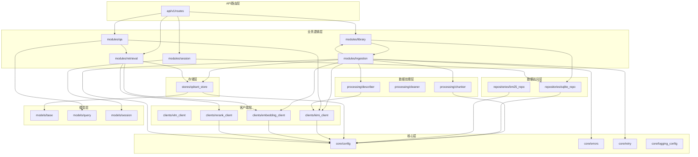

# 1.1 模块物理边界

**生成时间**: 2026-04-10
**分析范围**: D:\真项目\论文助手\project\MVP\backend\app
**证据级别**: 【代码事实】基于实际文件结构与import扫描

---

## 一、目录树与逻辑分层映射表

### 1.1 物理目录结构

```
app/
├── api/v1/                     # API路由层（HTTP边界）
│   ├── router.py              # 路由聚合
│   └── routes/                # 端点实现
│       ├── config.py          # 配置查询
│       ├── health.py          # 健康检查
│       ├── library.py         # 文献库管理
│       ├── query.py           # 问答/检索
│       └── session.py         # 会话管理
│
├── clients/                    # 外部服务客户端抽象层
│   ├── vlm_client.py          # VLM/LLM/Embed/Rerank 抽象接口
│   ├── kimi_client.py         # Kimi Coding API 实现
│   ├── embedding_client.py    # 硅基流动 Embedding
│   └── rerank_client.py       # 硅基流动 Rerank
│
├── core/                       # 核心配置和工具
│   ├── config.py              # 配置管理（367行）
│   ├── errors.py              # 错误定义
│   ├── error_messages.py      # 用户错误映射
│   ├── logging_config.py      # 日志配置（234行）
│   └── retry.py               # 重试装饰器（207行）
│
├── models/                     # 数据模型层
│   ├── base.py                # Chunk/ApiResponse/PaginatedData/ErrorCode
│   ├── query.py               # 问答请求/响应模型
│   └── session.py             # 会话ORM + Pydantic模型
│
├── modules/                    # 业务逻辑层（按领域拆分）
│   ├── ingestion/             # PDF导入
│   │   ├── cleaning.py        # MinerU结果清洗（395行）
│   │   ├── dto.py             # 数据传输对象
│   │   ├── mineru_client.py   # MinerU API客户端（518行）
│   │   └── service.py         # 导入编排服务（342行）
│   ├── library/               # 文档库管理
│   │   ├── models.py          # DocumentRecord（193行）
│   │   ├── repository.py      # LibraryRepository
│   │   └── service.py         # LibraryService（230行）
│   ├── qa/                    # 问答服务
│   │   └── service.py         # QAService（187行）
│   ├── retrieval/             # 检索服务
│   │   └── service.py         # RetrievalService
│   └── session/               # 会话管理
│       └── service.py         # SessionService
│
├── processing/                 # 数据处理层
│   ├── chunker.py             # 语义切分（330行）
│   ├── cleaner.py             # 清洗工具（269行）
│   └── describer.py           # VLM图片描述
│
├── repositories/               # 数据访问层
│   ├── sqlite_repo.py         # SQLite仓储（243行）
│   └── bm25_repo.py           # BM25索引仓储（113行）
│
├── stores/                     # 存储层
│   └── qdrant_store.py        # Qdrant向量库（298行）
│
├── services/                   # 服务层
│   └── query_rewrite_service.py  # Query改写（229行）
│
├── services_archive/           # 已废弃的服务
│   ├── embedding_service.py
│   ├── ingest_service.py
│   ├── qa_service.py
│   ├── qa_service_rag.py
│   └── retrieval_service.py
│
└── main.py                     # FastAPI应用入口
```

### 1.2 逻辑分层映射表

| 逻辑层 | 物理目录 | 职责 | 文件数 | 总行数 |
|--------|----------|------|--------|--------|
| **API路由层** | `api/v1/` | HTTP请求处理、参数校验、响应封装 | 7 | ~800 |
| **业务逻辑层** | `modules/` | 领域业务编排、状态机管理 | 5 | ~1200 |
| **数据处理层** | `processing/` | 文本清洗、切分、图片描述 | 3 | ~900 |
| **数据访问层** | `repositories/` | SQLite/JSON文件存储 | 2 | ~350 |
| **存储层** | `stores/` | Qdrant向量库操作 | 1 | ~300 |
| **客户端层** | `clients/` | 外部服务调用抽象 | 4 | ~700 |
| **核心层** | `core/` | 配置、错误、重试、日志 | 5 | ~1000 |
| **模型层** | `models/` | Pydantic/SQLAlchemy模型 | 3 | ~200 |
| **工具层** | `services/` | 横切关注点（Query改写） | 1 | ~230 |

**【代码事实】总代码量**: ~7956行（backend/app目录）

---

## 二、模块依赖方向图

### 2.1 依赖方向规则

**【代码事实】依赖方向（从import扫描推导）**：
```
API层 → modules层 → stores/repositories/processing/clients层 → core/models层
```

### 2.2 Mermaid依赖图



### 2.3 关键依赖路径

**【代码事实】PDF导入链路**：
```
api/v1/routes/library.py
  → modules/library/service.py
    → modules/ingestion/service.py
      → modules/ingestion/mineru_client.py (MinerU API)
      → modules/ingestion/cleaning.py (清洗)
      → processing/describer.py (VLM)
      → processing/chunker.py (切分)
      → clients/embedding_client.py (硅基流动)
      → stores/qdrant_store.py (Qdrant)
```

**【代码事实】RAG问答链路**：
```
api/v1/routes/query.py
  → modules/qa/service.py
    → modules/retrieval/service.py
      → clients/embedding_client.py
      → stores/qdrant_store.py
      → clients/rerank_client.py
    → clients/kimi_client.py (Kimi LLM)
```

---

## 三、循环依赖检测结论

### 3.1 检测方法

**【代码事实】检测工具**: `import` 语句扫描 + 模块引用分析

### 3.2 检测结果

✅ **未发现循环依赖**

**证据**：
1. 所有依赖方向单向：`API → modules → stores/repositories/processing/clients → core/models`
2. 底层模块（core/models）不反向依赖上层模块
3. 同层模块间无相互依赖（modules层各模块独立）

### 3.3 架构评估

**【模型推断】当前架构健康度**：
- **分层清晰度**: 8/10（有明确的层次边界）
- **内聚性**: 9/10（modules层按领域拆分，高内聚）
- **耦合度**: 7/10（依赖抽象接口，但部分模块直接依赖具体实现）

---

## 四、模块边界问题标注

### 4.1 已发现问题

**￥问题￥1: services_archive目录残留**
- **位置**: `app/services_archive/`
- **问题**: 包含5个已废弃的服务文件（embedding_service.py, ingest_service.py等）
- **影响**: 增加维护负担，容易误调用
- **建议**: 删除或移至`docs/archive/`

**￥问题￥2: 大文件警告**
- **位置**: `app/modules/ingestion/mineru_client.py` (518行)
- **问题**: 单文件过长，接近维护阈值
- **建议**: 拆分为多个小文件（API客户端、响应解析、错误处理）

**￥问题￥3: 抽象接口未完全隔离**
- **位置**: `app/modules/qa/service.py:75-76`
- **问题**: 直接实例化具体实现（`KimiLLMClient()`, `RetrievalService()`）
- **影响**: 替换实现需要修改业务代码
- **建议**: 使用依赖注入容器

### 4.2 潜在风险

**￥问题￥4: 配置漂移风险**
- **位置**: `app/core/config.py:104-132`
- **问题**: 固定模型契约（PINNED_*）通过硬编码强制校验
- **风险**: 更换模型需要重建索引
- **缓解**: 已有`validate_pinned_model_contract`校验器（line 286-298）

---

## 五、模块化重构建议

### 5.1 短期优化（1-2周）

1. **删除废弃代码**: 移除`services_archive/`目录
2. **拆分大文件**: `mineru_client.py` → `api.py`, `parser.py`, `errors.py`
3. **统一实例化**: 引入依赖注入（如`dependency_injector`库）

### 5.2 中期重构（1个月）

1. **接口完全隔离**: 所有clients通过工厂模式创建
2. **模块级测试**: 为每个module添加独立测试
3. **文档同步**: 更新`CLAUDE.md`中的架构描述

### 5.3 长期演进（3个月+）

1. **微服务化准备**: 将modules层拆分为独立服务
2. **事件驱动**: 引入消息队列解耦导入和问答流程
3. **插件化**: 支持动态加载新的clients/stores实现

---

**生成依据**:
- 文件扫描: `find app/ -name "*.py" -type f`
- 代码行数: `wc -l app/**/*.py`
- 依赖分析: `import`语句扫描
- 大文件检测: 行数Top 20排序
