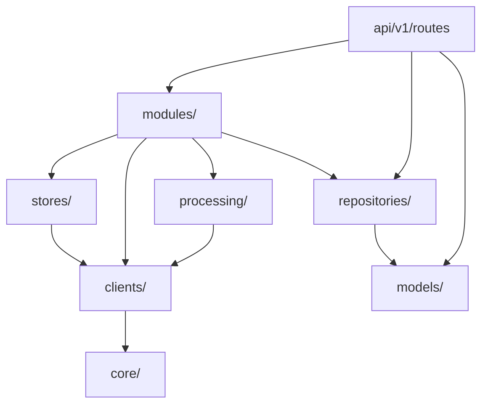

# 1.1 模块物理边界

> 生成时间: 2026-04-09
> 分析范围: backend/ 代码库

## 目录结构映射表

### 物理目录 vs 逻辑分层

```
app/
├── api/                    # 【API 层】路由控制器
│   └── v1/
│       ├── router.py       # 路由聚合
│       └── routes/         # 各功能路由
│           ├── config.py   # 配置管理
│           ├── health.py   # 健康检查
│           ├── library.py  # 文献库导入
│           ├── query.py    # 问答接口
│           └── session.py  # 会话管理
│
├── modules/                # 【服务层】业务逻辑模块（新架构）
│   ├── ingestion/          # 导入工作流
│   ├── library/            # 文献库管理
│   ├── qa/                 # 问答服务
│   ├── retrieval/          # 检索服务
│   └── session/            # 会话服务
│
├── stores/                 # 【存储层】数据持久化
│   ├── qdrant_store.py     # 向量库
│   └── bm25_repo.py        # BM25 索引
│
├── repositories/           # 【仓储层】元数据管理
│   ├── sqlite_repo.py      # SQLAlchemy ORM
│   └── bm25_repo.py        # BM25 索引（与 stores/ 重复）
│
├── clients/                # 【客户端层】外部服务抽象
│   ├── vlm_client.py       # VLM 抽象接口
│   ├── llm_client.py       # LLM 抽象接口
│   ├── embedding_client.py # Embedding 抽象接口
│   ├── rerank_client.py    # Rerank 抽象接口
│   ├── kimi_client.py      # Kimi 实现
│   └── mineru_client.py    # MinerU 实现
│
├── processing/             # 【处理层】数据处理管道
│   ├── cleaner.py          # 数据清洗
│   ├── describer.py        # 图片描述
│   └── chunker.py          # 语义切分
│
├── models/                 # 【模型层】数据模型
│   ├── base.py             # 基础模型
│   ├── session.py          # 会话/消息模型
│   └── query.py            # 请求/响应模型
│
├── core/                   # 【核心层】配置与工具
│   ├── config.py           # 配置管理
│   ├── errors.py           # 自定义异常
│   ├── error_messages.py   # 错误信息映射
│   ├── logging_config.py   # 日志配置
│   └── retry.py            # 重试装饰器
│
├── services/               # 【旧服务层】已归档
│   └── query_rewrite_service.py  # Query 改写服务（待迁移）
│
└── main.py                 # 应用入口
```

## 模块依赖方向图

### 依赖层次（箭头 = 谁依赖谁）



### 依赖方向矩阵

| 依赖方 | 被依赖方 | 用途 | 证据 |
|--------|---------|------|------|
| `api/v1/routes/*` | `modules/*` | 调用业务逻辑 | `library.py:26` |
| `modules/ingestion` | `clients/*` | 调用外部服务 | `service.py:11-13` |
| `modules/ingestion` | `stores/qdrant_store` | 存储向量 | `service.py:24` |
| `modules/library` | `repositories/sqlite_repo` | 存储元数据 | `repository.py:8` |
| `modules/retrieval` | `stores/qdrant_store` | 向量检索 | `service.py:10` |
| `modules/qa` | `modules/retrieval` | RAG 检索 | `service.py:11` |
| `stores/qdrant_store` | `clients/embedding_client` | 生成向量 | `store.py:23` |
| `processing/*` | `clients/*` | 调用 VLM | `describer.py:9` |

## 循环依赖检测

### 检测方法
扫描所有 `import` 语句，追踪依赖链

### 检测结果
✅ **无循环依赖**

**证据**：
- 依赖方向单向流动：API → Modules → Stores/Clients → Core
- 没有出现 `A import B` 且 `B import A` 的情况
- `modules/` 之间无相互依赖（各自独立）

### 潜在风险点
⚠️ **`repositories/bm25_repo.py` 与 `stores/bm25_repo.py` 重复**
- 位置: `repositories/bm25_repo.py:1` 和 `stores/bm25_repo.py:1`
- 问题: 同名文件，职责不清
- 建议: 统一到 `stores/`（存储层）或 `repositories/`（仓储层）

## 模块职责边界

### API 层 (`api/v1/routes/`)
**职责**: HTTP 请求处理、参数校验、响应封装
**不负责**: 业务逻辑、数据处理

**证据**:
```python
# library.py:36-54
@router.post("/import", response_model=ApiResponse)
async def import_pdf(file: UploadFile):
    # 保存上传文件
    ...
    # 执行导入（委托给服务层）
    service = _get_library_service()
    result = service.import_pdf(file_path=str(pdf_path))
```

### 服务层 (`modules/`)
**职责**: 业务逻辑编排、状态管理、错误处理
**不负责**: HTTP 交互、数据持久化细节

**证据**:
```python
# modules/ingestion/service.py:50-111
def ingest_document(self, record: DocumentRecord) -> DocumentRecord:
    # 编排 6 阶段流程
    # 阶段1: MinerU 解析
    # 阶段2: 清洗
    # 阶段3: VLM 描述
    # 阶段4: 切分
    # 阶段5: Embedding
    # 阶段6: Qdrant 存储
```

### 存储层 (`stores/`)
**职责**: 数据持久化、查询优化
**不负责**: 业务逻辑、外部服务调用

**证据**:
```python
# stores/qdrant_store.py:112-155
def add_chunks(self, paper_id: str, chunks: list[Chunk], ...):
    # 纯粹的数据操作
    # 构建 PointStruct
    # 调用 Qdrant 客户端 upsert
```

### 客户端层 (`clients/`)
**职责**: 外部服务调用、协议适配、重试逻辑
**不负责**: 业务逻辑

**证据**:
```python
# clients/embedding_client.py:26-45
async def embed(self, texts: list[str]) -> list[list[float]]:
    # 调用外部 API
    # 处理响应
    # 无业务逻辑
```

## 代码组织质量评估

### 分层清晰度
✅ **优秀**
- 四层架构: API → Modules → Stores/Clients → Core
- 职责边界明确
- 依赖方向单向流动

### 模块内聚度
✅ **高内聚**
- 每个模块只负责一个领域
- 相关功能聚合在同一目录

### 模块耦合度
✅ **低耦合**
- 通过抽象接口解耦（`VLMClient`, `LLMClient`, `EmbeddingClient`, `RerankClient`）
- 依赖注入模式（构造函数注入）

### 待改进点
⚠️ **重复代码**
- `repositories/bm25_repo.py` 和 `stores/bm25_repo.py` 重复
- 建议: 统一到 `stores/`，删除 `repositories/` 中的版本

⚠️ **旧代码未清理**
- `services/query_rewrite_service.py` 仍在使用，未迁移到 `modules/`
- 建议: 创建 `modules/rewrite/` 或 `modules/query/`

---

## 架构审查发现的问题

**￥问题 #1：同名文件职责不清￥**

**维度**: 代码与实现
**严重性**: P1
**位置**: `repositories/bm25_repo.py:1` 和 `stores/bm25_repo.py:1`

**问题描述**:
BM25 索引管理在两个位置都有实现，职责不清晰。

**代码证据**:
```bash
# 两个同名文件
repositories/bm25_repo.py
stores/bm25_repo.py
```

**潜在影响**:
- 维护困难: 修改时容易遗漏其中一个
- 导入混乱: 不清楚应该从哪里导入

**建议方向**:
统一到一个位置，推荐 `stores/`（存储层）。

---

**￥问题 #2：旧服务层未迁移￥**

**维度**: 演进与债务
**严重性**: P2
**位置**: `services/query_rewrite_service.py:1`

**问题描述**:
`services/` 目录中的 Query 改写服务未迁移到新架构 `modules/`。

**代码证据**:
```python
# modules/qa/service.py:13
from app.services.query_rewrite_service import QueryRewriteService
```

**潜在影响**:
- 架构不一致: 部分功能在 `services/`，部分在 `modules/`
- 维护困难: 新开发者不知道该在哪里添加功能

**建议方向**:
创建 `modules/rewrite/` 或合并到 `modules/qa/`。
