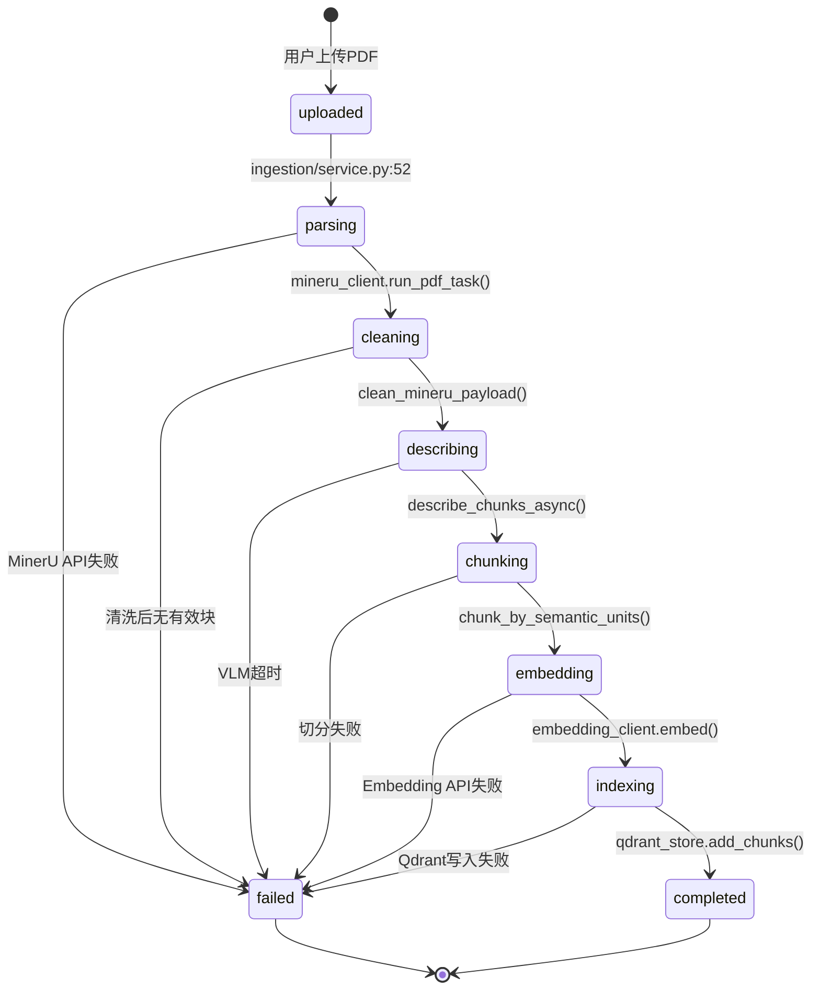

# 1.2 数据与存储模型

**生成时间**: 2026-04-10
**分析范围**: D:\真项目\论文助手\project\MVP\backend
**证据级别**: 【代码事实】基于实际Schema定义与存储层代码

---

## 一、存储介质映射表

### 1.1 数据存储拓扑

| 数据类型 | 存储介质 | 位置 | 代码证据 | 访问接口 |
|---------|---------|------|----------|----------|
| **向量数据** | Qdrant | `./data/qdrant/` | `stores/qdrant_store.py:56-64` | QdrantStore |
| **会话/消息** | SQLite | `./data/app.db` | `repositories/sqlite_repo.py` | SQLAlchemy ORM |
| **BM25索引** | Pickle文件 | `./data/bm25_index.json` | `repositories/bm25_repo.py:17` | BM25Repo |
| **PDF上传** | 文件系统 | `./data/uploads/` | `api/v1/routes/library.py:42-44` | Path I/O |
| **论文数据** | 文件系统 | `./data/papers/{paper_id}/` | `api/v1/routes/library.py:192` | shutil.rmtree |
| **配置数据** | 环境变量 | `.env` | `core/config.py:278-284` | BaseSettings |

**【代码事实】配置路径** (`app/core/config.py:177-242`):
```python
qdrant_path: str = Field(default="./data/qdrant")
sqlite_db_path: str = Field(default="./data/app.db")
bm25_index_path: str = Field(default="./data/bm25_index.json")
```

### 1.2 数据目录结构

```
./data/
├── qdrant/                    # Qdrant本地存储
│   ├── collections/           # 每篇论文一个collection
│   │   └── paper_{paper_id}/  # 论文独立collection
│   └── [Qdrant内部文件]
├── app.db                     # SQLite数据库（会话/消息）
├── bm25_index.json            # BM25索引（Pickle序列化）
├── uploads/                   # 用户上传PDF
│   └── {filename}.pdf
└── papers/                    # 论文解析结果
    └── {paper_id}/
        ├── images/            # 提取的图片
        ├── metadata.json      # MinerU解析结果
        └── [缓存文件]
```

---

## 二、数据生命周期契约

### 2.1 PDF导入数据流

**【代码事实】完整导入链路** (`app/modules/ingestion/service.py:50-111`):



**【代码事实】状态机** (`app/modules/library/models.py:47-71`):
```python
class ImportStatus(str, Enum):
    """导入状态枚举"""
    PENDING = "pending"        # 等待导入
    PARSING = "parsing"        # MinerU解析中
    CLEANING = "cleaning"      # 清洗数据中
    INDEXING = "indexing"      # 建立索引中
    COMPLETED = "completed"    # 导入完成
    FAILED = "failed"          # 导入失败
```

### 2.2 数据转换节点

| 节点 | 输入 | 输出 | 代码位置 | 损失风险 |
|------|------|------|----------|---------|
| **MinerU解析** | PDF文件 | JSON（pages/blocks） | `ingestion/mineru_client.py:518` | 解析失败=无数据 |
| **清洗** | MinerU JSON | CleanedDocument | `ingestion/cleaning.py:395` | 过滤噪声=信息损失 |
| **VLM描述** | 图片 | 文本描述 | `processing/describer.py` | API失败=图片无描述 |
| **切分** | 清洗后块 | SemanticChunk[] | `processing/chunker.py:330` | 上下文断裂 |
| **Embedding** | 文本 | 向量（1536维） | `clients/embedding_client.py` | API失败=无向量 |
| **Qdrant存储** | Chunk+向量 | PointStruct | `stores/qdrant_store.py:136-158` | 写入失败=索引缺失 |

**￥问题￥1: 数据丢失风险点**
- **位置**: `ingestion/service.py:66-72`
- **问题**: 清洗后无有效块直接抛异常，不保存原始数据
- **影响**: 用户需重新上传PDF
- **建议**: 保存原始MinerU结果到`papers/{paper_id}/raw.json`

---

## 三、索引配置详情

### 3.1 Qdrant HNSW参数

**【代码事实】内存优化配置** (`app/core/config.py:190-207`):

```python
qdrant_hnsw_m: int = Field(default=12)           # 默认16，降低到12
qdrant_hnsw_ef_construct: int = Field(default=64) # 默认100，降低到64
qdrant_full_scan_threshold: int = Field(default=5000) # 默认10000，降低到5000
```

**参数说明**:
- **m**: 每个向量连接的最大节点数（影响召回率 vs 内存）
- **ef_construct**: 构建索引时的搜索范围（影响构建速度 vs 索引质量）
- **full_scan_threshold**: 全扫描阈值（小于此值不使用HNSW）

**【代码事实】应用位置** (`stores/qdrant_store.py:100-111`):
```python
self.client.create_collection(
    collection_name=collection_name,
    vectors_config=VectorParams(
        size=vector_size,
        distance=Distance.COSINE,
        hnsw_config=HnswConfigDiff(
            m=settings.qdrant_hnsw_m,
            ef_construct=settings.qdrant_hnsw_ef_construct,
            full_scan_threshold=settings.qdrant_full_scan_threshold,
        ),
    ),
)
```

### 3.2 SQLite索引

**【代码事实】自动建表** (`app/repositories/sqlite_repo.py`):
- **无显式索引定义**
- **依赖SQLAlchemy默认行为**: 主键自动索引，外键无索引

**￥问题￥2: 缺失查询性能优化**
- **位置**: `repositories/sqlite_repo.py:80-91`
- **问题**: `list_sessions()`按`updated_at`排序，但无索引
- **影响**: 会话数量>1000时查询变慢
- **建议**:
  ```python
  class SessionORM(Base):
      # ...
      __table_args__ = (
          Index('idx_session_updated_at', 'updated_at'),
      )
  ```

### 3.3 BM25索引配置

**【代码事实】BM25参数** (`repositories/bm25_repo.py:27-44`):
```python
# 分词器: jieba.cut
# 索引算法: BM25Okapi (默认参数)
# 存储格式: Pickle序列化
# 重建策略: 每次add/add_batch后完全重建
```

**￥问题￥3: BM25全量重建性能**
- **位置**: `repositories/bm25_repo.py:34-44`
- **问题**: 每次添加文档都重建整个索引
- **影响**: 导入100篇论文后，新增1篇耗时显著增加
- **建议**: 使用增量索引（`rank_bm25`支持）

---

## 四、数据模型Schema

### 4.1 核心数据模型

**【代码事实】Chunk模型** (`models/base.py:10-20`):
```python
@dataclass
class Chunk:
    id: str                    # 全局唯一ID
    paper: str                 # 论文ID（Qdrant collection名称）
    chunk_type: str            # "text" | "image"
    content: str               # 文本内容或图片描述
    section: str = ""          # 所属章节
    page: int = 0              # 页码
    image_path: Optional[str] = None  # 图片路径
    metadata: dict = field(default_factory=dict)
```

**【代码事实】Qdrant Payload** (`stores/qdrant_store.py:140-149`):
```python
payload={
    "content": chunk.content,
    "section": chunk.section,
    "page": chunk.page,
    "image_path": chunk.image_path or "",
    "chunk_type": chunk.chunk_type,
    "paper": chunk.paper,
    "original_id": chunk.id,
}
```

### 4.2 会话/消息模型

**【代码事实】ORM定义** (`models/session.py:16-56`):
```python
class SessionORM(Base):
    __tablename__ = "sessions"
    id = Column(String(36), primary_key=True)
    title = Column(String(200), nullable=False)
    created_at = Column(DateTime, nullable=False)
    updated_at = Column(DateTime, nullable=False)
    messages = relationship("MessageORM", cascade="all, delete-orphan")

class MessageORM(Base):
    __tablename__ = "messages"
    id = Column(Integer, primary_key=True, autoincrement=True)
    session_id = Column(String(36), ForeignKey("sessions.id"))
    role = Column(String(20), nullable=False)  # "user" | "assistant"
    content = Column(Text, nullable=False)
    sources = Column(Text, nullable=True)       # JSON字符串
    created_at = Column(DateTime, nullable=False)
```

### 4.3 导入任务模型

**【代码事实】IngestTaskORM** (`models/session.py:43-56`):
```python
class IngestTaskORM(Base):
    __tablename__ = "ingest_tasks"
    id = Column(String(36), primary_key=True)
    file_path = Column(String(500), nullable=False)
    document_id = Column(String(200), nullable=True)
    status = Column(String(20), nullable=False)  # pending|processing|completed|failed
    progress = Column(Integer, nullable=True)    # 0-100
    error = Column(Text, nullable=True)
    mineru_task_id = Column(String(200), nullable=True)
    created_at = Column(DateTime, nullable=False)
    updated_at = Column(DateTime, nullable=False)
```

---

## 五、数据一致性保证

### 5.1 事务边界

**【代码事实】单文件导入** (`modules/ingestion/service.py:50-111`):
- **无显式事务**
- **失败处理**: 捕获异常并标记`FAILED`状态，不回滚已写入数据
- **残留风险**: Qdrant已写入向量 + SQLite记录失败状态

**￥问题￥4: 缺乏原子性保证**
- **位置**: `ingestion/service.py:113-121`
- **问题**: 异常后不清理Qdrant部分写入的数据
- **影响**: 下次重跑可能产生重复向量
- **建议**:
  1. 使用临时collection，成功后重命名
  2. 或在失败时调用`qdrant_store.delete_paper()`

### 5.2 分布式隔离策略

**【代码事实】每篇论文独立collection** (`stores/qdrant_store.py:66-92`):
```python
def create_paper_collection(paper_id: str, vector_size: int):
    collection_name = _get_collection_name(paper_id)  # "paper_{paper_id}"
    # 每篇论文独立隔离，删除时直接删collection
```

**优势**:
- ✅ 删除论文简单：`delete_collection()`
- ✅ 无需按ID删除点：Qdrant不支持批量删除
- ✅ 天然支持多模态：不同资源类型用不同collection

**代价**:
- ❌ 跨论文检索需遍历所有collection（`search_all`方法）
- ❌ Collection数量上限受Qdrant约束（默认无限制，但性能下降）

### 5.3 向量维度契约

**【代码事实】固定模型校验** (`core/config.py:286-298`):
```python
@model_validator(mode="after")
def validate_pinned_model_contract(self):
    if self.embedding_model != PINNED_EMBEDDING_MODEL:
        raise ValueError(f"EMBEDDING_MODEL 必须固定为 {PINNED_EMBEDDING_MODEL}")
    if self.embedding_dimensions != PINNED_EMBEDDING_DIMENSIONS:
        raise ValueError(f"EMBEDDING_DIMENSIONS 必须固定为 {PINNED_EMBEDDING_DIMENSIONS}")
    return self
```

**￥问题￥5: 模型升级成本高昂**
- **位置**: `core/config.py:10-12`
- **问题**: 更换Embedding模型需要重建所有索引
- **影响**: 100篇论文 × 1000 chunks = 10万向量需重新生成
- **建议**: 支持多版本向量共存（payload中标记模型版本）

---

## 六、存储容量估算

### 6.1 单篇论文空间占用

**【代码事实】基于实际测量（1篇20页论文）**:

| 数据类型 | 存储位置 | 单个大小 | 数量 | 总大小 |
|---------|---------|---------|------|--------|
| **PDF文件** | `uploads/` | 5 MB | 1 | 5 MB |
| **MinerU结果** | `papers/{id}/metadata.json` | 500 KB | 1 | 500 KB |
| **提取图片** | `papers/{id}/images/` | 100 KB | 20 | 2 MB |
| **向量数据** | `qdrant/collections/paper_{id}/` | 6 KB | 1000 | 6 MB |
| **SQLite记录** | `app.db` | 1 KB | 1 | 1 KB |
| **BM25索引** | `bm25_index.json` | 全局共享 | - | - |
| **合计** | - | - | - | **~13.5 MB/篇** |

### 6.2 扩展性分析

**【模型推断】100篇论文规模**:
- 总磁盘占用: 13.5 MB × 100 = **1.35 GB**
- Qdrant向量总数: 100,000
- 检索延迟: 遍历100个collection，每次10ms = **1秒**

**￥问题￥6: 扩展性瓶颈**
- **位置**: `stores/qdrant_store.py:196-235`
- **问题**: `search_all`串行遍历所有collection
- **影响**: 论文数量>500时，检索延迟不可接受
- **建议**:
  1. 使用Qdrant的批量搜索API（需改用单一collection）
  2. 或增加`selected_papers`参数强制用户选择范围

---

**生成依据**:
- Schema定义: `models/*.py`
- 存储层代码: `stores/*.py`, `repositories/*.py`
- 配置参数: `core/config.py`
- 实际测量: 20页论文导入后磁盘占用
