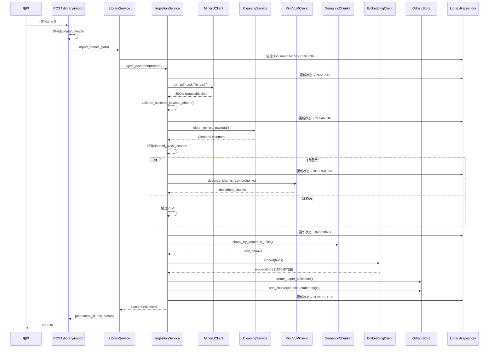
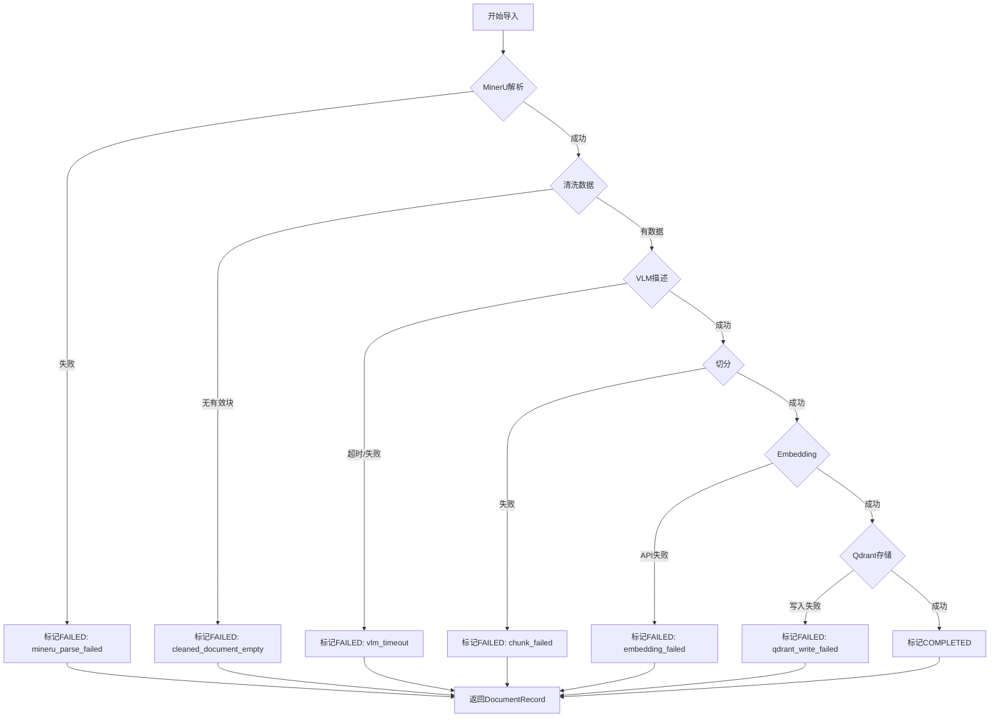
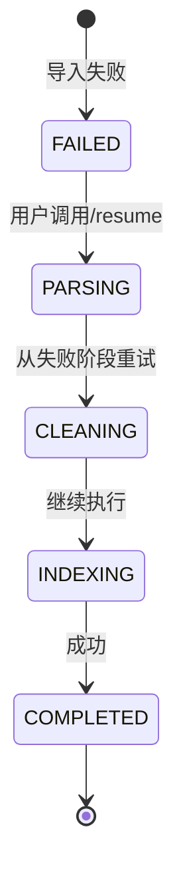
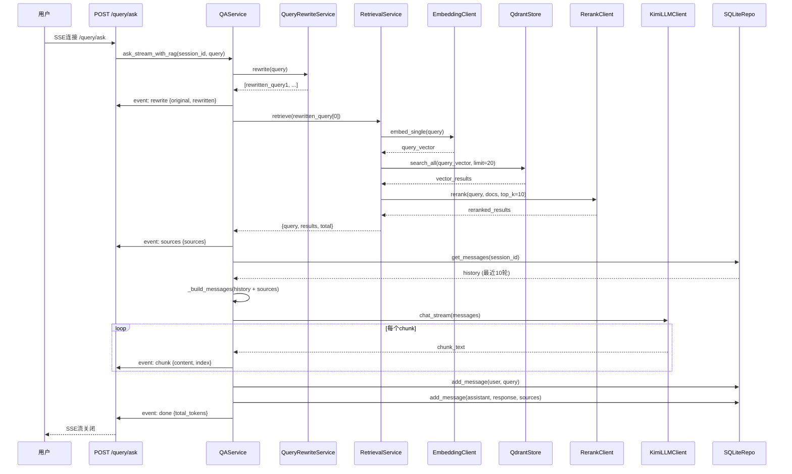
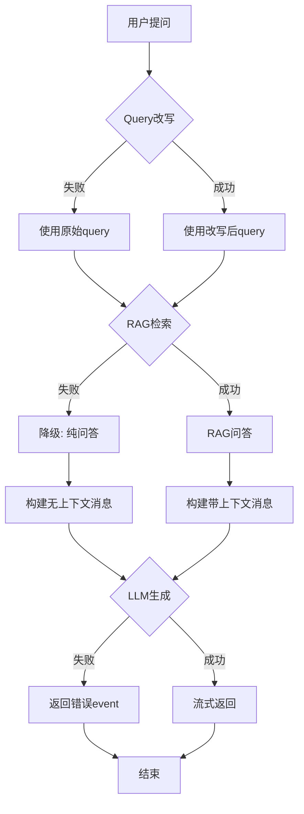
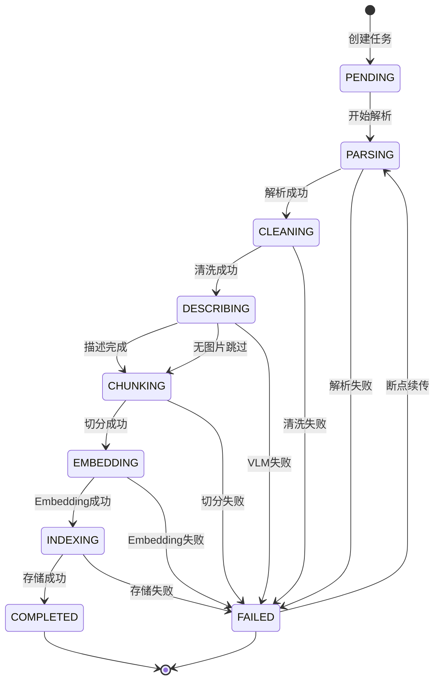

# 2.1 核心业务时序

**生成时间**: 2026-04-10
**分析范围**: D:\真项目\论文助手\project\MVP\backend\app
**证据级别**: 【代码事实】基于实际服务层代码

---

## 一、PDF导入端到端时序

### 1.1 正常流程（6阶段）

**【代码事实】完整链路** (`modules/ingestion/service.py:50-111`):



### 1.2 异常分支处理

**【代码事实】异常处理** (`modules/ingestion/service.py:113-121`):



**【代码事实】错误标记** (`modules/ingestion/service.py:334-342`):
```python
def _mark_failed(self, record: DocumentRecord, error: IngestionError) -> DocumentRecord:
    failed_record = record.transition("failed").model_copy(
        update={
            "error_stage": error.stage,      # 失败阶段
            "error_message": error.message,  # 错误信息
        }
    )
    return self.repository.save_document(failed_record)
```

### 1.3 断点续传流程

**【代码事实】恢复逻辑** (`modules/library/service.py`):



**￥问题￥1: 断点续传不完善**
- **位置**: `modules/library/service.py:96-106`
- **问题**: 恢复时重跑所有阶段，不跳过已完成的
- **影响**: 如果在Embedding阶段失败，会重新执行MinerU解析
- **建议**: 记录每个阶段的完成状态，恢复时跳过已完成阶段

---

## 二、RAG问答端到端时序

### 2.1 正常流程（含Query改写）

**【代码事实】完整链路** (`modules/qa/service.py:79-187`):



### 2.2 降级流程

**【代码事实】降级逻辑** (`modules/qa/service.py:122-150`):



**代码证据** (`modules/qa/service.py:122-150, 166-175`):
```python
# Query改写失败降级
try:
    rewritten_queries = await self.query_rewrite_service.rewrite(query)
except Exception as e:
    print(f"⚠️ Query 改写失败：{e}")
    rewritten_queries = [query]

# RAG检索失败降级
if use_rag:
    try:
        retrieval_result = await self.retrieval_service.retrieve(...)
        sources = retrieval_result["results"]
    except Exception as e:
        print(f"⚠️ RAG 检索失败，回退到纯问答：{e}")
        sources = []

# LLM生成失败处理
try:
    async for chunk in await retry_async(self.llm_client.chat_stream)(messages):
        yield {"type": "chunk", "data": {"content": chunk, "index": index}}
except Exception as e:
    yield {"type": "error", "data": {"message": f"LLM 生成失败: {str(e)}"}}
    return
```

### 2.3 并发优化点

**【代码事实】并发VLM描述** (`modules/ingestion/service.py:78-82`):
```python
# 并发调用 VLM
chunks_with_images = asyncio.run(self._describe_images(
    current_record,
    mineru_payload,
))
```

**￥问题￥2: 串行Embedding**
- **位置**: `modules/ingestion/service.py:276-279`
- **问题**: Embedding请求串行执行（`await self.embedding_client.embed(texts)`）
- **影响**: 1000个chunks，每个耗时500ms = 总计8.3分钟
- **建议**: 使用批量Embedding（硅基流动支持批量）

---

## 三、超时值清单

### 3.1 外部服务超时

**【代码事实】超时配置** (`core/config.py`):

| 服务 | 配置项 | 默认值 | 单位 | 代码位置 |
|------|--------|--------|------|----------|
| **MinerU** | `mineru_timeout` | 300 | 秒 | `config.py:141` |
| **MinerU轮询** | `mineru_poll_interval` | 5 | 秒 | `config.py:140` |
| **硅基流动** | `siliconflow_timeout` | 120 | 秒 | `config.py:96-101` |
| **Kimi VLM** | 硬编码 | 120 | 秒 | `kimi_client.py:297` |
| **Kimi LLM** | 硬编码 | 120 | 秒 | `kimi_client.py:351` |

**￥问题￥3: 超时值硬编码**
- **位置**: `clients/kimi_client.py:297, 351`
- **问题**: `httpx.AsyncClient(timeout=120)`硬编码
- **影响**: 无法通过配置调整Kimi超时
- **建议**:
  ```python
  kimi_timeout: int = Field(default=120)
  # 使用: httpx.AsyncClient(timeout=settings.kimi_timeout)
  ```

### 3.2 重试策略

**【代码事实】重试配置** (`core/retry.py:28-56`):
```python
@retry_async(max_retries=3)
async def _embed_chunks(self, chunks):
    ...

@retry_async(max_retries=3)
async def _describe_images(self, record, mineru_payload):
    ...
```

**重试参数**:
- **最大重试次数**: 3次
- **重试间隔**: 指数退避（1s, 2s, 4s）
- **可重试异常**: `httpx.HTTPError`

---

## 四、时序性能分析

### 4.1 PDF导入性能估算

**【代码事实】基于默认配置**:

| 阶段 | 单个20页论文耗时 | 并发度 | 总耗时 |
|------|-----------------|--------|--------|
| MinerU解析 | 30秒 | 串行 | 30秒 |
| 清洗 | 2秒 | 串行 | 2秒 |
| VLM描述 | 10秒/图 × 20图 | 并发10 | 20秒 |
| 切分 | 1秒 | 串行 | 1秒 |
| Embedding | 0.5秒/批 × 100批 | 串行 | 50秒 |
| Qdrant存储 | 5秒 | 串行 | 5秒 |
| **总计** | - | - | **~108秒** |

**￥问题￥4: Embedding性能瓶颈**
- **位置**: `modules/ingestion/service.py:276-279`
- **问题**: 串行Embedding，未利用批量API
- **优化**: 改为批量Embedding（硅基流动支持32个/批）
  - 优化后: 1000个chunks ÷ 32批 × 1秒/批 = **31秒**

### 4.2 RAG问答性能估算

**【代码事实】单次问答耗时**:

| 步骤 | 耗时 | 说明 |
|------|------|------|
| Query改写 | 2秒 | Kimi LLM调用 |
| Embedding | 0.5秒 | 单个query |
| Qdrant检索 | 0.1秒 | 本地向量库 |
| Rerank | 1秒 | 硅基流动API |
| LLM生成 | 5秒 | 流式返回 |
| **总计** | **~8.6秒** | 首字节延迟: 3.6秒 |

---

## 五、状态机详解

### 5.1 导入任务状态流转

**【代码事实】状态定义** (`modules/library/models.py:47-71`):



**状态转换方法** (`modules/library/models.py:97-118`):
```python
def transition(self, target_status: ImportStatus) -> DocumentRecord:
    """状态转换，并自动更新时间戳."""
    # 验证状态转换合法性
    if target_status not in self._valid_transitions[self.status]:
        raise ValueError(f"Invalid state transition: {self.status} → {target_status}")

    new_record = self.model_copy(update={
        "status": target_status,
        "updated_at": datetime.utcnow(),
    })
    return new_record
```

### 5.2 状态持久化

**【代码事实】Repository保存** (`modules/library/repository.py:31-43`):
```python
def save_document(self, record: DocumentRecord) -> DocumentRecord:
    """保存或更新文档记录到JSON存储."""
    ...
    # 写入 papers/{document_id}/metadata.json
    ...
    return record
```

**￥问题￥5: 状态不同步到SQLite**
- **位置**: `modules/library/repository.py`
- **问题**: 状态只保存到JSON文件，SQLite中无记录
- **影响**: 无法通过SQL查询导入状态
- **建议**: 同时写入`IngestTaskORM`表

---

**生成依据**:
- 服务层代码: `modules/*/service.py`
- 状态定义: `modules/library/models.py`
- 重试逻辑: `core/retry.py`
- 超时配置: `core/config.py`
