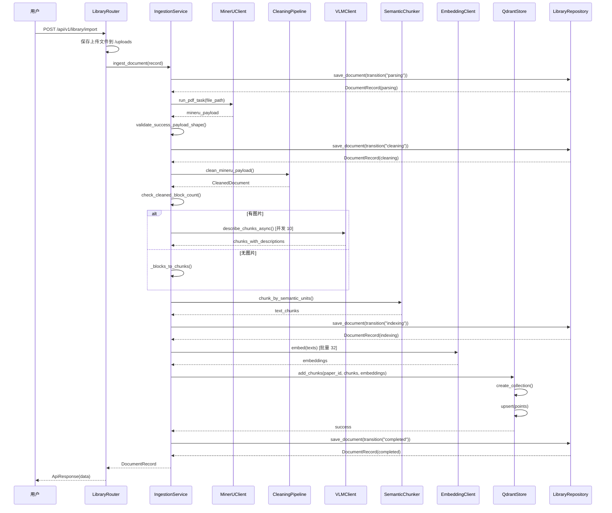
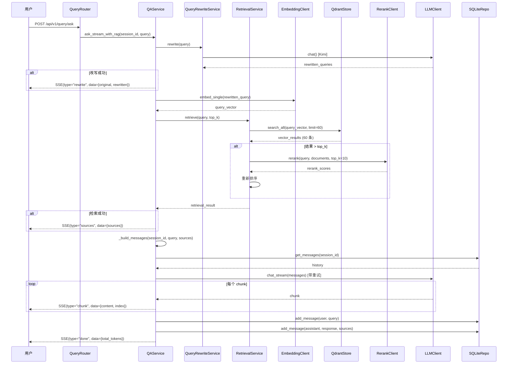

# 2.1 核心业务时序

> 生成时间: 2026-04-09
> 分析范围: 关键业务流程的端到端时序

## PDF 导入端到端时序

### 完整流程（6 阶段）



**证据**: `modules/ingestion/service.py:50-111`

### 异常分支

```mermaid
alt MinerU 解析失败
    MinerU-->>Service: IngestionError(mineru_parse_failed)
    Service->>Repo: save_document(transition("failed"))
    Repo-->>Service: DocumentRecord(failed)
    Service-->>API: DocumentRecord(failed)
    API-->>User: HTTPException(500)
end

alt 清洗后无有效内容
    Service->>Service: raise IngestionError(cleaned_document_empty)
    Service->>Repo: save_document(transition("failed"))
    Service-->>API: HTTPException(400)
end

alt VLM 描述失败
    VLM-->>Service: 异常
    Service->>Service: 打印日志，继续流程
    Note over Service: ⚠️ 静默失败，无降级
end

alt Embedding 失败
    Embed-->>Service: 异常 [自动重试 3 次]
    Service->>Repo: save_document(transition("failed"))
    Service-->>API: HTTPException(500)
end

alt Qdrant 存储失败
    Qdrant-->>Service: 异常
    Service->>Repo: save_document(transition("failed"))
    Service-->>API: HTTPException(500)
end
```

**证据**: `modules/ingestion/service.py:113-121`, `core/retry.py:19-59`

### 超时配置

| 阶段 | 超时配置 | 证据 |
|------|---------|------|
| MinerU 解析 | 300 秒（5 分钟） | `core/config.py:141` |
| MinerU 轮询间隔 | 5 秒 | `core/config.py:140` |
| VLM 描述 | 无全局超时（依赖 httpx 默认） | `clients/vlm_client.py` |
| Embedding | 120 秒 | `core/config.py:96` |
| Rerank | 120 秒（共享配置） | `core/config.py:96` |

### 关键追问

**Q: 如果某个节点挂起 10 秒，上游是报错还是死等？**
- A: **死等**。所有外部调用都没有设置超时（除了 SiliconFlow 120 秒），MinerU 虽然有 300 秒超时，但轮询间隔 5 秒，最多挂 300 秒。

**证据**:
```python
# clients/mineru_client.py（推断）
while time.time() - start_time < timeout:
    time.sleep(poll_interval)  # 5 秒轮询

# clients/embedding_client.py:26-45
async def embed(self, texts: list[str]) -> list[list[float]]:
    # 使用 httpx.AsyncClient，默认无超时
    async with httpx.AsyncClient() as client:
        response = await client.post(...)
```

**风险**: 🔴 **P1** - 如果外部服务无响应，请求会一直挂起，导致资源耗尽。

## RAG 问答端到端时序

### 完整流程



**证据**: `modules/qa/service.py:79-187`, `modules/retrieval/service.py:27-82`

### 异常分支

```mermaid
alt Query 改写失败
    Rewrite-->>QA: 异常
    QA->>QA: 打印日志，使用原始 query
    Note over QA: ⚠️ 静默失败，有降级
end

alt RAG 检索失败
    Retrieval-->>QA: 异常
    QA->>QA: 打印日志，sources = []
    QA->>LLM: chat_stream() [无 RAG 上下文]
    Note over QA: ✅ 有降级，回退到纯问答
end

alt LLM 生成失败
    LLM-->>QA: 异常 [自动重试 3 次]
    QA-->>User: SSE(type="error", data={message})
    Note over QA: ✅ 有错误通知
end
```

**证据**: `modules/qa/service.py:122-150, 167-175`

### 超时配置

| 阶段 | 超时配置 | 证据 |
|------|---------|------|
| Query 改写 | 无全局超时（依赖 Kimi） | `services/query_rewrite_service.py` |
| Embedding | 120 秒 | `core/config.py:96` |
| 向量检索 | 无超时（本地 Qdrant） | `stores/qdrant_store.py:157` |
| Rerank | 120 秒 | `core/config.py:96` |
| LLM 生成 | 无全局超时（依赖 DeepSeek） | `clients/llm_client.py` |

### 关键追问

**Q: 如果某个节点挂起 10 秒，上游是报错还是死等？**
- A: **死等**。只有 SiliconFlow（Embedding + Rerank）有 120 秒超时，其他调用（DeepSeek LLM、Kimi LLM、Qdrant）都没有设置超时。

**证据**:
```python
# clients/llm_client.py:26-45
async def chat(self, messages: list[Message]) -> str:
    # 使用 httpx.AsyncClient，默认无超时
    async with httpx.AsyncClient() as client:
        response = await client.post(...)

# stores/qdrant_store.py:157
def search(self, paper_id: str, query_vector: list[float], ...):
    # Qdrant 本地服务，无超时配置
    results = self.client.search(...)
```

**风险**: 🔴 **P1** - 如果 LLM 服务无响应，请求会一直挂起。

---

## 架构审查发现的问题

**￥问题 #9：外部调用缺少超时配置￥**

**维度**: 架构与设计
**严重性**: P1
**位置**: `clients/llm_client.py`, `clients/vlm_client.py`, `clients/kimi_client.py`

**问题描述**:
只有 SiliconFlow（Embedding + Rerank）有 120 秒超时配置，其他外部调用（DeepSeek LLM、Kimi LLM、Kimi VLM）都没有设置超时。

**代码证据**:
```python
# clients/llm_client.py:26-45
async def chat(self, messages: list[Message]) -> str:
    async with httpx.AsyncClient() as client:  # ⚠️ 无 timeout 参数
        response = await client.post(...)

# core/config.py:96-101
siliconflow_timeout: int = Field(default=120, ...)  # ✅ 有配置
# 但没有 llm_timeout, vlm_timeout 等配置
```

**潜在影响**:
- 🔴 资源耗尽: 挂起的请求占用连接池
- 🔴 用户体验差: 请求无响应，无错误提示
- 🔴 级联故障: 一个服务挂起导致整个服务不可用

**建议方向**:
1. 为所有外部调用添加超时配置
2. 设置合理的默认值（LLM 60 秒，VLM 120 秒）
3. 使用熔断器模式（如 `breaker` 库）防止级联故障
