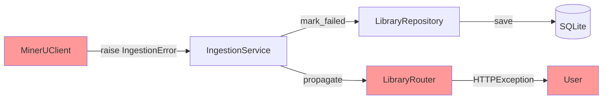
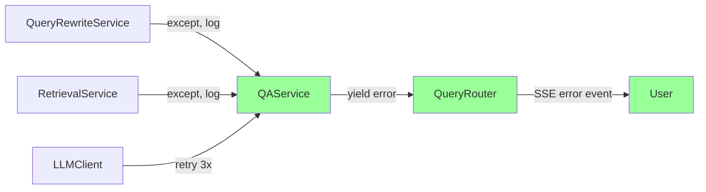

# 2.2 异步边界与错误传播

> 生成时间: 2026-04-09
> 分析范围: 异步边界、错误处理与传播链路

## 异步边界分析

### `async` / `await` 边界地图

| 代码位置 | 是否异步 | 异步操作 | 证据 |
|---------|---------|---------|------|
| `api/v1/routes/*.py` | ✅ 是 | 所有路由都是 `async def` | `routes/query.py:17` |
| `modules/ingestion/service.py` | ❌ 否 | **同步**，但依赖异步子服务 | `service.py:50` |
| `modules/qa/service.py` | ✅ 是 | `ask_stream_with_rag()` 是异步 | `service.py:79` |
| `modules/retrieval/service.py` | ✅ 是 | `retrieve()` 是异步 | `service.py:27` |
| `clients/embedding_client.py` | ✅ 是 | `embed()` 是异步 | `client.py:26` |
| `clients/rerank_client.py` | ✅ 是 | `rerank()` 是异步 | `client.py:26` |
| `clients/llm_client.py` | ✅ 是 | `chat()` 是异步 | `client.py:26` |
| `clients/vlm_client.py` | ✅ 是 | `describe_image()` 是异步 | `vlm_client.py:11` |
| `stores/qdrant_store.py` | ❌ 否 | **同步**（qdrant-client 同步模式） | `store.py:39` |
| `repositories/sqlite_repo.py` | ❌ 否 | **同步**（SQLAlchemy 同步模式） | `sqlite_repo.py:12` |

### 同步/异步混用风险

**🔴 高风险**: `IngestionService` 是同步的，但依赖异步子服务

**证据**:
```python
# modules/ingestion/service.py:50-111
def ingest_document(self, record: DocumentRecord) -> DocumentRecord:
    # ⚠️ 同步方法
    ...
    # 阶段5: Embedding（异步）
    embeddings = asyncio.run(self._embed_chunks(text_chunks))  # Line 96
    # ⚠️ 在同步方法中用 asyncio.run() 包装异步调用

# modules/ingestion/service.py:275-279
@retry_async(max_retries=3)
async def _embed_chunks(self, chunks: list[dict]) -> list[list[float]]:
    # ✅ 异步方法
    texts = [c["content"] for c in chunks]
    return await self.embedding_client.embed(texts)
```

**问题**:
1. `asyncio.run()` 在已有事件循环中会报错
2. 阻塞事件循环，影响并发性能
3. 违反 FastAPI 异步最佳实践

**潜在影响**:
- 🔴 运行时错误: 在已有事件循环中调用 `asyncio.run()` 会抛出 `RuntimeError`
- 🔴 性能下降: 阻塞事件循环，其他请求被阻塞

**建议**: 将 `IngestionService.ingest_document()` 改为异步方法，使用 `await` 而非 `asyncio.run()`。

---

## 错误传播链路

### PDF 导入错误传播



**证据**: `modules/ingestion/service.py:113-121`, `api/v1/routes/library.py:62-86`

**错误分类**:
| 错误代码 | HTTP 状态码 | 严重性 | 证据 |
|---------|-----------|--------|------|
| `file_not_found` | 404 | error | `core/error_messages.py:40-44` |
| `invalid_file_format` | 400 | error | `core/error_messages.py:45-49` |
| `mineru_parse_failed` | 400 | error | `core/error_messages.py:50-54` |
| `cleaned_document_empty` | 200 | warning | `core/error_messages.py:55-59` |
| `embedding_failed` | 400 | error | `core/error_messages.py:62-66` |
| `qdrant_storage_failed` | 400 | error | `core/error_messages.py:67-71` |
| `internal_error` | 500 | critical | `core/error_messages.py:93-97` |

**用户友好信息**:
```python
# core/error_messages.py:118-145
def format_user_error(error_code: str, context: dict | None = None) -> dict:
    error_info = get_error_message(error_code)
    return {
        "code": error_code,
        "user_message": error_info["user_message"],  # 用户友好描述
        "suggestion": error_info["suggestion"],      # 解决建议
        "severity": error_info["severity"],          # 严重程度
    }
```

**证据**: `core/error_messages.py:118-145`

### RAG 问答错误传播



**证据**: `modules/qa/service.py:122-175`

**降级策略**:
| 失败点 | 降级策略 | 证据 |
|-------|---------|------|
| Query 改写失败 | 使用原始 query | `service.py:124-126` |
| RAG 检索失败 | 回退到纯问答（无 RAG 上下文） | `service.py:148-150` |
| LLM 生成失败 | 返回错误事件，不降级 | `service.py:171-175` |

---

## 静默错误清单

### 检测方法
扫描所有 `try/except` 块，检查是否有 `except: pass` 或只打印日志的错误处理

### 静默错误列表

| 位置 | 错误类型 | 处理方式 | 风险 | 证据 |
|------|---------|---------|------|------|
| `modules/qa/service.py:124-126` | Query 改写失败 | `print` 日志，使用原始 query | ⚠️ 低 | 用户不知道改写失败 |
| `modules/qa/service.py:148-150` | RAG 检索失败 | `print` 日志，sources = `[]` | ⚠️ 低 | 有降级，用户可能不知道 |
| `processing/describer.py`（推断） | VLM 描述失败 | 只打印日志 | ⚠️ 中 | 图片无描述，用户不知道 |
| `modules/ingestion/service.py:113-121` | 导入失败 | 记录到 DB，返回 failed | ✅ 无风险 | 有状态记录 |

**代码证据**:
```python
# modules/qa/service.py:122-126
try:
    rewritten_queries = await self.query_rewrite_service.rewrite(query)
except Exception as e:
    print(f"⚠️ Query 改写失败：{e}")  # ⚠️ 只打印日志
    rewritten_queries = [query]
```

### 静默错误风险

**低风险**（用户可接受）:
- Query 改写失败: 使用原始 query，功能不受影响
- RAG 检索失败: 回退到纯问答，功能可用但准确性下降

**中风险**（影响准确性）:
- VLM 描述失败: 图片无文字描述，影响检索准确性

**高风险**（影响可用性）:
- 无（所有高风险错误都有明确的错误处理）

---

## 幂等性分析

### 导入接口幂等性

**接口**: `POST /api/v1/library/import`

**幂等性**: ❌ **非幂等**

**原因**:
- 每次调用都会创建新的 `DocumentRecord`
- 同一 PDF 多次导入会创建多个 Collection

**证据**:
```python
# api/v1/routes/library.py:51-53
service = _get_library_service()
result = service.import_pdf(file_path=str(pdf_path))
# ⚠️ 没有检查是否已存在
```

**潜在影响**:
- 重复导入同一 PDF 会创建多个 Collection，浪费存储
- 用户误操作会累积重复数据

**建议方向**:
1. 基于 PDF 文件 hash 检查是否已存在
2. 返回已存在的 document_id，而非重复导入

### 问答接口幂等性

**接口**: `POST /api/v1/query/ask`

**幂等性**: ❌ **非幂等**（但可接受）

**原因**:
- 每次调用都会保存消息到数据库
- 同一问题多次提问会创建多条消息记录

**证据**:
```python
# modules/qa/service.py:178-185
add_message(session_id, "user", query)
add_message(session_id, "assistant", assistant_content, sources=sources if sources else None)
# ⚠️ 每次都保存，不检查重复
```

**可接受原因**:
- 问答天然是"会话"场景，重复提问是合理的
- 消息记录需要保留历史

---

## 架构审查发现的问题

**￥问题 #10：同步/异步混用导致运行时错误￥**

**维度**: 架构与设计
**严重性**: P0
**位置**: `modules/ingestion/service.py:50-111`

**问题描述**:
`IngestionService.ingest_document()` 是同步方法，但依赖异步子服务，使用 `asyncio.run()` 包装异步调用，在已有事件循环中会报错。

**代码证据**:
```python
# modules/ingestion/service.py:50-111
def ingest_document(self, record: DocumentRecord) -> DocumentRecord:  # ⚠️ 同步
    ...
    embeddings = asyncio.run(self._embed_chunks(text_chunks))  # Line 96
    # ❌ 在 FastAPI 异步环境中会报错:
    #    RuntimeError: This event loop is already running

# modules/ingestion/service.py:275-279
@retry_async(max_retries=3)
async def _embed_chunks(self, chunks: list[dict]) -> list[list[float]]:  # ✅ 异步
    ...
```

**潜在影响**:
- 🔴 运行时错误: 在 FastAPI 异步环境中调用会抛出 `RuntimeError`
- 🔴 功能不可用: PDF 导入功能完全不可用

**建议方向**:
将 `IngestionService.ingest_document()` 改为异步方法:
```python
async def ingest_document(self, record: DocumentRecord) -> DocumentRecord:
    ...
    embeddings = await self._embed_chunks(text_chunks)  # ✅ 直接 await
```

---

**￥问题 #11：静默错误影响用户知情权￥**

**维度**: 可观测性与运维
**严重性**: P2
**位置**: `modules/qa/service.py:122-150`

**问题描述**:
Query 改写失败、RAG 检索失败时只打印日志，用户不知道功能降级。

**代码证据**:
```python
# modules/qa/service.py:122-126
try:
    rewritten_queries = await self.query_rewrite_service.rewrite(query)
except Exception as e:
    print(f"⚠️ Query 改写失败：{e}")  # ⚠️ 只打印日志
    rewritten_queries = [query]
    # ❌ 用户不知道改写失败

# modules/qa/service.py:148-150
except Exception as e:
    print(f"⚠️ RAG 检索失败，回退到纯问答：{e}")  # ⚠️ 只打印日志
    sources = []  # ❌ 用户不知道检索失败
```

**潜在影响**:
- 🔴 用户体验差: 用户不知道功能降级，可能误以为系统正常
- 🔴 调试困难: 用户反馈"回答不准确"，但不知道是检索失败导致的

**建议方向**:
通过 SSE 事件通知用户:
```python
# 改写失败
yield {"type": "warning", "data": {"message": "Query 改写失败，使用原始问题"}}

# 检索失败
yield {"type": "warning", "data": {"message": "文献检索失败，回退到纯问答"}}
```
