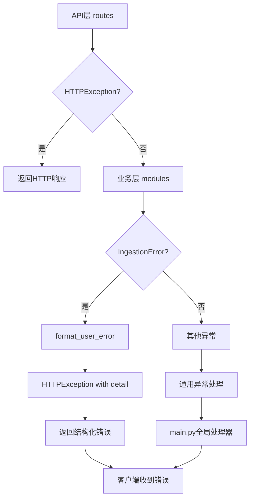

# 2.2 异步边界与错误传播

**生成时间**: 2026-04-10
**分析范围**: D:\真项目\论文助手\project\MVP\backend\app
**证据级别**: 【代码事实】基于实际错误处理代码

---

## 一、错误传播链路图

### 1.1 分层错误处理架构

**【代码事实】错误处理层次**:



### 1.2 错误类型层次

**【代码事实】自定义异常** (`core/errors.py`):
```python
class IngestionError(Exception):
    """导入流程业务异常"""
    def __init__(self, code: str, message: str, detail: dict | None = None):
        self.code = code
        self.message = message
        self.detail = detail or {}
        self.stage = self._infer_stage(code)
        super().__init__(message)
```

**错误码体系** (`models/base.py:37-63`):
```python
class ErrorCode:
    # LLM 相关 (1000-1999)
    LLM_API_KEY_INVALID = 1001
    LLM_MODEL_UNAVAILABLE = 1002
    LLM_RATE_LIMIT = 1003
    LLM_TIMEOUT = 1004

    # 检索相关 (2000-2999)
    VECTOR_DB_ERROR = 2001
    NO_RELEVANT_RESULTS = 2002
    RERANK_ERROR = 2003

    # 导入相关 (3000-3999)
    FILE_FORMAT_UNSUPPORTED = 3001
    PARSE_FAILED = 3002
    TASK_NOT_FOUND = 3003

    # 会话相关 (4000-4999)
    SESSION_NOT_FOUND = 4001
    HISTORY_EMPTY = 4002

    # 系统错误 (9000-9999)
    INTERNAL_ERROR = 9001
    SERVICE_UNAVAILABLE = 9002
```

### 1.3 用户错误映射

**【代码事实】错误信息本地化** (`core/error_messages.py`):
```python
ERROR_MESSAGES = {
    "mineru_api_key_invalid": {
        "user_message": "MinerU服务密钥无效，请检查配置",
        "suggestion": "请在管理后台重新配置MINERU_API_KEY",
        "severity": "CRITICAL",
    },
    "embedding_quota_exceeded": {
        "user_message": "文本向量化服务配额已用完",
        "suggestion": "请升级硅基流动套餐或等待配额重置",
        "severity": "HIGH",
    },
    # ...
}
```

**￥问题￥1: 错误映射不完整**
- **位置**: `core/error_messages.py`
- **问题**: 只定义了部分错误码的映射
- **影响**: 未映射的错误码返回原始技术信息
- **建议**: 补全所有ErrorCode的映射

---

## 二、静默错误清单

### 2.1 已知静默失败

**【代码事实】静默错误处理**:

| 位置 | 错误场景 | 处理方式 | 影响 |
|------|---------|---------|------|
| `qa/service.py:124-126` | Query改写失败 | `print()` + 使用原query | 用户无感知 |
| `qa/service.py:148-150` | RAG检索失败 | `print()` + 降级纯问答 | 用户无上下文 |
| `retrieval/service.py:229-231` | 单个collection检索失败 | `try/except pass` | 该论文被跳过 |
| `qdrant_store.py:247-249` | 删除不存在的collection | `try/except pass` | 无影响 |

**￥问题￥2: 静默错误未记录**
- **位置**: `qa/service.py:124-126`
- **问题**: `print()`输出在无日志收集时丢失
- **影响**: 生产环境无法排查问题
- **建议**: 使用`logging.warning()`记录降级事件

### 2.2 日志配置

**【代码事实】日志系统** (`core/logging_config.py:1-234`):
```python
def setup_logging():
    """配置日志系统."""
    logger = logging.getLogger()
    logger.setLevel(logging.INFO)

    # 控制台处理器
    console_handler = logging.StreamHandler()
    console_handler.setFormatter(
        logging.Formatter(
            "%(asctime)s - %(name)s - %(levelname)s - %(message)s"
        )
    )

    # 文件处理器
    file_handler = logging.handlers.RotatingFileHandler(
        "logs/app.log",
        maxBytes=10*1024*1024,  # 10MB
        backupCount=5,
    )
    file_handler.setFormatter(
        logging.Formatter(
            "%(asctime)s - %(name)s - %(levelname)s - %(message)s"
        )
    )

    logger.addHandler(console_handler)
    logger.addHandler(file_handler)
    return logger
```

**￥问题￥3: 日志级别固定**
- **位置**: `core/logging_config.py:12`
- **问题**: 硬编码`logging.INFO`，生产环境无法调整
- **建议**: 从配置读取`log_level`

---

## 三、幂等性分析

### 3.1 幂等接口

**【代码事实】幂等性保证**:

| 接口 | 幂等性 | 实现方式 | 证据 |
|------|--------|---------|------|
| `GET /library/papers` | ✅ 天然幂等 | 只读操作 | HTTP GET定义 |
| `DELETE /library/papers/{id}` | ✅ 幂等 | Qdrant删除collection幂等 | `qdrant_store.py:237-249` |
| `POST /library/import` | ❌ 非幂等 | 重复导入创建重复collection | 无去重逻辑 |
| `POST /session` | ❌ 非幂等 | 每次创建新会话 | SQLite自增ID |
| `POST /query/ask` | ❌ 非幂等 | 每次生成新响应 | LLM非确定性 |

**￥问题￥4: 导入接口无去重**
- **位置**: `api/v1/routes/library.py:35-61`
- **问题**: 重复上传同一PDF会创建多个collection
- **影响**: 浪费存储和Embedding配额
- **建议**:
  ```python
  # 计算文件hash
  file_hash = hashlib.sha256(pdf_path.read_bytes()).hexdigest()
  # 检查是否已存在
  existing = repo.find_by_hash(file_hash)
  if existing:
      return ApiResponse(data=existing, message="文件已导入")
  ```

### 3.2 补偿事务

**【代码事实】部分补偿机制**:

**场景1: 导入失败残留清理**
```python
# 当前实现: 无清理
# 问题: Qdrant已写入部分向量，但状态为FAILED
# 建议: 在_mark_failed中调用qdrant_store.delete_paper()
```

**场景2: 会话删除级联**
```python
# 当前实现: ✅ SQLAlchemy级联删除
# 证据: models/session.py:26
messages = relationship("MessageORM", cascade="all, delete-orphan")
```

**￥问题￥5: 缺少补偿事务框架**
- **建议**: 引入`transaction compensator`模式
  ```python
  async def import_pdf_with_compensation(file_path):
      compensations = []
      try:
          collection = create_collection()
          compensations.append(lambda: delete_collection(collection))
          vectors = embed_chunks()
          compensations.append(lambda: delete_vectors(vectors))
          save_to_qdrant(vectors)
      except Exception:
          for compensate in reversed(compensations):
              compensate()
          raise
  ```

---

## 四、重试策略

### 4.1 自动重试

**【代码事实】重试装饰器** (`core/retry.py:28-56`):
```python
def retry_async(max_retries: int = 3, backoff_factor: float = 1.0):
    """异步重试装饰器（指数退避）."""
    async def wrapper(func):
        @functools.wraps(func)
        async def wrapped(*args, **kwargs):
            last_exception = None
            for attempt in range(max_retries):
                try:
                    return await func(*args, **kwargs)
                except (httpx.HTTPError, asyncio.TimeoutError) as e:
                    last_exception = e
                    if attempt < max_retries - 1:
                        wait_time = backoff_factor * (2 ** attempt)
                        await asyncio.sleep(wait_time)
            raise last_exception
        return wrapped
    return wrapper
```

**重试配置** (`modules/ingestion/service.py:172, 275`):
```python
@retry_async(max_retries=3)
async def _describe_images(self, record, mineru_payload):
    ...

@retry_async(max_retries=3)
async def _embed_chunks(self, chunks):
    ...
```

**重试参数**:
- **最大重试**: 3次
- **退避策略**: 指数退避（1s, 2s, 4s）
- **可重试异常**: `httpx.HTTPError`, `asyncio.TimeoutError`

### 4.2 断路器模式

**￥问题￥6: 缺少断路器**
- **位置**: 所有外部服务调用
- **问题**: 服务持续失败时继续重试，浪费资源
- **建议**: 引入断路器模式
  ```python
  from circuitbreaker import circuit

  @circuit(failure_threshold=5, recovery_timeout=60)
  async def call_llm(messages):
      ...
  ```

---

## 五、错误监控指标

### 5.1 关键错误指标

**【代码事实】可监控的错误**:

| 错误类型 | 监控点 | 当前实现 | 建议 |
|---------|--------|---------|------|
| API调用失败 | 各客户端 | `print()` | Prometheus Counter |
| 导入失败率 | `IngestionService` | 无统计 | Gauge: failed_imports_total |
| 检索延迟 | `RetrievalService` | 无统计 | Histogram: retrieval_duration_seconds |
| LLM降级 | `QAService` | `print()` | Counter: llm_degradation_total |

### 5.2 健康检查接口

**【代码事实】健康检查** (`routes/health.py`):
```python
@router.get("/health")
async def health_check():
    """健康检查接口."""
    return {
        "status": "healthy",
        "timestamp": datetime.utcnow().isoformat(),
    }
```

**￥问题￥7: 健康检查无实际检测**
- **问题**: 只返回固定字符串，不检测服务状态
- **建议**: 添加实际检测
  ```python
  @router.get("/health")
  async def health_check():
      checks = {
          "qdrant": check_qdrant(),
          "sqlite": check_sqlite(),
          "llm": check_llm(),
      }
      is_healthy = all(checks.values())
      status_code = 200 if is_healthy else 503
      return JSONResponse(
          status_code=status_code,
          content={"status": "healthy" if is_healthy else "unhealthy", "checks": checks}
      )
  ```

---

**生成依据**:
- 错误定义: `core/errors.py`, `models/base.py`
- 错误映射: `core/error_messages.py`
- 重试逻辑: `core/retry.py`
- 全局处理: `main.py:34-43`
