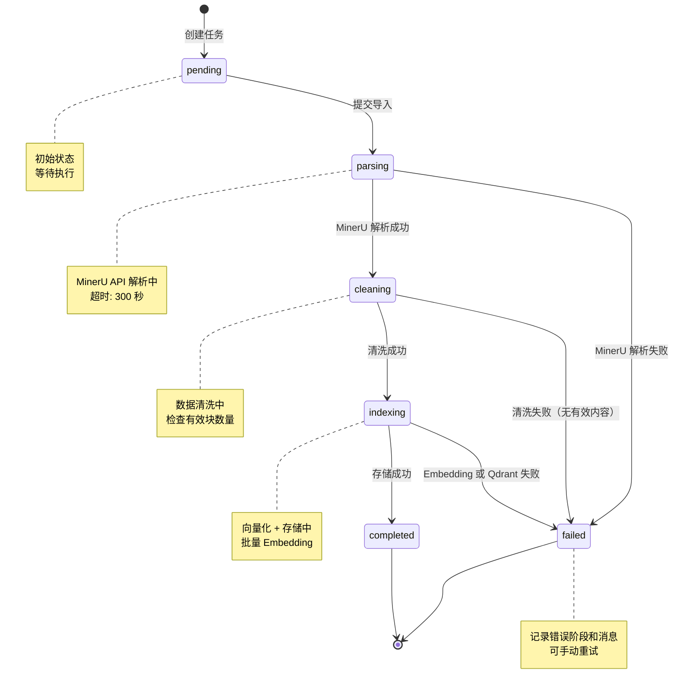
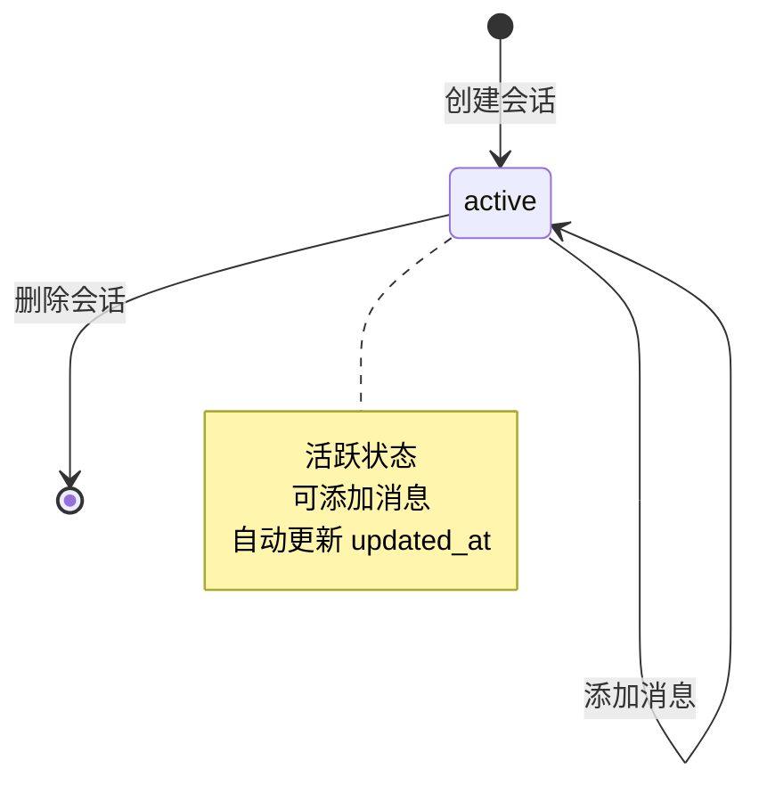
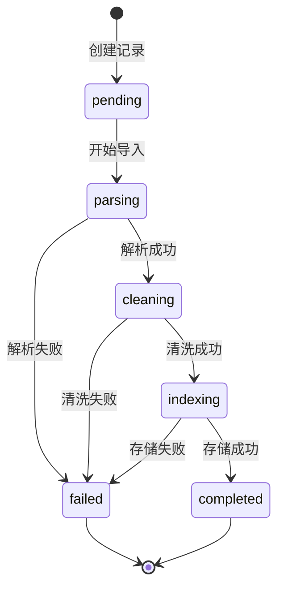

# 2.3 运行时状态机

> 生成时间: 2026-04-09
> 分析范围: 有状态实体的状态流转与异常处理

## 导入任务状态机

### 状态流转图



**证据**: `modules/ingestion/service.py:50-111`, `modules/library/models.py:21-42`

### 状态定义

| 状态 | 说明 | 触发条件 | 证据 |
|------|------|---------|------|
| `pending` | 等待执行 | 创建任务时 | `models.py:21` |
| `parsing` | MinerU 解析中 | `transition("parsing")` | `service.py:52` |
| `cleaning` | 数据清洗中 | `transition("cleaning")` | `service.py:61` |
| `indexing` | 向量化 + 存储中 | `transition("indexing")` | `service.py:92` |
| `completed` | 完成成功 | 所有阶段成功 | `service.py:105` |
| `failed` | 失败 | 任何阶段失败 | `service.py:336` |

### 异常退出点

| 退出点 | 残留数据 | 清理逻辑 | 风险 |
|-------|---------|---------|------|
| `parsing` → `failed` | Qdrant Collection（可能） | ❌ 无 | 🔴 中 |
| `cleaning` → `failed` | MinerU 解析结果（JSON） | ❌ 无 | 🟡 低 |
| `indexing` → `failed` | Qdrant Collection（部分） | ❌ 无 | 🔴 高 |

**证据**: `modules/ingestion/service.py:334-342`

**残留清理缺失**:
```python
# modules/ingestion/service.py:334-342
def _mark_failed(self, record: DocumentRecord, error: IngestionError) -> DocumentRecord:
    failed_record = record.transition("failed").model_copy(
        update={
            "error_stage": error.stage,
            "error_message": error.message,
        }
    )
    return self.repository.save_document(failed_record)
    # ❌ 没有清理残留数据:
    #    - Qdrant Collection（可能已创建）
    #    - 文件系统 data/papers/{paper_id}/
```

### 关键追问

**Q: 用户在中间状态关闭了 WPS，再次打开系统显示什么？**
- A: **显示失败状态**。任务状态持久化在 SQLite，再次打开时会读取最新状态。
- **证据**: `repositories/sqlite_repo.py:175-183`（创建任务时持久化到数据库）

**Q: 用户可以重试失败的导入吗？**
- A: **代码未实现**。虽然有 `POST /api/v1/library/resume/{document_id}` 接口，但服务未实现。
- **证据**: `api/v1/routes/library.py:89-139`（路由已定义，但 `LibraryRepository.resume_import()` 未实现）

---

## 会话状态机

### 状态流转图



**证据**: `models/session.py:11-37`

### 状态定义

| 状态 | 说明 | 触发条件 | 证据 |
|------|------|---------|------|
| `active` | 活跃 | 创建会话后 | `session.py:11` |

**注**: 会话没有显式的状态字段，所有会话都是"活跃"的，通过 `updated_at` 排序确定"最近使用"。

### 异常退出点

| 退出点 | 残留数据 | 清理逻辑 | 风险 |
|-------|---------|---------|------|
| 删除会话 | 无（级联删除） | ✅ 自动清理 | 🟢 无 |

**证据**: `sqlite_repo.py:99-107`

```python
# sqlite_repo.py:99-107
def delete_session(session_id: str) -> bool:
    with DBSession(get_engine()) as db:
        session = db.get(SessionORM, session_id)
        if not session:
            return False
        db.delete(session)  # ✅ 级联删除消息
        db.commit()
        return True
```

---

## 文档记录状态机

### 状态流转图



**证据**: `modules/library/models.py:21-42`

### 状态定义

| 状态 | 说明 | 触发条件 | 证据 |
|------|------|---------|------|
| `pending` | 等待导入 | 创建记录时 | `models.py:21` |
| `parsing` | 解析中 | MinerU 调用 | `service.py:52` |
| `cleaning` | 清洗中 | 清洗数据 | `service.py:61` |
| `indexing` | 索引中 | Embedding + 存储 | `service.py:92` |
| `completed` | 完成 | 所有阶段成功 | `service.py:105` |
| `failed` | 失败 | 任何阶段失败 | `service.py:336` |

### 状态转换方法

**证据**: `modules/library/models.py:56-92`

```python
def transition(self, to_state: str) -> "DocumentRecord":
    """状态转换（带校验）"""
    # 校验状态转换合法性
    valid_transitions = {
        "pending": ["parsing", "failed"],
        "parsing": ["cleaning", "failed"],
        "cleaning": ["indexing", "failed"],
        "indexing": ["completed", "failed"],
        "completed": [],
        "failed": [],
    }

    if to_state not in valid_transitions.get(self.status, []):
        raise ValueError(f"Invalid state transition: {self.status} -> {to_state}")

    return self.model_copy(update={"status": to_state})
```

---

## 架构审查发现的问题

**￥问题 #12：失败导入残留数据未清理￥**

**维度**: 架构与设计
**严重性**: P1
**位置**: `modules/ingestion/service.py:334-342`

**问题描述**:
导入任务失败时，Qdrant Collection 和文件系统残留数据未清理，导致磁盘空间泄漏。

**代码证据**:
```python
# modules/ingestion/service.py:334-342
def _mark_failed(self, record: DocumentRecord, error: IngestionError) -> DocumentRecord:
    failed_record = record.transition("failed").model_copy(
        update={
            "error_stage": error.stage,
            "error_message": error.message,
        }
    )
    return self.repository.save_document(failed_record)
    # ❌ 没有清理:
    #    - Qdrant Collection（可能在 indexing 阶段已创建）
    #    - 文件系统 data/papers/{paper_id}/（可能在 parsing 阶段创建）
```

**残留数据清单**:
| 阶段失败 | Qdrant Collection | 文件系统 | 清理逻辑 |
|---------|-------------------|---------|---------|
| `parsing` → `failed` | ❌ 无 | 🟡 可能有 | ❌ 无 |
| `cleaning` → `failed` | ❌ 无 | 🟡 有（MinerU 结果） | ❌ 无 |
| `indexing` → `failed` | 🔴 **有** | 🟡 有 | ❌ 无 |

**潜在影响**:
- 🔴 磁盘空间泄漏: 失败次数越多，残留越多
- 🔴 Qdrant 存储泄漏: 空 Collection 占用内存
- 🔴 数据不一致: 元数据显示失败，但残留数据存在

**建议方向**:
在 `_mark_failed` 中添加残留清理逻辑:
```python
def _mark_failed(self, record: DocumentRecord, error: IngestionError) -> DocumentRecord:
    # 清理 Qdrant Collection
    try:
        self.qdrant_store.delete_paper(record.document_id)
    except Exception:
        pass  # Collection 可能不存在

    # 清理文件系统
    import shutil
    papers_dir = Path(settings.sqlite_db_path).parent / "papers" / record.document_id
    if papers_dir.exists():
        shutil.rmtree(papers_dir)

    # 标记失败
    failed_record = record.transition("failed").model_copy(...)
    return self.repository.save_document(failed_record)
```

---

**￥问题 #13：断点续传未完整实现￥**

**维度**: 演进与债务
**严重性**: P1
**位置**: `api/v1/routes/library.py:89-139`

**问题描述**:
虽然定义了 `POST /api/v1/library/resume/{document_id}` 接口，但服务层的 `resume_import()` 方法未实现。

**代码证据**:
```python
# api/v1/routes/library.py:89-139
@router.post("/resume/{document_id}", response_model=ApiResponse)
async def resume_import(document_id: str):
    """恢复失败的导入任务（断点续传）"""
    try:
        service = _get_library_service()
        result = service.resume_import(document_id)  # ❌ 方法不存在
        return ApiResponse(...)
    except KeyError as e:
        # ❌ 异常处理也说明方法未实现
```

**证据**: `modules/library/service.py` 中没有 `resume_import()` 方法。

**潜在影响**:
- 🔴 功能不可用: 断点续传功能完全不可用
- 🔴 用户重复导入: 失败后只能重新开始，浪费资源

**建议方向**:
实现 `LibraryService.resume_import()` 方法:
```python
def resume_import(self, document_id: str) -> DocumentRecord:
    """恢复失败的导入任务"""
    record = self.repository.get_document(document_id)
    if not record:
        raise KeyError(f"Document not found: {document_id}")

    # 从失败阶段继续
    if record.status == "parsing":
        # 从 MinerU 解析开始
        ...
    elif record.status == "cleaning":
        # 从清洗开始（需要缓存 MinerU 结果）
        ...
    elif record.status == "indexing":
        # 从索引开始（需要缓存清洗结果）
        ...
```
