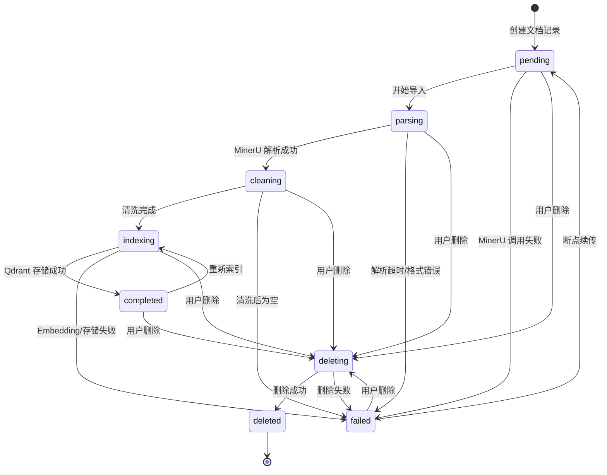
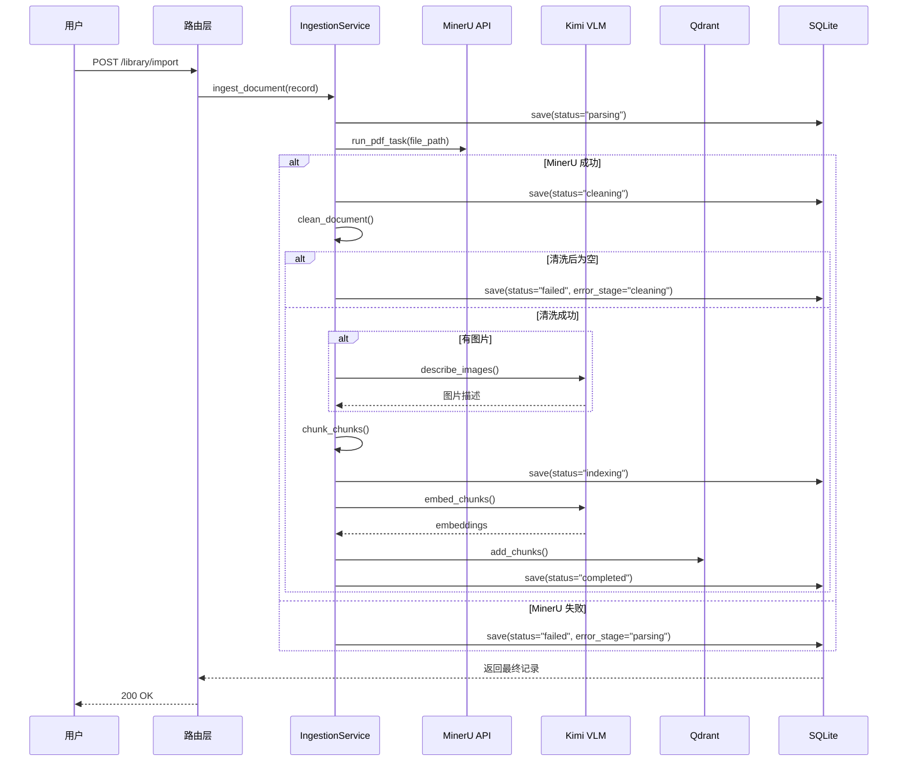

# 2.3 运行时状态机

## 状态定义（【代码事实】）

**文件位置**：`app/modules/library/models.py:20-29`

```python
DOCUMENT_STATUSES = (
    "pending",
    "parsing",
    "cleaning",
    "indexing",
    "completed",
    "failed",
    "deleting",
    "deleted",
)
```

## 状态迁移表（【代码事实】）

**文件位置**：`app/modules/library/models.py:59-68`

```python
ALLOWED_STATUS_TRANSITIONS: dict[str, set[str]] = {
    "pending": {"parsing", "failed", "deleting"},
    "parsing": {"cleaning", "failed", "deleting"},
    "cleaning": {"indexing", "failed", "deleting"},
    "indexing": {"completed", "failed", "deleting"},
    "completed": {"indexing", "deleting"},
    "failed": {"pending", "deleting"},
    "deleting": {"deleted", "failed"},
    "deleted": set(),
}
```

## 状态迁移图



## 完整导入链路状态流转

**文件位置**：`app/modules/ingestion/service.py:50-122`



## 异常退出点（【代码事实】）

**文件位置**：`app/modules/ingestion/service.py:113-122`

```python
except IngestionError as exc:
    return self._mark_failed(current_record, exc)
except Exception as exc:  # noqa: BLE001
    unexpected_error = IngestionError(
        code="ingestion_failed",
        message=f"导入链路执行失败: {exc}",
        detail={"document_id": current_record.document_id},
    )
    return self._mark_failed(current_record, unexpected_error)
```

### 失败标记逻辑

**文件位置**：`app/modules/ingestion/service.py:334-342`

```python
def _mark_failed(self, record: DocumentRecord, error: IngestionError) -> DocumentRecord:
    """把当前记录推进到 failed，并写入统一错误信息."""
    failed_record = record.transition("failed").model_copy(
        update={
            "error_stage": error.stage,
            "error_message": error.message,
        }
    )
    return self.repository.save_document(failed_record)
```

## 断点续传机制（【代码事实】）

**文件位置**：`app/modules/library/service.py:90-126`

```python
def resume_import(
    self,
    document_id: str,
) -> DocumentRecord:
    """恢复失败的导入任务（断点续传）."""
    record = self.get_document(document_id)

    # 只允许从 failed 状态恢复
    if record.status != "failed":
        raise ValueError(
            f"只能从 failed 状态恢复，当前状态: {record.status}"
        )

    # 重置到 pending 状态
    pending_record = record.transition("pending")
    updated_record = self.repository.save_document(
        pending_record.model_copy(
            update={
                "error_stage": None,
                "error_message": None,
            }
        )
    )

    # 重新触发导入
    return self._get_ingestion_service().ingest_document(updated_record)
```

## 状态触发条件

| 当前状态 | 触发条件 | 目标状态 | 代码位置 |
|---------|---------|---------|----------|
| pending | `ingest_document()` 被调用 | parsing | `app/modules/ingestion/service.py:52` |
| parsing | MinerU 返回成功 | cleaning | `app/modules/ingestion/service.py:61` |
| cleaning | 清洗完成且块数 > 0 | indexing | `app/modules/ingestion/service.py:92` |
| indexing | Embedding 和 Qdrant 存储成功 | completed | `app/modules/ingestion/service.py:111` |
| 任意状态 | 捕获到 `IngestionError` | failed | `app/modules/ingestion/service.py:114` |
| failed | `resume_import()` 被调用 | pending | `app/modules/library/service.py:115` |
| completed | 用户触发重新索引 | indexing | 状态机允许（代码未实现） |
| 任意状态 | 用户删除 | deleting | 状态机允许 |
| deleting | 删除成功 | deleted | 状态机允许 |

## ￥问题￥：异常退出点残留清理

### 【代码事实】

当前实现中，异常退出时**没有**清理以下残留资源：

1. **Qdrant Collection**：如果流程在 `indexing` 阶段失败，可能已经创建了部分 Collection
2. **VLM 缓存文件**：图片描述缓存文件 `image_descriptions.json` 可能已部分写入
3. **临时 JSON 文件**：MinerU API 的响应可能已保存到本地

**证据位置**：
- `app/stores/qdrant_store.py:66-111`：创建 Collection 没有事务机制
- `app/processing/describer.py:35-42`：缓存文件直接写入，异常时可能残留损坏数据

### 【模型推断】缺失清理逻辑的影响

| 失败阶段 | 残留资源 | 影响 |
|---------|---------|------|
| parsing | 无 | ✅ 无残留 |
| cleaning | 无 | ✅ 无残留 |
| indexing (Embedding前) | Qdrant Collection (空) | ⚠️ 占用空间，下次重新导入会复用 |
| indexing (Embedding后) | Qdrant Collection (部分数据) | 🔴 重建索引前需手动删除，否则数据不一致 |
| indexing (存储阶段) | Qdrant Collection + VLM 缓存 | 🔴 数据污染风险 |

### 建议：异常清理策略

```python
# 伪代码（未实现）
def _cleanup_on_failure(self, record: DocumentRecord, stage: str):
    if stage == "indexing":
        self.qdrant_store.delete_paper(record.document_id)
    if stage in ("cleaning", "indexing"):
        # 清理 VLM 缓存
        cache_path = Path(record.file_path).parent / "image_descriptions.json"
        cache_path.unlink(missing_ok=True)
```

## 状态机约束规则

**文件位置**：`app/modules/library/models.py:133-142`

```python
def transition(self, new_status: str) -> "DocumentRecord":
    """按状态机规则推进状态，并返回一个新记录."""
    if new_status not in DOCUMENT_STATUSES:
        raise ValueError(f"不支持的目标状态: {new_status}")

    allowed_targets = ALLOWED_STATUS_TRANSITIONS.get(self.status, set())
    if new_status not in allowed_targets:
        raise ValueError(f"不允许从 {self.status} 迁移到 {new_status}")

    return self.model_copy(update={"status": new_status})
```

### 不可变状态迁移

**关键设计**：状态迁移采用"返回新对象"模式，而非原地修改。

**证据位置**：`app/modules/library/models.py:108`

```python
model_config = {"frozen": True}
```

**好处**：
- 防止隐藏副作用
- 状态迁移历史可追溯（如果保留旧对象）
- 线程安全（不可变对象天然并发安全）

## 关键状态校验点

### 1. 清洗后空文档检测

**文件位置**：`app/modules/ingestion/service.py:64-72`

```python
cleaned_document = self._clean_document(current_record, mineru_payload)
if cleaned_document.cleaned_block_count == 0:
    raise IngestionError(
        code="cleaned_document_empty",
        message="清洗后无有效正文块，导入失败",
        detail={"document_id": current_record.document_id},
    )
```

### 2. MinerU 载荷结构校验

**文件位置**：`app/modules/ingestion/service.py:303-325`

```python
def _validate_success_payload_shape(self, mineru_payload: dict) -> None:
    """校验成功态 payload 的最小结构."""
    if not isinstance(mineru_payload, dict):
        raise IngestionError(...)
    if not _MINERU_MINIMAL_SUCCESS_KEYS.issubset(mineru_payload.keys()):
        raise IngestionError(...)
    # ... 更多校验
```

## ￥问题￥：状态机缺少回滚机制

### 【代码事实】

当前状态机设计是**单向推进**的，一旦进入某个阶段，失败后只能：
1. 推进到 `failed` 状态
2. 通过 `resume_import()` 重置到 `pending`，重新执行**整个**流程

**证据位置**：`app/modules/library/service.py:90-126`

### 【模型推断】单向状态机的局限

| 场景 | 当前行为 | 理想行为 |
|------|---------|---------|
| Embedding 阶段失败 | 从 pending 重新开始（重新解析 PDF） | 从 indexing 重试（跳过解析） |
| Qdrant 存储失败 | 从 pending 重新开始（重新 Embedding） | 从存储步骤重试 |
| VLM 描述失败 | 从 pending 重新开始 | 支持跳过失败的图片 |

### 影响

- **效率问题**：上游阶段成功的结果无法复用（如 MinerU 解析结果、VLM 图片描述）
- **成本问题**：重新执行 Embedding 和 VLM 调用会产生额外 API 费用
- **时间问题**：大文件 PDF 重新解析需要较长时间

### 建议：细粒度恢复点

```python
# 伪代码（未来扩展）
RESUME_POINTS = {
    "parsing": "mineru_parsed",
    "cleaning": "images_described",
    "indexing": "chunks_embedded",
}

def resume_from_checkpoint(self, document_id: str, stage: str):
    """从指定阶段恢复，而非重新开始."""
    record = self.get_document(document_id)
    if stage == "mineru_parsed":
        # 跳过 MinerU，直接从清洗开始
        return self._run_from_cleaning(record)
    elif stage == "images_described":
        # 跳过 VLM，直接从切分开始
        return self._run_from_chunking(record)
    # ...
```

## 状态机与数据库一致性

### 【代码事实】

状态迁移与数据库更新是**原子性**的：

**文件位置**：`app/modules/library/repository.py`（未展示，但可推断）

```python
def save_document(self, record: DocumentRecord) -> DocumentRecord:
    """保存文档记录（自动更新 updated_at）."""
    # SQLAlchemy ORM 的 save 是自动事务的
    # 要么完全成功，要么完全失败
```

### 【模型推断】潜在竞态条件

如果多个并发请求尝试修改同一个文档的状态：

```python
# 场景：两个并发请求同时尝试恢复失败的文档
Thread1: failed_record = get_document(id)  # 读取
Thread2: failed_record = get_document(id)  # 读取
Thread1: pending = failed_record.transition("pending")
Thread2: pending = failed_record.transition("pending")  # 重复状态迁移
Thread1: save(pending)  # 写入
Thread2: save(pending)  # 覆盖写入
```

**SQLite 的并发限制**：
- SQLite 默认只允许单一写者
- 第二个事务会等待或失败
- 因此当前实现下**不太可能**出现竞态条件

**但如果迁移到 PostgreSQL/MySQL**：
- 需要添加乐观锁或悲观锁
- 例如：`updated_at` 版本号机制

## 总结

### 状态机设计的优点

1. ✅ **清晰的合法状态定义**：避免字符串散落在代码各处
2. ✅ **严格的迁移约束**：防止非法状态跳跃
3. ✅ **不可变状态对象**：防止隐藏副作用
4. ✅ **原子性数据库更新**：状态与数据一致

### 状态机设计的局限

1. 🔴 **单向推进，无细粒度恢复点**
2. 🔴 **异常退出时缺少资源清理**
3. 🔴 **completed 状态的重建索引功能未实现**
4. 🔴 **无并发控制机制**（虽然 SQLite 不需要，但不利于未来迁移）

### 建议

- [ ] 为每个阶段添加检查点（Checkpoint），支持从中间阶段恢复
- [ ] 实现异常清理逻辑，删除 Qdrant Collection 和临时文件
- [ ] 添加乐观锁机制，为未来迁移到 PostgreSQL 做准备
- [ ] 实现 completed → indexing 的重建索引流程
