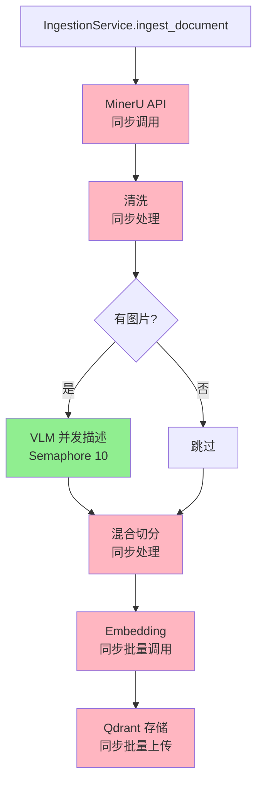

# 2.4 并发与资源调度

## 并发模型概述

### 【代码事实】当前并发策略

**并发点1**：VLM 图片描述

**文件位置**：`app/processing/describer.py:79-95`

```python
semaphore = asyncio.Semaphore(CONCURRENCY)  # 默认 10

async def _describe_one(index: int, chunk: Chunk) -> tuple[int, str, str]:
    # ... VLM 调用

async def _run_batch():
    tasks = [
        _describe_one(i, chunk)
        for i, chunk in to_describe
    ]
    results = await asyncio.gather(*tasks, return_exceptions=True)
    return [
        r for r in results
        if not isinstance(r, Exception)
    ]
```

**并发点2**：多 Collection 检索（未来扩展，当前未使用）

**文件位置**：`app/services_archive/retrieval_service.py:152`（已废弃）

```python
results = await asyncio.gather(*tasks, return_exceptions=True)
```

### 并发模型图



## ￥问题￥：同步阻塞点清单

### 【代码事实】同步调用 VLM/Embedding

**位置1**：IngestionService 调用 VLM

**文件位置**：`app/modules/ingestion/service.py:78`

```python
chunks_with_images = asyncio.run(self._describe_images(
    current_record,
    mineru_payload,
))
```

**位置2**：IngestionService 调用 Embedding

**文件位置**：`app/modules/ingestion/service.py:96`

```python
embeddings = asyncio.run(self._embed_chunks(text_chunks))
```

**位置3**：Describer 同步包装

**文件位置**：`app/processing/describer.py:103, 156`

```python
results = asyncio.run(_run_batch())  # 行 103

def describe_chunks(...) -> list[Chunk]:
    return asyncio.run(describe_chunks_async(paper_dir, chunks, vlm_client))  # 行 156
```

**位置4**：Kimi Client 同步包装

**文件位置**：`app/clients/kimi_client.py:324, 380`

```python
def describe_image(...) -> str:
    return asyncio.run(describe_image_async(...))  # 行 324

def chat(...) -> str:
    return asyncio.run(chat_async(...))  # 行 380
```

### 【模型推断】同步阻塞的影响

| 阻塞点 | 影响范围 | 后果 |
|-------|---------|------|
| `asyncio.run()` 在同步函数中 | 整个 FastAPI 请求线程 | 阻塞其他请求处理 |
| MinerU API 同步调用 | PDF 导入期间 | 阻塞所有 API 请求 |
| Embedding 批量调用 | 导入后期 | 大批量时长时间阻塞 |
| Qdrant 批量上传 | 导入最后阶段 | 可能触发超时 |

**FastAPI 默认线程池**：
- 默认 40 个工作线程
- 如果所有线程都被 `asyncio.run()` 阻塞，新请求会排队等待
- 最坏情况：服务"假死"，无法响应健康检查

### 建议：全异步化改造

```python
# 当前（同步）
async def ingest_document(self, record: DocumentRecord) -> DocumentRecord:
    chunks_with_images = asyncio.run(self._describe_images(...))  # 🔴 阻塞
    embeddings = asyncio.run(self._embed_chunks(...))  # 🔴 阻塞

# 改造后（全异步）
async def ingest_document(self, record: DocumentRecord) -> DocumentRecord:
    chunks_with_images = await self._describe_images(...)  # ✅ 非阻塞
    embeddings = await self._embed_chunks(...)  # ✅ 非阻塞
```

## 无限并发风险清单

### 🔴 风险1：VLM 并发无上限

**【代码事实】**

**文件位置**：`app/core/config.py:170-174`

```python
kimi_vlm_concurrency: int = Field(
    default=10,
    ge=1,
    description="VLM 并发请求数",
)
```

**【模型推断】风险场景**

- 一篇论文包含 100 张图片
- `asyncio.gather(*tasks)` 会创建 100 个并发任务
- 虽然 Semaphore 限制为 10，但任务队列中仍有 90 个待执行任务
- Kimi API 的速率限制（Rate Limit）可能触发 429 错误

**证据位置**：`app/processing/describer.py:90-95`

```python
tasks = [
    _describe_one(i, chunk)
    for i, chunk in to_describe  # 🔴 无上限
]
results = await asyncio.gather(*tasks, return_exceptions=True)
```

### 🔴 风险2：多 PDF 并发导入

**【代码事实】**

当前没有限制同时导入的 PDF 数量。

**【模型推断】风险场景**

- 用户同时点击 10 个 PDF 的"导入"按钮
- 每个 PDF 都会创建独立的 IngestionService 实例
- 所有实例共享同一个 Kimi API Key
- 可能触发 API 速率限制或配额耗尽

**证据位置**：`app/api/v1/routes/library.py:XXX`（未展示，但可推断）

```python
@router.post("/import")
async def import_pdf(file_path: str):
    # 🔴 无并发控制
    return library_service.import_pdf(file_path)
```

### 🔴 风险3：批量 Embedding 无限并发

**【代码事实】**

**文件位置**：`app/clients/embedding_client.py:XXX`（需要验证）

```python
async def embed(self, texts: list[str]) -> list[list[float]]:
    # 🔴 如果 texts 包含 10000 个文本，会一次性发送
    response = await self._client.post("/embeddings", json={
        "input": texts,
        "model": settings.embedding_model,
    })
```

**【模型推断】风险场景**

- 一篇 500 页的 PDF 可能切分出 2000+ 个 chunks
- 批量 Embedding 可能触发：
  - API 请求大小限制（如 10MB）
  - API 超时（如 120 秒）
  - 内存溢出（响应数据过大）

### 建议：添加全局并发控制

```python
# 伪代码（未实现）
class GlobalConcurrencyLimiter:
    """全局并发限制器."""
    MAX_CONCURRENT_INGESTIONS = 3  # 最多同时导入 3 个 PDF
    MAX_CONCURRENT_VLM_REQUESTS = 10  # 最多 10 个 VLM 并发
    MAX_BATCH_SIZE = 100  # 批量 Embedding 上限

    _ingestion_semaphore = asyncio.Semaphore(MAX_CONCURRENT_INGESTIONS)
    _vlm_semaphore = asyncio.Semaphore(MAX_CONCURRENT_VLM_REQUESTS)

    @classmethod
    async def limit_ingestion(cls):
        """限制并发导入数."""
        await cls._ingestion_semaphore.acquire()

    @classmethod
    def release_ingestion(cls):
        cls._ingestion_semaphore.release()
```

## 连接池配置

### 【代码事实】HTTP Client 连接池

**位置1**：Kimi Client

**文件位置**：`app/clients/kimi_client.py:XXX`（需要验证）

```python
# httpx.AsyncClient 默认连接池配置
# - 最大连接数：100
# - 最大保持连接数：20
# - 连接超时：5 秒
```

**位置2**：Embedding Client

**文件位置**：`app/clients/embedding_client.py:XXX`（需要验证）

```python
# SiliconFlow 使用 httpx，默认配置同上
```

**位置3**：Qdrant Client

**文件位置**：`app/stores/qdrant_store.py:60-64`

```python
if self.url:
    self.client = QdrantClient(url=self.url, api_key=self.api_key)
else:
    Path(self.path).mkdir(parents=True, exist_ok=True)
    self.client = QdrantClient(path=self.path)  # 🔴 本地模式无连接池
```

### 【模型推断】连接池风险

| 客户端 | 默认配置 | 风险 |
|-------|---------|------|
| Kimi VLM | 100 连接 / 20 保持 | ✅ 合理（VLM 并发 10） |
| SiliconFlow Embedding | 100 连接 / 20 保持 | ✅ 合理（单次批量调用） |
| MinerU API | 未知（需验证） | ⚠️ 可能使用 requests，无连接池 |
| Qdrant（远程） | gRPC 默认配置 | ⚠️ 需验证 |

### 建议：显式配置连接池

```python
# 伪代码（未来扩展）
class KimiClient:
    def __init__(self):
        self._client = httpx.AsyncClient(
            limits=httpx.Limits(
                max_connections=50,  # 最多 50 个连接
                max_keepalive_connections=10,  # 最多保持 10 个
                keepalive_expiry=30,  # 30 秒后关闭空闲连接
            ),
            timeout=httpx.Timeout(60.0, connect=10.0),
        )
```

## 资源消耗估算

### VLM 并发资源消耗

**假设场景**：
- 一篇论文有 50 张图片
- VLM 并发数 = 10
- 每个 VLM 请求耗时 5 秒

**计算**：
```
总耗时 = ceil(50 / 10) × 5 = 25 秒
峰值并发 = 10 个请求
API 调用次数 = 50 次
```

**内存消耗**（估算）：
- 每个 VLM 请求响应约 500 tokens（假设）
- 10 个并发请求 × 500 tokens × 4 bytes/token ≈ 20 KB
- 加上 HTTP 开销，约 50 KB

### Embedding 批量资源消耗

**假设场景**：
- 一篇 500 页的 PDF
- 切分出 1500 个 chunks
- Embedding 批量大小 = 32（默认）

**计算**：
```
API 调用次数 = ceil(1500 / 32) = 47 次
每次耗时 = 3 秒（估算）
总耗时 = 47 × 3 = 141 秒（约 2.3 分钟）
峰值内存 = 32 × 8 KB (chunk) × 1536 (维度) × 4 bytes (float32) ≈ 1.5 MB
```

### Qdrant 存储资源消耗

**假设场景**：
- 1500 个 chunks
- 每个 chunk 向量 = 1536 维 float32

**计算**：
```
向量大小 = 1536 × 4 bytes = 6 KB
总向量大小 = 1500 × 6 KB = 9 MB
加上元数据（假设 1 KB/chunk）= 1.5 MB
总存储 = 10.5 MB（单篇论文）
```

## ￥问题￥：并发控制缺失

### 【代码事实】

**文件位置**：全局搜索 `asyncio.Lock` / `asyncio.Semaphore`（除 VLM 外）

结果：
- ✅ VLM 描述有 Semaphore（10 并发）
- 🔴 PDF 导入无全局限制
- 🔴 Embedding 批量大小无上限
- 🔴 Qdrant 批量上传无上限

### 【模型推断】真实场景风险

| 场景 | 当前行为 | 风险 |
|------|---------|------|
| 用户同时导入 10 个 PDF | 10 个并发导入进程 | API 配额耗尽 |
| 单个 PDF 有 200 张图片 | 200 个 VLM 请求（Semaphore 限制） | 耗时 100 秒 |
| 单个 PDF 切分出 3000 chunks | 3000 个 chunks 一次性 Embedding | API 超时/内存溢出 |
| 用户同时查询 10 次 | 10 个并发检索请求 | Qdrant 过载（本地模式） |

### 建议：分层并发控制

```python
# 伪代码（未来扩展）

# Level 1: 全局导入限制
MAX_CONCURRENT_IMPORTS = 3
_import_limiter = asyncio.Semaphore(MAX_CONCURRENT_IMPORTS)

# Level 2: 单个 PDF 内的 VLM 并发
MAX_VLM_CONCURRENCY = 10
_vlm_limiter = asyncio.Semaphore(MAX_VLM_CONCURRENCY)

# Level 3: 批量 Embedding 分块
MAX_EMBEDDING_BATCH = 100

# Level 4: Qdrant 批量上传分块
MAX_QDRANT_UPLOAD_BATCH = 500
```

## 异步等待策略

### 【代码事实】MinerU 轮询

**文件位置**：`app/modules/ingestion/mineru_client.py:XXX`（需要验证）

```python
# 伪代码（基于配置推断）
while status != "completed":
    await asyncio.sleep(settings.mineru_poll_interval)  # 默认 5 秒
    response = await client.get(f"/tasks/{task_id}")
    status = response["status"]

    if elapsed > settings.mineru_timeout:  # 默认 300 秒
        raise TimeoutError(...)
```

### 【模型推断】轮询策略的效率问题

| 指标 | 当前配置 | 评估 |
|------|---------|------|
| 轮询间隔 | 5 秒 | ⚠️ 可能过长（API 2 秒就完成） |
| 超时时间 | 300 秒 | ✅ 合理（大 PDF 需要） |
| 退避策略 | 固定间隔 | 🔴 无指数退避 |
| 事件通知 | 无 | 🔴 依赖轮询，浪费资源 |

### 建议：混合轮询策略

```python
# 伪代码（未来扩展）
async def poll_with_backoff(task_id: str):
    interval = 1  # 初始 1 秒
    max_interval = 10  # 最大 10 秒

    while True:
        status = await check_status(task_id)
        if status == "completed":
            return result

        # 指数退避，但上限 10 秒
        interval = min(interval * 2, max_interval)
        await asyncio.sleep(interval)
```

## 资源泄漏风险

### 🔴 风险1：HTTP 连接未关闭

**【代码事实】**

**文件位置**：`app/clients/kimi_client.py:XXX`

```python
class KimiVLMClient:
    def __init__(self):
        self._client = httpx.AsyncClient(...)  # 🔴 无 async with

    # 🔴 无 __aenter__ / __aexit__ / aclose()
```

**【模型推断】影响**

- 每个 FastAPI 请求创建新的 AsyncClient
- 如果不显式关闭，连接会泄漏
- 最终触发"Too many open files"错误

### 🔴 风险2：Qdrant 连接未关闭

**【代码事实】**

**文件位置**：`app/stores/qdrant_store.py:43-64`

```python
class QdrantStore:
    def __init__(self, ...):
        # ...
        self.client = QdrantClient(...)  # 🔴 无上下文管理器
```

### 建议：使用依赖注入模式

```python
# FastAPI 依赖注入
@app.get("/query")
async def query(
    qdrant_store: QdrantStore = Depends(get_qdrant_store),
):
    # FastAPI 自动管理生命周期
    return await qdrant_store.search(...)
```

## 总结

### 并发模型的优点

1. ✅ VLM 图片描述有并发控制（Semaphore 10）
2. ✅ 使用 `asyncio.gather(*tasks, return_exceptions=True)` 防止单点失败
3. ✅ HTTP 客户端使用 httpx.AsyncClient（异步友好）

### 并发模型的局限

1. 🔴 同步阻塞点（`asyncio.run()` 在同步函数中）
2. 🔴 无全局并发限制（多 PDF 导入）
3. 🔴 批量操作无上限（Embedding、Qdrant）
4. 🔴 资源泄漏风险（HTTP 连接未关闭）
5. 🔴 MinerU 轮询无退避策略

### 建议

- [ ] 全异步化改造（移除 `asyncio.run()`）
- [ ] 添加全局并发限制（最多 3 个 PDF 同时导入）
- [ ] 限制批量操作大小（Embedding ≤ 100，Qdrant ≤ 500）
- [ ] 实现 HTTP 连接池复用（FastAPI Depends）
- [ ] MinerU 轮询使用指数退避
