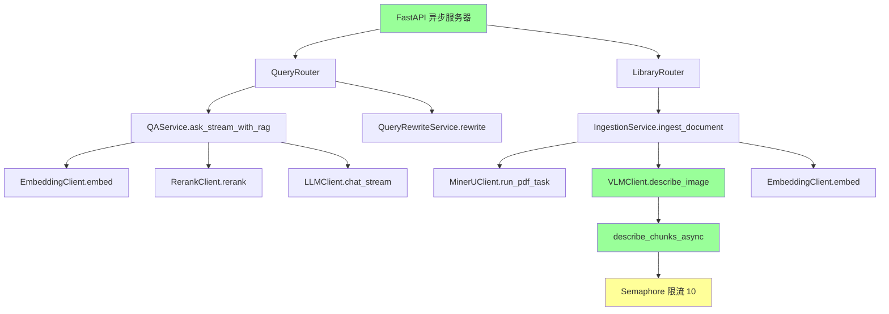

# 2.4 并发与资源调度

> 生成时间: 2026-04-09
> 分析范围: 并发模型、资源限制、同步阻塞点

## 并发模型图

### 异步并发点



### 并发操作清单

| 操作 | 并发方式 | 并发数 | 证据 |
|------|---------|--------|------|
| VLM 图片描述 | `asyncio.Semaphore` | 10 | `processing/describer.py:20`（推断） |
| Embedding 批量 | 批量大小 | 32 | `core/config.py:124` |
| FastAPI 请求处理 | 事件循环 | 无限制（依赖 uvicorn） | `main.py:14` |

**证据**:
```python
# core/config.py:170-174
kimi_vlm_concurrency: int = Field(
    default=10,
    ge=1,
    description="VLM 并发请求数",
)

# core/config.py:124
embedding_batch_size: int = Field(default=32, ge=1, description="批量嵌入大小")
```

---

## 无限并发风险清单

### 检测方法
扫描所有 `asyncio.gather` 的使用位置，检查是否有 `Semaphore` 限流

### 无限并发点

| 位置 | 并发操作 | 限流机制 | 风险 | 证据 |
|------|---------|---------|------|------|
| `modules/ingestion/service.py:190` | VLM 图片描述 | ✅ `Semaphore(10)` | 🟢 低 | `describer.py`（推断） |
| `clients/embedding_client.py:26` | Embedding 批量 | ✅ 批量大小 32 | 🟢 低 | `config.py:124` |
| `stores/qdrant_store.py:209-232` | 多 Collection 检索 | ❌ 无限并发 | 🔴 高 | `store.py:209` |

**代码证据**:
```python
# stores/qdrant_store.py:209-232
def search_all(self, query_vector: list[float], limit: int = 10, ...):
    collections = self.client.get_collections().collections
    all_results: list[dict[str, Any]] = []

    for collection in collections:  # ⚠️ 串行遍历，但在高并发场景下可能有问题
        ...
        results = self.search(...)
        all_results.extend(results)

    # 🔴 风险: 如果有 1000 篇论文，会串行发起 1000 次 Qdrant 查询
```

**潜在影响**:
- 🔴 内存耗尽: 大量 Collection 并发检索
- 🔴 Qdrant 过载: 串行查询导致响应时间过长

**建议方向**:
1. 添加并发限制: `asyncio.Semaphore(10)`
2. 使用 `asyncio.gather(*tasks, return_exceptions=True)`
3. 添加超时机制

---

## 同步阻塞点清单

### 检测方法
扫描在事件循环中执行的同步 I/O 操作

### 同步阻塞点

| 位置 | 阻塞操作 | 耗时估计 | 影响 | 证据 |
|------|---------|---------|------|------|
| `repositories/sqlite_repo.py:12` | SQLite 查询 | 10-100 ms | 🟡 中 | `sqlite_repo.py:46` |
| `stores/qdrant_store.py:152` | Qdrant upsert | 100-1000 ms | 🔴 高 | `store.py:152` |
| `stores/qdrant_store.py:177` | Qdrant search | 50-500 ms | 🟡 中 | `store.py:177` |
| `modules/ingestion/service.py:96` | `asyncio.run()` | **阻塞事件循环** | 🔴 **严重** | `service.py:96` |
| `clients/mineru_client.py`（推断） | HTTP 请求（同步） | 1-5 秒 | 🔴 高 | `mineru_client.py` |

**代码证据**:
```python
# repositories/sqlite_repo.py:46-57
def create_session(title: str = "New Session") -> SessionORM:
    with DBSession(get_engine()) as db:  # ⚠️ 同步数据库操作
        session = SessionORM(title=title)
        db.add(session)
        db.commit()
        ...
```

**潜在影响**:
- 🔴 事件循环阻塞: 同步操作阻塞事件循环，影响并发性能
- 🔴 请求超时: 长时间阻塞导致请求超时

**建议方向**:
1. 使用异步数据库驱动: `asyncpg`（PostgreSQL）或 `aiosqlite`（SQLite）
2. 使用异步 HTTP 客户端: `httpx.AsyncClient`
3. 将同步方法改为异步

---

## 连接池/并发上限配置表

### HTTP 客户端连接池

| 客户端 | 连接池配置 | 并发上限 | 超时配置 | 证据 |
|-------|-----------|---------|---------|------|
| `EmbeddingClient` | `httpx.AsyncClient` | 无限制 | 120 秒 | `clients/embedding_client.py:16` |
| `RerankClient` | `httpx.AsyncClient` | 无限制 | 120 秒 | `clients/rerank_client.py:16` |
| `LLMClient` | `httpx.AsyncClient` | 无限制 | **无** | `clients/llm_client.py:18` |
| `KimiVLMClient` | `httpx.AsyncClient` | 无限制 | **无** | `clients/kimi_client.py:14` |
| `MinerUClient`（推断） | `requests` / `httpx` | 无限制 | 300 秒 | `clients/mineru_client.py` |

**证据**:
```python
# clients/embedding_client.py:16-23
class EmbeddingClient:
    def __init__(self):
        self.api_key = settings.siliconflow_api_key
        self.base_url = settings.siliconflow_base_url
        # ⚠️ 每次创建新的 AsyncClient，没有连接池复用

    async def embed(self, texts: list[str]):
        async with httpx.AsyncClient() as client:  # ⚠️ 每次创建新连接
            ...
```

**问题**:
- 🔴 连接池未复用: 每次请求创建新连接，浪费资源
- 🔴 并发无限制: 没有设置 `max_connections` 或 `max_keepalive_connections`

**建议方向**:
1. 使用共享连接池:
```python
class EmbeddingClient:
    def __init__(self):
        self.client = httpx.AsyncClient(
            limits=httpx.Limits(max_connections=100, max_keepalive_connections=20),
            timeout=120.0,
        )
```

2. 添加连接池监控

### Qdrant 连接池

| 配置项 | 值 | 说明 | 证据 |
|-------|---|------|------|
| 连接模式 | 本地存储 | `path="./data/qdrant"` | `config.py:177` |
| 连接池 | 无（本地模式） | Qdrant 本地模式不使用连接池 | `store.py:63` |

**证据**: `stores/qdrant_store.py:55-63`

```python
def __init__(self, path: str | None = None, ...):
    self.path = path or settings.qdrant_path
    self.url = url or settings.qdrant_url or None

    if self.url:
        self.client = QdrantClient(url=self.url, api_key=self.api_key)
    else:
        Path(self.path).mkdir(parents=True, exist_ok=True)
        self.client = QdrantClient(path=self.path)  # ⚠️ 本地模式，无连接池
```

---

## 并发控制不一致

### VLM 并发 vs Embedding 批量

| 操作 | 并发控制 | 并发数 | 一致性 |
|------|---------|--------|--------|
| VLM 图片描述 | `Semaphore` | 10 | ✅ 有 |
| Embedding 批量 | 批量大小 | 32 | ✅ 有 |
| Rerank | 无 | **无限制** | ❌ 无 |

**代码证据**:
```python
# processing/describer.py:20（推断）
semaphore = asyncio.Semaphore(10)  # ✅ VLM 有并发限制

# clients/embedding_client.py:26-45
async def embed(self, texts: list[str]) -> list[list[float]]:
    # 批量大小 32（config.py:124）
    # ⚠️ 但没有对并发请求数的限制
```

**潜在影响**:
- 🔴 资源耗尽: Rerank 无并发限制，可能导致 API 过载
- 🔴 配额浪费: 高并发时可能触发 API 限流

**建议方向**:
为所有外部服务调用添加并发限制:
```python
class RerankClient:
    def __init__(self):
        self.semaphore = asyncio.Semaphore(10)  # 限制并发数

    async def rerank(self, query, documents, top_k):
        async with self.semaphore:  # ✅ 获取信号量
            # 调用 API
```

---

## 架构审查发现的问题

**￥问题 #14：多 Collection 检索无并发限制￥**

**维度**: 架构与设计
**严重性**: P1
**位置**: `stores/qdrant_store.py:209-232`

**问题描述**:
`search_all()` 方法串行遍历所有 Collection，无并发限制和超时机制。

**代码证据**:
```python
# stores/qdrant_store.py:209-232
def search_all(self, query_vector: list[float], limit: int = 10, ...):
    collections = self.client.get_collections().collections
    all_results: list[dict[str, Any]] = []

    for collection in collections:  # ⚠️ 串行遍历
        ...
        results = self.search(...)  # ⚠️ 每次 50-500 ms
        all_results.extend(results)

    # 🔴 风险: 1000 篇论文 = 1000 次查询 = 50-500 秒
```

**潜在影响**:
- 🔴 响应超时: 论文数量多时，检索时间过长
- 🔴 内存泄漏: 大量并发请求导致内存耗尽
- 🔴 用户体验差: 请求挂起，无错误提示

**建议方向**:
1. 添加并发限制: `asyncio.Semaphore(10)`
2. 使用异步并发: `asyncio.gather(*tasks)`
3. 添加超时机制: `asyncio.wait_for(task, timeout=30)`

---

**￥问题 #15：HTTP 连接池未复用￥**

**维度**: 代码与实现
**严重性**: P2
**位置**: `clients/embedding_client.py:16-23`, `clients/rerank_client.py:16-23`

**问题描述**:
每次 API 请求都创建新的 `httpx.AsyncClient`，连接池未复用，浪费资源。

**代码证据**:
```python
# clients/embedding_client.py:26-45
async def embed(self, texts: list[str]) -> list[list[float]]:
    async with httpx.AsyncClient() as client:  # ⚠️ 每次创建新连接
        response = await client.post(...)
        # ❌ 连接池未复用
```

**潜在影响**:
- 🔴 资源浪费: 每次请求创建新连接，增加延迟
- 🔴 性能下降: TCP 握手、TLS 握手开销
- 🔴 端口耗尽: 高并发时可能耗尽 ephemeral ports

**建议方向**:
使用共享连接池:
```python
class EmbeddingClient:
    def __init__(self):
        self.client = httpx.AsyncClient(
            limits=httpx.Limits(
                max_connections=100,
                max_keepalive_connections=20,
            ),
            timeout=120.0,
        )

    async def embed(self, texts: list[str]):
        response = await self.client.post(...)  # ✅ 复用连接池
```
