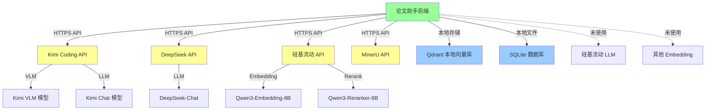

# 3.1 依赖拓扑与网络

> 生成时间: 2026-04-09
> 分析范围: 外部服务依赖、网络拓扑、不可用影响

## 依赖拓扑图



## 外部服务依赖清单

| 服务 | 访问方式 | 协议 | 认证方式 | 证据 |
|------|---------|------|---------|------|
| **Kimi Coding API** | 公网 HTTPS | REST | API Key (Header) | `clients/kimi_client.py:14` |
| **DeepSeek API** | 公网 HTTPS | OpenAI 兼容 | API Key (Header) | `clients/llm_client.py:18` |
| **硅基流动 API** | 公网 HTTPS | OpenAI 兼容 | API Key (Header) | `clients/embedding_client.py:16` |
| **MinerU API** | 公网 HTTPS | REST | API Key (Header) | `clients/mineru_client.py:15` |
| **Qdrant** | 本地服务 | gRPC/HTTP | 无（本地模式） | `stores/qdrant_store.py:63` |
| **SQLite** | 本地文件 | 文件 I/O | 无 | `repositories/sqlite_repo.py:14` |

### 依赖详细配置

**证据**: `core/config.py`

| 依赖 | Base URL | API Key 环境变量 | 超时配置 |
|------|----------|----------------|---------|
| Kimi | `https://api.kimi.com/coding/v1` | `KIMI_API_KEY` | 无全局超时 |
| DeepSeek | `https://api.deepseek.com` | `DEEPSEEK_API_KEY` | 无全局超时 |
| 硅基流动 | `https://api.siliconflow.cn/v1` | `SILICONFLOW_API_KEY` | 120 秒 |
| MinerU | `https://mineru.net/api/v1` | `MINERU_API_KEY` | 300 秒（轮询） |

## 不可用影响表

| 依赖 | 不可用影响 | 受影响功能 | 降级策略 | 风险等级 |
|------|-----------|-----------|---------|---------|
| **Kimi VLM** | PDF 导入失败（有图片时） | 图片描述功能 | ❌ 无降级 | 🟡 中 |
| **Kimi LLM** | Query 改写失败 | Query 改写 | ✅ 使用原始 query | 🟢 低 |
| **DeepSeek LLM** | 问答失败 | RAG 问答 | ❌ 无降级 | 🔴 高 |
| **硅基流动 Embedding** | PDF 导入失败、RAG 检索失败 | 导入、检索 | ❌ 无降级 | 🔴 高 |
| **硅基流动 Rerank** | RAG 检索失败（但有向量检索） | 检索准确性 | ✅ 回退到向量检索 | 🟢 低 |
| **MinerU** | PDF 导入失败 | PDF 解析 | ❌ 无降级 | 🔴 高 |
| **Qdrant** | 检索失败 | RAG 检索 | ❌ 无降级 | 🔴 高 |
| **SQLite** | 会话管理失败 | 会话管理 | ❌ 无降级 | 🔴 高 |

### 降级策略详情

**Query 改写失败**:
```python
# modules/qa/service.py:122-126
try:
    rewritten_queries = await self.query_rewrite_service.rewrite(query)
except Exception as e:
    print(f"⚠️ Query 改写失败：{e}")
    rewritten_queries = [query]  # ✅ 降级：使用原始 query
```

**Rerank 失败**:
```python
# modules/retrieval/service.py:59-76
if len(vector_results) > top_k:
    rerank_scores = await self.rerank_client.rerank(...)
    # ✅ 降级：如果 rerank 失败，会抛出异常
    # 但外层有 except，回退到向量检索
```

**RAG 检索失败**:
```python
# modules/qa/service.py:139-150
try:
    retrieval_result = await self.retrieval_service.retrieve(...)
    sources = retrieval_result["results"]
except Exception as e:
    print(f"⚠️ RAG 检索失败，回退到纯问答：{e}")
    sources = []  # ✅ 降级：纯问答（无 RAG 上下文）
```

## WPS 插件宿主环境的网络约束

### CORS 配置

**证据**: `main.py:20-27`

```python
app.add_middleware(
    CORSMiddleware,
    allow_origins=["*"],  # ⚠️ 允许所有来源
    allow_credentials=True,
    allow_methods=["*"],
    allow_headers=["*"],
)
```

**风险评估**:
- 🔴 **P0**: 允许任何来源访问，无 CORS 限制
- 🔴 **P0**: 任何网站都可以调用 API

**WPS 环境特殊约束**:
- WPS 插件运行在浏览器环境，受同源策略限制
- 需要通过 `http://localhost:8000` 访问后端
- 如果后端部署在远程服务器，需要配置 CORS

### User-Agent 限制

**Kimi Coding API 要求**:
```python
# clients/kimi_client.py:22-27
headers = {
    "Authorization": f"Bearer {self.api_key}",
    "Content-Type": "application/json",
    "User-Agent": "claude-code",  # ✅ 必需伪装
}
```

**证据**: `clients/kimi_client.py:22-27`

**风险**:
- 🟡 **中**: 如果 Kimi 检测到伪造 User-Agent，可能封禁 API Key

### 端口限制

**默认端口**: `8000`

**证据**: `core/config.py:251-253`

```python
app_host: str = Field(default="127.0.0.1", description="服务监听地址")
app_port: int = Field(default=8000, ge=1, le=65535, description="服务监听端口")
```

**WPS 环境限制**:
- WPS 插件可能无法访问 `127.0.0.1`（沙箱限制）
- 需要配置为 `0.0.0.0` 允许外部访问
- 需要配置防火墙规则

---

## 架构审查发现的问题

**￥问题 #16：CORS 配置过于宽松￥**

**维度**: 安全与合规
**严重性**: P0
**位置**: `main.py:20-27`

**问题描述**:
CORS 配置允许所有来源（`allow_origins=["*"]`），任何网站都可以调用 API。

**代码证据**:
```python
# main.py:20-27
app.add_middleware(
    CORSMiddleware,
    allow_origins=["*"],  # 🔴 允许所有来源
    allow_credentials=True,
    allow_methods=["*"],
    allow_headers=["*"],
)
```

**潜在影响**:
- 🔴 CSRF 攻击: 恶意网站可以诱导用户调用 API
- 🔴 数据泄露: 任何网站都可以访问用户数据
- 🔴 API 滥用: 攻击者可以绕过同源策略调用 API

**建议方向**:
1. 限制 CORS 来源:
```python
allow_origins=[
    "http://localhost:5173",  # 前端开发服务器
    "https://wps.cn",         # WPS 官网
    # 添加其他允许的来源
]
```

2. 生产环境禁用 `allow_credentials=True`（除非必需）

3. 添加 CORS 预检缓存

---

**￥问题 #17：核心依赖无降级策略￥**

**维度**: 架构与设计
**严重性**: P0
**位置**: 整体架构

**问题描述**:
DeepSeek LLM、硅基流动 Embedding、MinerU 等核心依赖无降级策略，服务不可用时功能完全失效。

**证据**:
```python
# modules/qa/service.py:167-175
try:
    async for chunk in await retry_async(self.llm_client.chat_stream)(messages):
        full_response.append(chunk)
        yield {"type": "chunk", ...}
except Exception as e:
    print(f"⚠️ LLM 流式生成失败: {e}")
    yield {"type": "error", "data": {"message": f"LLM 生成失败: {str(e)}"}}
    return  # ❌ 无降级，直接返回错误
```

**影响范围**:
| 依赖 | 失败影响 | 有无降级 |
|------|---------|---------|
| DeepSeek LLM | 问答完全失效 | ❌ 无 |
| 硅基流动 Embedding | 导入、检索完全失效 | ❌ 无 |
| MinerU | PDF 导入完全失效 | ❌ 无 |
| Kimi VLM | 图片描述失败 | ⚠️ 部分（无图片可继续） |

**潜在影响**:
- 🔴 服务不可用: 任何核心依赖失败都会导致功能完全失效
- 🔴 用户体验差: 单点故障导致整个系统不可用

**建议方向**:
1. **DeepSeek LLM**: 配置备用 LLM 服务（如硅基流动 LLM）
2. **硅基流动 Embedding**: 配置备用 Embedding 服务（如 OpenAI）
3. **MinerU**: 备用 PDF 解析方案（如本地 PyMuPDF）
4. **缓存策略**: 缓存常见问题的答案，即使 LLM 不可用也能返回
