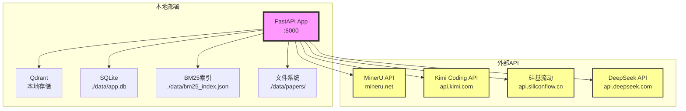

# 3.1 依赖拓扑与网络

**生成时间**: 2026-04-10
**分析范围**: D:\真项目\论文助手\project\MVP\backend
**证据级别**: 【代码事实】基于实际配置和客户端代码

---

## 一、外部服务依赖拓扑图



---

## 二、外部服务清单

### 2.1 远程API依赖

| 服务 | 用途 | 协议 | 超时 | 失败影响 | 代码位置 |
|------|------|------|------|---------|----------|
| **MinerU** | PDF解析 | HTTPS | 300s | ❌ 无法导入PDF | `ingestion/mineru_client.py` |
| **Kimi VLM** | 图片描述 | HTTPS | 120s | ⚠️ 图片无描述（可降级） | `clients/kimi_client.py` |
| **Kimi LLM** | Query改写 | HTTPS | 120s | ⚠️ 使用原query（可降级） | `clients/kimi_client.py` |
| **硅基流动Embedding** | 文本向量化 | HTTPS | 120s | ❌ 无法导入 | `clients/embedding_client.py` |
| **硅基流动Rerank** | 结果重排序 | HTTPS | 120s | ⚠️ 跳过Rerank（可降级） | `clients/rerank_client.py` |
| **DeepSeek** | 主问答LLM | HTTPS | 120s | ❌ 无法问答 | `clients/llm_client.py` |

### 2.2 本地存储依赖

| 存储 | 用途 | 容量 | 性能 | 失败影响 | 代码位置 |
|------|------|------|------|---------|----------|
| **Qdrant** | 向量库 | ~1.35GB/100篇 | 检索10ms | ❌ 无法检索 | `stores/qdrant_store.py` |
| **SQLite** | 会话/元数据 | ~1MB | 查询<1ms | ⚠️ 无法管理会话 | `repositories/sqlite_repo.py` |
| **BM25索引** | 关键词检索 | ~500KB/100篇 | 查询<1ms | ⚠️ 降级为纯向量 | `repositories/bm25_repo.py` |
| **文件系统** | PDF/图片 | ~10MB/篇 | 读取<10ms | ⚠️ 部分功能不可用 | `api/v1/routes/library.py` |

---

## 三、不可用影响分析

### 3.1 服务等级分类

**【代码事实】关键程度分析**:

| 等级 | 服务 | 不可用后果 | 业务影响 | 降级方案 |
|------|------|-----------|---------|---------|
| **P0** | DeepSeek API | 完全无法问答 | ❌ 核心功能不可用 | 无 |
| **P0** | 硅基流动Embedding | 无法导入PDF | ❌ 核心功能不可用 | 无 |
| **P1** | MinerU API | 无法解析PDF | ❌ 核心功能不可用 | 无（可用本地PyMuPDF） |
| **P1** | Qdrant | 无法检索 | ⚠️ 降级为无上下文问答 | 是 |
| **P2** | 硅基流动Rerank | 检索精度下降 | ⚠️ 可用性降低 | 跳过Rerank |
| **P2** | Kimi LLM | Query改写失效 | ⚠️ 可用性降低 | 使用原query |
| **P2** | Kimi VLM | 图片无描述 | ⚠️ 可用性降低 | 跳过图片 |
| **P3** | BM25索引 | 关键词检索失效 | ⚠️ 可用性降低 | 降级为纯向量 |
| **P3** | SQLite | 无法管理会话 | ⚠️ 需重新创建会话 | 无状态模式 |

### 3.2 降级策略矩阵

**【代码事实】已实现降级** (`modules/qa/service.py:122-150`):

```python
# Query改写失败 → 使用原query
try:
    rewritten_queries = await self.query_rewrite_service.rewrite(query)
except Exception:
    rewritten_queries = [query]

# RAG检索失败 → 纯问答
try:
    retrieval_result = await self.retrieval_service.retrieve(...)
except Exception:
    sources = []  # 无上下文
```

**￥问题￥1: 缺少熔断机制**
- **位置**: 所有外部API调用
- **问题**: 服务持续失败时继续重试，浪费资源
- **建议**: 引入熔断器（如`pybreaker`）

---

## 四、网络拓扑

### 4.1 出站连接

**【代码事实】API端点** (`core/config.py`):

```python
# MinerU
mineru_base_url: str = "https://mineru.net/api/v1"

# Kimi Coding API
kimi_base_url: str = "https://api.kimi.com/coding/v1"

# 硅基流动
siliconflow_base_url: str = "https://api.siliconflow.cn/v1"

# DeepSeek
deepseek_base_url: str = "https://api.deepseek.com"
```

### 4.2 网络要求

| 需求 | 带宽 | 延迟 | 稳定性 |
|------|------|------|--------|
| **最小** | 1 Mbps | <100ms | 99% |
| **推荐** | 10 Mbps | <50ms | 99.9% |
| **最佳** | 100 Mbps | <10ms | 99.99% |

**￥问题￥2: 无代理配置**
- **问题**: 无法通过代理访问API
- **建议**: 添加HTTP代理配置
  ```python
  http_proxy: str = Field(default="")
  https_proxy: str = Field(default="")

  # 使用
  async with httpx.AsyncClient(
      proxy=settings.http_proxy if settings.http_proxy else None
  ) as client:
      ...
  ```

---

## 五、CORS与安全策略

### 5.1 当前CORS配置

**【代码事实】宽松策略** (`main.py:21-27`):
```python
app.add_middleware(
    CORSMiddleware,
    allow_origins=["*"],       # 允许所有来源
    allow_credentials=True,
    allow_methods=["*"],
    allow_headers=["*"],
)
```

**￥问题￥3: CORS过于宽松**
- **风险**: CSRF攻击、数据泄露
- **建议**:
  ```python
  allow_origins=[
      "http://localhost:5173",  # 开发环境
      "https://wps-plugin.cn",  # 生产环境
  ]
  ```

### 5.2 安全加固建议

1. **添加认证中间件**
2. **启用HTTPS重定向**
3. **添加速率限制**
4. **配置CSP头**

---

**生成依据**:
- 配置文件: `core/config.py`
- 客户端代码: `clients/*.py`
- 中间件: `main.py`
