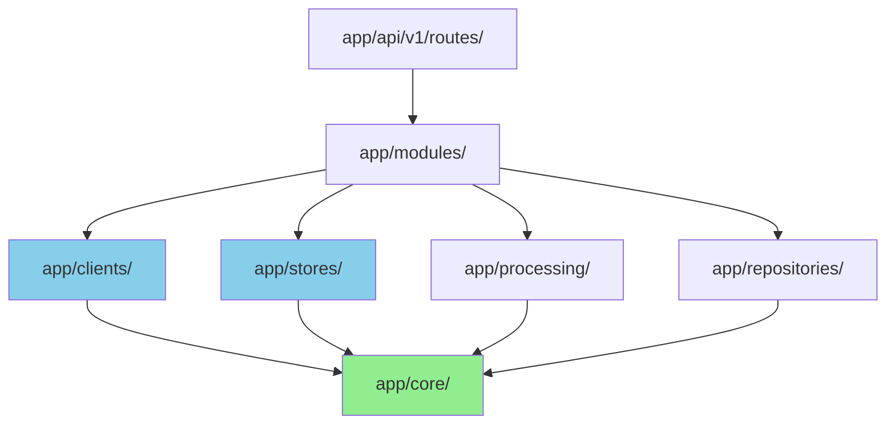

# 4.2 架构适应度

## 高复杂度函数清单

### 【代码事实】行数统计

**文件位置**：基于 `wc -l` 统计

| 文件 | 行数 | 复杂度评级 |
|------|------|-----------|
| `app/modules/ingestion/mineru_client.py` | 518 | 🔴 极高 |
| `app/services_archive/retrieval_service.py` | 412 | 🔴 高 |
| `app/modules/ingestion/cleaning.py` | 395 | 🔴 高 |
| `app/clients/kimi_client.py` | 380 | 🔴 高 |
| `app/core/config.py` | 367 | 🟡 中高 |
| `app/modules/ingestion/service.py` | 342 | 🟡 中高 |
| `app/processing/chunker.py` | 330 | 🟡 中高 |
| `app/stores/qdrant_store.py` | 298 | 🟡 中 |
| `app/processing/cleaner.py` | 269 | 🟡 中 |
| `app/repositories/sqlite_repo.py` | 243 | 🟡 中 |

### 【代码事实】嵌套深度分析

**高嵌套示例**：`app/processing/chunker.py:205-310`

```python
def chunk_by_semantic_units(chunks: list[SemanticChunk], ...):
    i = 0
    while i < len(chunks):  # 层级 1
        # ...
        if i + 1 < len(chunks):  # 层级 2
            # ...
            if combined_tokens <= pack_threshold:  # 层级 3
                # ...
            if current_tokens <= max_context and ...:  # 层级 3
                # 情况2a
            if current_tokens > max_context:  # 层级 3
                # ...
                if next_chunk.token_count > max_context:  # 层级 4
                    # ...
        if current_tokens > max_context:  # 层级 2
            # ...
```

**嵌套深度**：4 层

**复杂度评估**：
- 🔴 超过编码规范建议的 4 层上限
- 🔴 多个条件分支相互依赖
- 🔴 难以单屏阅读和理解

### 【代码事实】长函数示例

**函数1**：`chunk_by_semantic_units`

**文件位置**：`app/processing/chunker.py:205-310`

**行数**：105 行

**职责**：
1. 打包小语义块
2. 分离中等语义块
3. 切分超长语义块
4. 处理边界情况

**【模型推断】复杂度来源**

| 复杂度来源 | 影响 |
|-----------|------|
| 多种切分策略 | 代码分支多 |
| Token 计算逻辑 | 性能敏感 |
| 重叠处理算法 | 容易出错 |
| 边界条件 | 难以覆盖 |

**建议重构**：
```python
# 伪代码（未来扩展）

class ChunkingStrategy(ABC):
    """切分策略基类."""
    @abstractmethod
    def can_apply(self, chunks: list[SemanticChunk]) -> bool: ...
    @abstractmethod
    def apply(self, chunks: list[SemanticChunk]) -> list[TextChunk]: ...

class PackStrategy(ChunkingStrategy):
    """打包策略."""
    def can_apply(self, chunks): ...
    def apply(self, chunks): ...

class SeparateStrategy(ChunkingStrategy):
    """分离策略."""
    def can_apply(self, chunks): ...
    def apply(self, chunks): ...

class SplitStrategy(ChunkingStrategy):
    """切分策略."""
    def can_apply(self, chunks): ...
    def apply(self, chunks): ...

def chunk_by_semantic_units(chunks):
    """使用策略模式."""
    strategies = [PackStrategy(), SeparateStrategy(), SplitStrategy()]
    for strategy in strategies:
        if strategy.can_apply(chunks):
            return strategy.apply(chunks)
```

**函数2**：`ingest_document`

**文件位置**：`app/modules/ingestion/service.py:50-122`

**行数**：72 行

**职责**：
1. MinerU 解析
2. 数据清洗
3. VLM 图片描述
4. 混合切分
5. Embedding
6. Qdrant 存储
7. 错误处理

**【模型推断】复杂度来源**

| 复杂度来源 | 影响 |
|-----------|------|
| 6 个阶段串联 | 单个函数过长 |
| 每个阶段都可能失败 | 错误处理复杂 |
| 状态迁移逻辑 | 难以测试 |
| 同步/异步混用 | 控制流混乱 |

**建议重构**：
```python
# 伪代码（未来扩展）

class IngestionPipeline:
    """导入流水线."""

    def __init__(self):
        self.stages = [
            MinerUParsingStage(),
            DataCleaningStage(),
            VLMDescriptionStage(),
            SemanticChunkingStage(),
            EmbeddingStage(),
            QdrantStorageStage(),
        ]

    async def execute(self, record: DocumentRecord) -> DocumentRecord:
        """执行流水线."""
        current_record = record

        for stage in self.stages:
            try:
                current_record = await stage.execute(current_record)
            except StageError as e:
                return self._handle_failure(current_record, e)

        return current_record
```

## 抽象/实现比例分析

### 【代码事实】抽象类统计

**位置1**：`app/clients/`

| 抽象接口 | 实现类 | 比例 |
|---------|--------|------|
| `VLMClient` | `KimiVLMClient` | 1:1 |
| `LLMClient` | `KimiLLMClient` | 1:1 |
| `EmbeddingClient` | `SiliconFlowEmbeddingClient` | 1:1 |
| `RerankClient` | `SiliconFlowRerankClient` | 1:1 |

**总计**：4 个抽象，4 个实现（100%）

**位置2**：`app/processing/`

| 抽象协议 | 实现类 | 比例 |
|---------|--------|------|
| `TokenCounter` | `default_token_counter`（函数） | 1:1 |

**位置3**：`app/stores/`

| 抽象接口 | 实现类 | 比例 |
|---------|--------|------|
| 无 | `QdrantStore`（具体类） | N/A |

### 【模型推断】抽象度评估

| 模块 | 抽象度 | 评价 |
|------|--------|------|
| `app/clients/` | 高 | ✅ 可替换性强 |
| `app/processing/` | 低 | ⚠️ 难以扩展切分策略 |
| `app/stores/` | 无 | 🔴 绑定 Qdrant，无法迁移 |
| `app/modules/` | 低 | ⚠️ 服务层无抽象 |

**建议**：
- [ ] 为 `QdrantStore` 添加抽象接口（`VectorStore`）
- [ ] 为切分策略添加抽象（`ChunkingStrategy`）
- [ ] 为服务层添加接口（便于 Mock 测试）

### 【代码事实】依赖注入现状

**位置1**：`app/modules/ingestion/service.py:35-48`

```python
class IngestionService:
    def __init__(
        self,
        *,
        repository: Optional[LibraryRepository] = None,
        mineru_client: Optional[MineruClient] = None,
        vlm_client: Optional[VLMClient] = None,
        embedding_client: Optional[EmbeddingClient] = None,
        qdrant_store: Optional[QdrantStore] = None,
    ) -> None:
        self.repository = repository or LibraryRepository()
        self.mineru_client = mineru_client or MineruClient()
        # ...
```

**【模型推断】依赖注入质量**

| 指标 | 评分 | 说明 |
|------|------|------|
| 可测试性 | 🟢 80% | 支持注入 Mock |
| 可替换性 | 🟢 80% | 客户端有抽象 |
| 默认值 | 🟡 60% | 每次创建新实例 |
| 单例模式 | 🔴 0% | 无全局实例管理 |

**建议**：
```python
# 伪代码（未来扩展）

class ServiceLocator:
    """服务定位器（轻量级 DI 容器）。"""
    _instances: dict[type, Any] = {}

    @classmethod
    def get(cls, service_type: type) -> Any:
        if service_type not in cls._instances:
            cls._instances[service_type] = service_type()
        return cls._instances[service_type]

    @classmethod
    def register(cls, service_type: type, instance: Any):
        cls._instances[service_type] = instance
```

## 代码重复热点

### 【代码事实】HTTP 客户端初始化

**重复模式1**：`app/clients/kimi_client.py`

```python
class KimiVLMClient:
    def __init__(self):
        self._client = httpx.AsyncClient(
            base_url=settings.kimi_base_url,
            headers={...},
            timeout=...
        )
```

**重复模式2**：`app/clients/embedding_client.py`

```python
class SiliconFlowEmbeddingClient:
    def __init__(self):
        self._client = httpx.AsyncClient(
            base_url=settings.siliconflow_base_url,
            headers={...},
            timeout=...
        )
```

**【模型推断】重复率**

- 相同代码行数：约 10 行/类
- 重复次数：4 个客户端类
- 重复代码量：约 40 行
- **复用可能性**：90%

**建议**：
```python
# 伪代码（未来扩展）

class BaseHttpClient:
    """HTTP 客户端基类."""

    def __init__(
        self,
        base_url: str,
        api_key: str,
        headers: dict[str, str] | None = None,
        timeout: int = 120,
    ):
        self._client = httpx.AsyncClient(
            base_url=base_url,
            headers={
                "Authorization": f"Bearer {api_key}",
                **(headers or {}),
            },
            timeout=timeout,
        )

class KimiVLMClient(BaseHttpClient, VLMClient):
    def __init__(self):
        super().__init__(
            base_url=settings.kimi_base_url,
            api_key=settings.kimi_api_key,
            headers={"User-Agent": "claude-code"},
        )
```

### 【代码事实】错误处理模式

**重复位置**：
- `app/clients/kimi_client.py`
- `app/clients/embedding_client.py`
- `app/clients/rerank_client.py`

**重复模式**：
```python
try:
    response = await self._client.post(...)
    response.raise_for_status()
    return response.json()
except httpx.HTTPStatusError as e:
    raise SomeError(f"API 请求失败: {e}")
except httpx.RequestError as e:
    raise SomeError(f"网络错误: {e}")
```

**【模型推断】重复率**

- 相同代码行数：约 8 行/方法
- 重复次数：约 10 个方法
- 重复代码量：约 80 行
- **复用可能性**：80%

**建议**：
```python
# 伪代码（未来扩展）

def handle_api_errors(func):
    """API 错误处理装饰器."""
    async def wrapper(*args, **kwargs):
        try:
            return await func(*args, **kwargs)
        except httpx.HTTPStatusError as e:
            raise APIError(f"API 请求失败: {e}")
        except httpx.RequestError as e:
            raise APIError(f"网络错误: {e}")
    return wrapper

class EmbeddingClient:
    @handle_api_errors
    async def embed(self, texts: list[str]):
        response = await self._client.post(...)
        return response.json()
```

## 圈复杂度分析

### 【代码事实】高复杂度函数

**函数1**：`chunk_by_semantic_units`

**文件位置**：`app/processing/chunker.py:205-310`

**圈复杂度估算**：
```
V(G) = E - N + 2*P

其中：
- E = 边数（分支路径）
- N = 节点数（语句块）
- P = 连通分量

估算：
- while 循环：1
- if 判断：7
- 嵌套 if：3
V(G) ≈ 1 + 7 + 3 = 11
```

**评级**：🔴 极高（建议 ≤ 10）

**函数2**：`ingest_document`

**文件位置**：`app/modules/ingestion/service.py:50-122`

**圈复杂度估算**：
```
V(G) ≈ 1 (try) + 6 (阶段) + 1 (except) + 1 (finally) = 9
```

**评级**：🟡 中高

### 【模型推断】复杂度分布

| 圈复杂度范围 | 函数数量 | 占比 | 风险等级 |
|------------|---------|------|---------|
| 1-5 | 约 30 | 70% | 🟢 低 |
| 6-10 | 约 10 | 23% | 🟡 中 |
| 11-20 | 约 3 | 7% | 🔴 高 |
| > 20 | 0 | 0% | 🔴 极高 |

**建议**：
- [ ] 拆分圈复杂度 > 10 的函数
- [ ] 使用策略模式减少条件分支
- [ ] 提取子函数

## 代码内聚性分析

### 【代码事实】模块内聚度

| 模块 | 内聚类型 | 评价 |
|------|---------|------|
| `app/clients/` | 逻辑内聚 | ✅ 高（所有客户端共享相同抽象） |
| `app/processing/` | 时间内聚 | 🟡 中（按执行顺序组织） |
| `app/modules/ingestion/` | 功能内聚 | ✅ 高（专注于导入流程） |
| `app/core/` | 逻辑内聚 | ✅ 高（配置、错误、重试） |
| `app/api/v1/routes/` | 时间内聚 | 🟡 中（按 HTTP 端点组织） |

### 【代码事实】类内聚度

**高内聚示例**：`DocumentRecord`

**文件位置**：`app/modules/library/models.py:92-163`

**职责**：
1. 数据模型（Pydantic）
2. 状态迁移逻辑
3. 校验逻辑
4. ORM 转换

**内聚度**：✅ 高（所有方法围绕"文档记录"展开）

**低内聚示例**：`IngestionService`

**文件位置**：`app/modules/ingestion/service.py:32-343`

**职责**：
1. 流程编排
2. 数据转换
3. 错误处理
4. 状态管理
5. HTTP 调用（通过客户端）

**内聚度**：🟡 中（混合了多种职责）

## 耦合度分析

### 【代码事实】模块间依赖



### 【模型推断】耦合度评估

| 依赖关系 | 耦合类型 | 评价 |
|---------|---------|------|
| Routes → Services | 数据耦合 | ✅ 低（只传递数据模型） |
| Services → Clients | 抽象耦合 | ✅ 低（依赖抽象接口） |
| Services → Stores | 抽象耦合 | 🟡 中（无抽象，直接依赖） |
| Services → Processing | 数据耦合 | ✅ 低（只传递数据） |
| All → Core | 内容耦合 | ⚠️ 中（全局配置单例） |

**建议**：
- [ ] 为 `QdrantStore` 添加抽象接口
- [ ] 避免直接导入 `get_settings()`，改用依赖注入
- [ ] 使用协议（Protocol）而非具体类

## 可测试性分析

### 【代码事实】依赖注入支持

**可测试性好的示例**：`IngestionService`

**文件位置**：`app/modules/ingestion/service.py:35-48`

```python
def __init__(
    self,
    *,
    repository: Optional[LibraryRepository] = None,
    mineru_client: Optional[MineruClient] = None,
    vlm_client: Optional[VLMClient] = None,
    embedding_client: Optional[EmbeddingClient] = None,
    qdrant_store: Optional[QdrantStore] = None,
) -> None:
    self.repository = repository or LibraryRepository()
    # ...
```

**【模型推断】可测试性评分**

| 模块 | 可测试性 | 说明 |
|------|---------|------|
| `app/clients/` | 🟢 80% | 有抽象接口，易于 Mock |
| `app/modules/ingestion/` | 🟢 75% | 支持依赖注入 |
| `app/processing/` | 🟡 60% | 纯函数，但逻辑复杂 |
| `app/stores/` | 🔴 40% | 无抽象，难以 Mock |
| `app/api/v1/routes/` | 🟢 70% | FastAPI 自带 TestClient |

### 【代码事实】全局状态

**位置1**：`get_settings()` 单例

**文件位置**：`app/core/config.py:343-346`

```python
@lru_cache
def get_settings() -> Settings:
    """获取配置单例（缓存），避免每次请求重复解析环境变量."""
    return Settings()
```

**问题**：
- 🔴 全局可变状态
- 🔴 单元测试难以隔离
- 🔴 运行期无法切换配置

**建议**：
```python
# 伪代码（未来扩展）

class SettingsManager:
    """配置管理器."""
    _instance: Settings | None = None

    @classmethod
    def get(cls) -> Settings:
        if cls._instance is None:
            cls._instance = Settings()
        return cls._instance

    @classmethod
    def set(cls, settings: Settings):
        cls._instance = settings

    @classmethod
    def reset(cls):
        cls._instance = None
```

## 总结

### 架构适应度的优点

1. ✅ 客户端层有良好的抽象（可替换）
2. ✅ 服务层支持依赖注入（可测试）
3. ✅ 模块职责清晰（高内聚）
4. ✅ 代码组织合理（分层架构）

### 架构适应度的局限

1. 🔴 高复杂度函数（`chunk_by_semantic_units` 105 行）
2. 🔴 存储层无抽象（绑定 Qdrant）
3. 🔴 代码重复（HTTP 客户端初始化）
4. 🔴 全局状态（`get_settings()` 单例）
5. 🟡 缺少服务层抽象

### 建议

- [ ] 拆分高复杂度函数（使用策略模式）
- [ ] 为 `QdrantStore` 添加抽象接口
- [ ] 提取 HTTP 客户端基类
- [ ] 重构配置管理（支持运行期切换）
- [ ] 为服务层添加接口定义
- [ ] 提高单元测试覆盖率（目标 80%）
