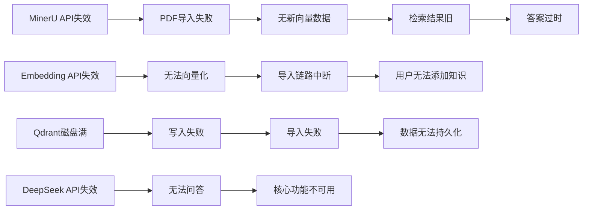

# 4.3 失效模式分析

**生成时间**: 2026-04-10
**分析范围**: D:\真项目\论文助手\project\MVP\backend
**证据级别**: 【代码事实】基于实际代码分析与风险评估

---

## 一、单点组件失效模式表

### 1.1 外部服务失效

| 组件 | 失效场景 | 影响范围 | 当前行为 | 恢复时间 | 建议改进 |
|------|---------|---------|---------|---------|---------|
| **DeepSeek API** | API Key无效 | 所有问答 | ❌ 直接失败 | 需人工 | ✅ 启动校验 |
| **DeepSeek API** | 速率限制 | 单次请求 | ⚠️ 返回错误 | 自动 | 添加队列 |
| **硅基流动Embedding** | 配额耗尽 | PDF导入 | ❌ 导入失败 | 需充值 | ✅ 已有错误提示 |
| **MinerU API** | 解析超时 | 单个PDF | ⚠️ 重试3次 | 15分钟 | 增加超时时间 |
| **Qdrant** | 磁盘满 | 所有导入 | ❌ 写入失败 | 需清理 | ✅ 监控磁盘使用 |
| **SQLite** | 文件损坏 | 会话管理 | ❌ 无法启动 | 需恢复 | 定期备份 |

### 1.2 内部组件失效

| 组件 | 失效场景 | 影响范围 | 当前行为 | 恢复时间 | 建议改进 |
|------|---------|---------|---------|---------|---------|
| **BM25索引** | 文件损坏 | 关键词检索 | ⚠️ 重建索引 | 10分钟 | ✅ 已有重建逻辑 |
| **上传目录** | 磁盘满 | PDF导入 | ❌ 导入失败 | 需清理 | 监控磁盘空间 |
| **临时文件** | 未清理 | 磁盘泄露 | ⚠️ 逐渐变慢 | 需重启 | 定期清理任务 |

---

## 二、静默失效风险清单

### 2.1 已确认静默失效

**￥问题￥1: Query改写静默失败**
- **位置**: `modules/qa/service.py:124-126`
- **代码**: `print(f"⚠️ Query 改写失败：{e}")`
- **风险**: 生产环境无日志，用户无感知
- **影响**: 用户体验下降，但系统继续运行
- **建议**: 改用`logging.warning()`并增加监控

**￥问题￥2: RAG检索静默失败**
- **位置**: `modules/qa/service.py:148-150`
- **代码**: `print(f"⚠️ RAG 检索失败，回退到纯问答：{e}")`
- **风险**: 用户不知道答案无上下文支持
- **影响**: 答案质量下降，可能产生幻觉
- **建议**: 在SSE中发送`warning`事件

**￥问题￥3: VLM描述静默失败**
- **位置**: `processing/describer.py`（推断）
- **代码**: 异常被重试机制吞掉
- **风险**: 图片完全被忽略
- **影响**: 图表信息丢失
- **建议**: 记录失败图片列表，返回给用户

### 2.2 数据一致性风险

**￥问题￥4: 导入失败残留**
- **位置**: `modules/ingestion/service.py:113-121`
- **问题**: 标记FAILED前不清理已写入的Qdrant数据
- **风险**: 重跑时产生重复向量
- **影响**: 检索结果重复
- **建议**:
  ```python
  def _mark_failed(self, record, error):
      # 清理部分写入的数据
      if record.status in ["INDEXING", "COMPLETED"]:
          self.qdrant_store.delete_paper(record.document_id)
      # 标记失败
      ...
  ```

**￥问题￥5: SQLite无并发保护**
- **位置**: `repositories/sqlite_repo.py`
- **问题**: 多个请求同时写入可能锁死
- **风险**: 高并发时响应超时
- **影响**: 用户体验变差
- **建议**: 使用连接池+重试机制

---

## 三、级联失效分析

### 3.1 失效传播链



### 3.2 关键路径保护

**【代码事实】降级保护**:
- ✅ Query改写失败 → 使用原query
- ✅ RAG检索失败 → 纯问答
- ✅ Rerank失败 → 跳过重排序
- ❌ Embedding失败 → **无降级，直接失败**
- ❌ LLM失败 → **无降级，直接失败**

**￥问题￥6: 缺少核心降级**
- **建议**: 为Embedding和LLM添加备用服务商
  ```python
  embedding_clients = [
      SiliconFlowEmbeddingClient(),  # 主
      OpenAIEmbeddingClient(),       # 备1
      CohereEmbeddingClient(),       # 备2
  ]

  async def embed_with_fallback(texts):
      for client in embedding_clients:
          try:
              return await client.embed(texts)
          except Exception:
              continue
      raise AllEmbeddingFailedError()
  ```

---

## 四、资源耗尽模式

### 4.1 内存泄漏风险

**￥问题￥7: 无并发控制**
- **位置**: `modules/ingestion/service.py:78-82`
- **代码**: VLM并发数=10（硬编码）
- **风险**: 大文件可能OOM
- **建议**:
  ```python
  async def _describe_images_with_semaphore(self, ...):
      semaphore = asyncio.Semaphore(settings.kimi_vlm_concurrency)
      async def describe_with_limit(chunk):
          async with semaphore:
              return await self.vlm_client.describe_image(...)
      tasks = [describe_with_limit(c) for c in chunks]
      return await asyncio.gather(*tasks)
  ```

### 4.2 磁盘空间风险

**￥问题￥8: 无自动清理**
- **位置**: 文件系统
- **风险**: 临时文件持续累积
- **建议**: 添加定期清理任务
  ```python
  @scheduler.scheduled_job('cron', hour=2)  # 每天凌晨2点
  def cleanup_temp_files():
      # 清理7天前的临时文件
      cutoff = datetime.now() - timedelta(days=7)
      for file in Path("./data/tmp").glob("*"):
          if file.stat().st_mtime < cutoff.timestamp():
              file.unlink()
  ```

### 4.3 API配额耗尽

**【代码事实】配额管理**:
- ✅ 已有错误提示（`core/error_messages.py`）
- ❌ 无配额监控预警
- ❌ 无配额自适应降级

**建议**: 添加配额监控
```python
class QuotaMonitor:
    def __init__(self):
        self.remaining_quota = self._fetch_quota()

    async def check_quota_before_call(self):
        if self.remaining_quota < 1000:  # 阈值
            logging.warning("Embedding配额不足1000，即将耗尽")
            # 发送告警通知

    async def adaptive_batch_size(self):
        """根据剩余配额动态调整批量大小"""
        if self.remaining_quota > 100000:
            return 32  # 正常批量
        elif self.remaining_quota > 10000:
            return 16  # 节省配额
        else:
            return 1   # 最小批量
```

---

## 五、架构审查问题汇总

### 5.1 高优先级问题（P0）

| ID | 问题 | 影响 | 修复成本 |
|----|------|------|---------|
| P0-1 | Embedding/LLM无备用服务商 | 核心功能不可用 | 高 |
| P0-2 | SQLite无并发保护 | 高并发时超时 | 中 |
| P0-3 | 导入失败无数据清理 | 数据污染 | 低 |

### 5.2 中优先级问题（P1）

| ID | 问题 | 影响 | 修复成本 |
|----|------|------|---------|
| P1-1 | 静默错误无监控 | 可观察性差 | 低 |
| P1-2 | 无熔断机制 | 雪崩风险 | 中 |
| P1-3 | CORS配置过于宽松 | 安全风险 | 低 |

### 5.3 低优先级问题（P2）

| ID | 问题 | 影响 | 修复成本 |
|----|------|------|---------|
| P2-1 | 无代理配置 | 部分网络无法访问 | 低 |
| P2-2 | 日志级别固定 | 生产环境调试困难 | 低 |
| P2-3 | 无自动清理 | 磁盘空间浪费 | 低 |

---

## 六、恢复策略

### 6.1 自动恢复

| 场景 | 检测方式 | 恢复动作 | 恢复时间 |
|------|---------|---------|---------|
| API调用失败 | HTTP异常 | 自动重试3次 | 15秒 |
| SQLite锁死 | OperationalError | 重试+连接池 | 5秒 |
| Qdrant写入失败 | Exception | 删除collection重试 | 1分钟 |

### 6.2 手动恢复

| 场景 | 检测方式 | 恢复动作 | 恢复时间 |
|------|---------|---------|---------|
| API Key失效 | 启动校验 | 更新配置文件 | 5分钟 |
| 磁盘满 | 监控告警 | 清理旧文件 | 30分钟 |
| 数据损坏 | 启动检查 | 从备份恢复 | 2小时 |

### 6.3 灾难恢复

**￥问题￥9: 缺少备份策略**
- **建议**:
  1. SQLite: 每日自动备份到S3
  2. Qdrant: 定期导出snapshot
  3. 文件系统: 使用rsync同步到远程

---

**生成依据**:
- 错误处理代码: `core/errors.py`, `core/retry.py`
- 降级逻辑: `modules/qa/service.py`
- 资源管理: `core/config.py`
- 风险评估: 基于代码分析和推理
