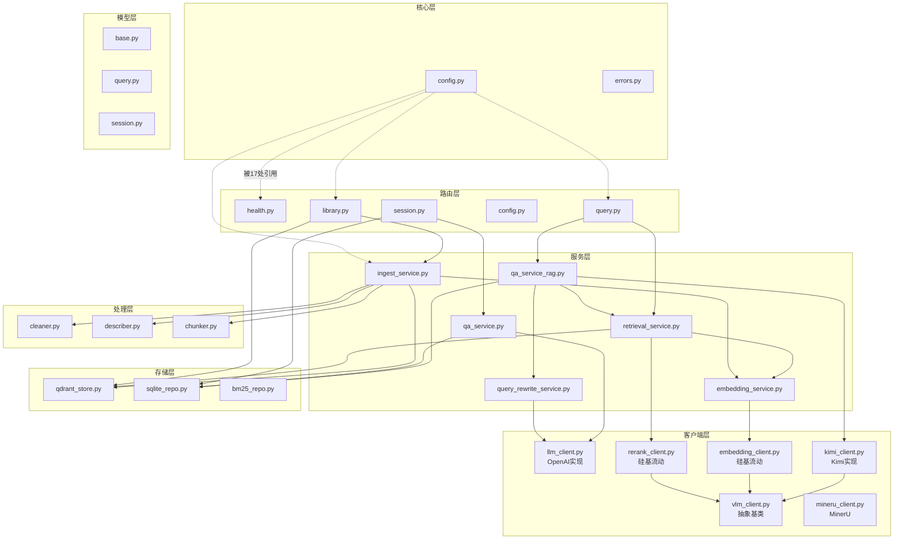

# 1.1 模块物理边界

> 生成时间: 2026-04-08
> 分析方法: 目录结构扫描 + import 语句统计

---

## 物理目录树 vs 逻辑分层映射

```
app/                              # 物理根目录
├── api/v1/                       # [路由层] HTTP 入口
│   ├── routes/
│   │   ├── health.py             #   健康检查
│   │   ├── session.py            #   会话 CRUD
│   │   ├── query.py              #   问答 + 检索
│   │   ├── config.py             #   配置查询/测试
│   │   └── library.py            #   PDF 导入/删除/列表
│   └── router.py                 #   路由聚合
│
├── clients/                      # [客户端层] 外部服务抽象接口 + 实现
│   ├── vlm_client.py             #   抽象基类: VLMClient, LLMClient, EmbeddingClient, RerankClient
│   ├── llm_client.py             #   OpenAI 兼容实现（独立，非继承抽象）
│   ├── kimi_client.py            #   Kimi 实现（继承抽象）
│   ├── embedding_client.py       #   硅基流动 Embedding（继承抽象）
│   ├── rerank_client.py          #   硅基流动 Rerank（继承抽象）
│   └── mineru_client.py          #   MinerU API（独立，非继承抽象）
│
├── services/                     # [服务层] 业务逻辑编排
│   ├── ingest_service.py         #   导入工作流（IngestWorkflow）
│   ├── retrieval_service.py      #   分布式检索 + RRF 融合
│   ├── qa_service_rag.py         #   RAG 问答（流式）
│   ├── qa_service.py             #   纯 LLM 问答（无 RAG）
│   ├── embedding_service.py      #   Embedding 编排
│   └── query_rewrite_service.py  #   Query 改写（4 场景）
│
├── processing/                   # [处理层] 数据加工管线
│   ├── cleaner.py                #   MinerU JSON 清洗
│   ├── describer.py              #   VLM 图片描述（含 Semaphore）
│   └── chunker.py                #   混合语义切分
│
├── stores/                       # [存储层] 向量库
│   └── qdrant_store.py           #   Qdrant CRUD
│
├── repositories/                 # [仓储层] 关系型 + 索引
│   ├── sqlite_repo.py            #   SQLite 元数据
│   └── bm25_repo.py              #   BM25 关键词索引
│
├── modules/                      # [模块层] 新架构模块（重构中间态）
│   ├── ingestion/                #   导入模块（部分迁移）
│   │   ├── service.py
│   │   ├── cleaning.py
│   │   ├── mineru_client.py
│   │   └── dto.py
│   ├── library/                  #   文献库模块
│   │   ├── service.py
│   │   ├── models.py
│   │   └── repository.py
│   ├── indexing/                 #   索引模块（残留）
│   ├── retrieval/
│   ├── qa/
│   └── session/
│
├── models/                       # [模型层] Pydantic 数据模型
│   ├── base.py                   #   ApiResponse, Chunk
│   ├── query.py                  #   AskRequest, RetrieveRequest, QueryContext
│   └── session.py                #   Session 模型
│
├── core/                         # [核心层] 配置 + 错误
│   ├── config.py                 #   Settings（环境变量 + 契约校验）
│   └── errors.py                 #   DomainError 体系
│
├── workflows/                    # [工作流层]（空目录）
│
└── main.py                       # FastAPI 应用入口
```

---

## 模块依赖方向图

基于 import 语句统计（箭头 = A → B 表示 A import B，即 A 依赖 B）：

```
被依赖次数排行（谁绑架了谁）：

app.core.config          ← 17 次引用  【最核心依赖，几乎所有模块都依赖配置】
app.models.base          ← 10 次引用  【通用模型，路由层和服务层共享】
app.clients.vlm_client   ←  5 次引用  【抽象接口，被 kimi/embedding/rerank 继承】
app.stores.qdrant_store  ←  4 次引用  【向量库，服务层直接依赖】
app.repositories.sqlite_repo ← 3 次  【元数据，路由层直接调用】
app.core.errors          ←  3 次引用  【错误体系，客户端层使用】
```

### 依赖方向图（Mermaid）



---

## 架构异常（非理想态）

| 异常 | 位置 | 说明 |
|------|------|------|
| **路由层穿透调用存储** | `session.py` 直接调用 `sqlite_repo`，`library.py` 直接调用 `qdrant_store` | 【代码事实】路由层绕过服务层直接操作存储，违反分层原则 |
| **LLMClient 命名冲突** | `llm_client.py` 和 `vlm_client.py` 都有 `LLMClient` | 【代码事实】前者是 OpenAI 实现，后者是抽象接口，无继承关系 |
| **MinerU 不继承抽象** | `mineru_client.py` 是独立实现 | 【代码事实】未纳入 VLMClient 抽象体系，替换时需改调用方 |
| **modules/ 残留** | `modules/` 下有 indexing/retrieval/qa/session 子目录（部分为空或半迁移） | 【代码事实】重构中间态，新旧架构并存 |
| **workflows/ 空目录** | `workflows/__init__.py` 存在但无内容 | 【代码事实】预留未使用 |

---

## 循环依赖检测

**结论：无循环依赖。**（基于 import 语句分析，依赖方向均为单向向下）
