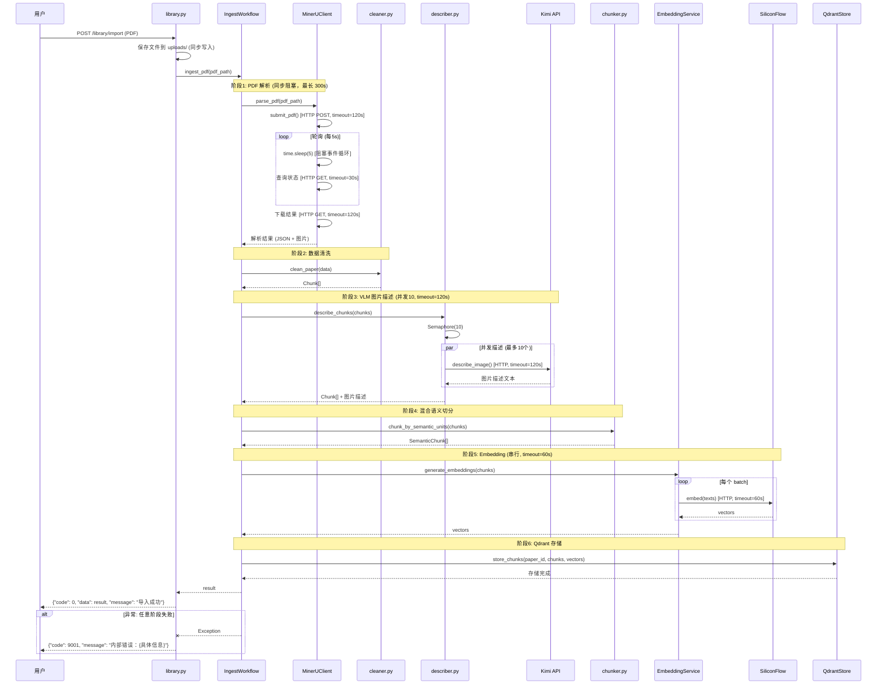
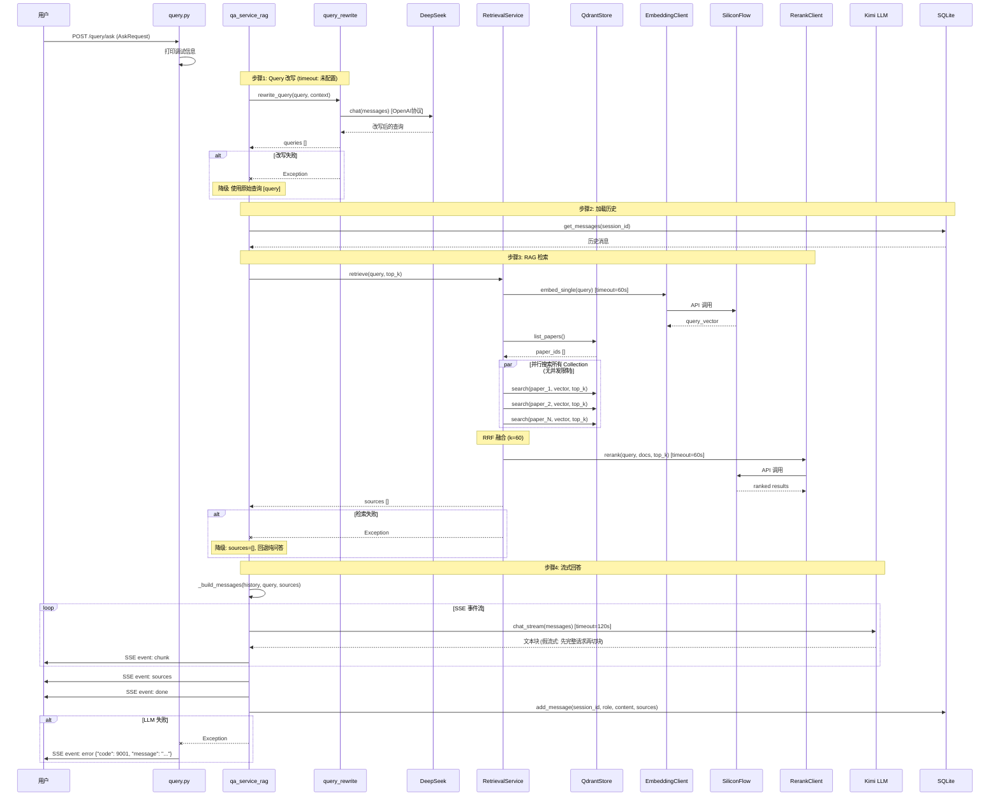

# 2.1 核心业务时序

> 生成时间: 2026-04-08
> 分析方法: 从 API 路由追踪完整调用栈

---

## PDF 导入端到端时序



---

## RAG 问答端到端时序



---

## 外部调用超时值清单

| 外部服务 | 操作 | 超时 | 配置方式 | 位置 |
|---------|------|------|---------|------|
| MinerU | 提交 PDF | 120s | 硬编码 | `mineru_client.py:109` |
| MinerU | 状态查询 | 30s | 硬编码 | `mineru_client.py:39` |
| MinerU | 下载结果 | 120s | 硬编码 | `mineru_client.py:153` |
| MinerU | 整体等待 | 300s | 环境变量 `MINERU_TIMEOUT` | `config.py:114` |
| Kimi VLM | 图片描述 | 120s | 硬编码 | `kimi_client.py:293` |
| Kimi LLM | 聊天 | 120s | 硬编码 | `kimi_client.py:347` |
| SiliconFlow Embedding | 批量嵌入 | 60s | 硬编码 | `embedding_client.py:84` |
| SiliconFlow Rerank | 重排序 | 60s | 硬编码 | `rerank_client.py:43` |
| DeepSeek | 问答/改写 | **未配置** (默认5s) | 未设置 | `llm_client.py` |
￥那个硅基流动不要硬编码，进入环境变量￥
￥
【确认】：硅基流动的 API Key 和 Base URL 已配置环境变量（`config.py:53-74`），但**超时时间是硬编码的**。

**代码证据**：
- ✅ 已配置：`SILICONFLOW_API_KEY`、`SILICONFLOW_BASE_URL`（`config.py:53-74`）
- ❌ 硬编码超时：`embedding_client.py:84` → `timeout=60.0`
- ❌ 硬编码超时：`rerank_client.py:43` → `timeout=60.0`

**建议修复**：
1. 在 `config.py` 中添加：
   ```python
   embedding_timeout: int = Field(default=60, ge=1, description="Embedding 超时（秒）")
   rerank_timeout: int = Field(default=60, ge=1, description="Rerank 超时（秒）")
   ```
2. 客户端中读取配置：`timeout=settings.embedding_timeout`

**优先级**：P2（可优化）
￥
### 关键追问

**如果某个节点挂起 10 秒，上游是报错还是死等？**
￥自动重试，重试3次后熔断，给出报错原因￥
￥
【建议】：当前代码**没有自动重试机制**，所有外部调用都是"一次失败即报错"。

**代码证据**：`embedding_client.py:84`
```python
async with httpx.AsyncClient(timeout=60.0) as client:
    response = await client.post(...)
    response.raise_for_status()  # ← 失败直接抛异常，无重试
```

**影响**：
- 网络抖动 → 请求失败 → 用户看到错误
- API 限流（429）→ 请求失败 → 无重试，需手动重试
- 超时 → 请求失败 → 无重试，需手动重试

**建议实现**（🔮 未来扩展）：
1. **重试策略**：指数退避（1s → 2s → 4s），最多3次
2. **熔断机制**：连续失败 N 次后，暂停该服务调用一段时间（如 30s）
3. **错误分类**：
   - 可重试：网络错误、超时、429 限流
   - 不可重试：401 认证失败、404 资源不存在、400 参数错误
4. **用户提示**：重试失败后，给出明确错误原因（"API 限流，请稍后重试" vs "论文不存在"）

**优先级**：P1（影响用户体验）
￥
| 节点 | 上游行为 | 说明 |
|------|---------|------|
| MinerU 提交 | 死等 120s | `httpx.post(timeout=120)` |
| MinerU 轮询 | 死等 300s | `while` 循环 + `time.sleep` |
| Kimi VLM | 死等 120s | `httpx.AsyncClient(timeout=120)` |
| Kimi LLM | 死等 120s | `httpx.AsyncClient(timeout=120)` |
| SiliconFlow | 死等 60s | `httpx.AsyncClient(timeout=60.0)` |
| DeepSeek | 死等 **5s** | httpx 默认超时，**可能太短** |
