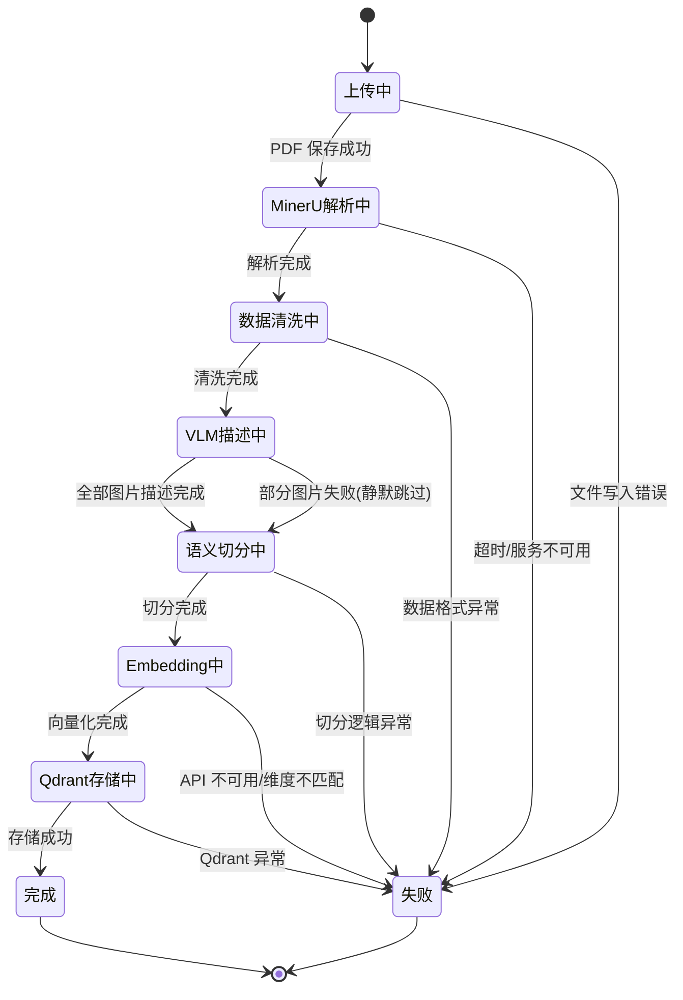
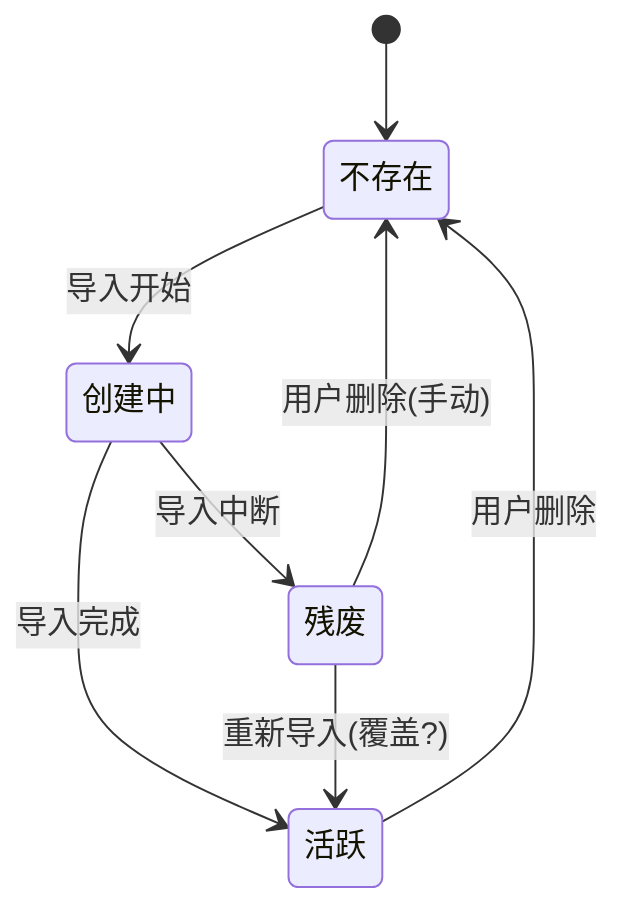
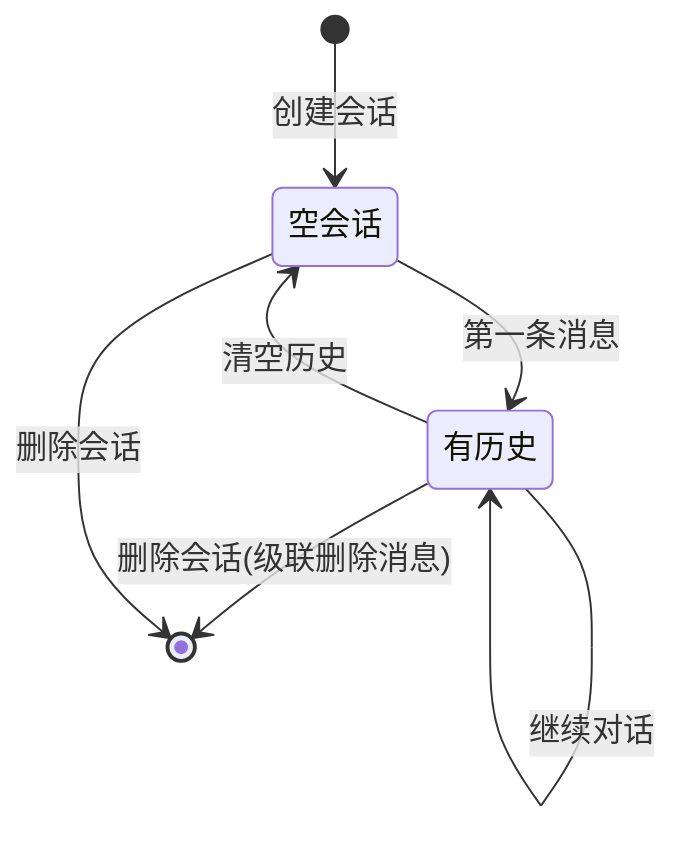

# 2.3 运行时状态机

> 生成时间: 2026-04-08
> 分析方法: 有状态实体识别 + 异常退出点分析

---

## 实体 1：PDF 导入任务



### 状态追踪

**【代码事实】**：系统**没有显式的状态追踪机制**。导入过程中没有持久化中间状态（如 `status: "parsing"`）。

- `ingest_service.py` 的 `ingest_pdf()` 是一个线性的 async 函数
- 无数据库记录导入进度
- 前端无法查询"当前导入到哪一步了"
- `get_status()` 只返回已完成论文的统计，不返回进行中任务的状态

### 异常退出点与残留清理

| 阶段 | 可能的残留 | 清理逻辑 | 风险 |
|------|-----------|---------|------|
| MinerU 解析中断 | MinerU 服务端任务可能仍在执行 | **无** | MinerU 账户产生僵尸任务 |
| VLM 描述中断 | 部分 chunks 有描述，部分没有 | **无** | 内存数据丢失，无持久化影响 |
| Embedding 中断 | 部分 chunks 有向量 | **无** | 内存数据丢失 |
| Qdrant 存储中断 | 不完整的 Collection | **无** | **残留 Collection**，后续检索会命中脏数据 |
| uploads/ 目录 | 原始 PDF 文件 | **无清理** | 磁盘空间持续占用 |  ￥这个没问题，就要保留原始PDF文件￥
￥
【确认】：保留原始 PDF 文件是正确的设计决策。

**原因**：
1. **可追溯性**：用户可以随时查看原始论文，确认解析结果是否准确
2. **重新解析**：当 MinerU 升级或自研清洗逻辑时，可以重新解析
3. **审计需求**：学术场景需要保留原始来源

**代价**：
- 磁盘占用：每篇论文约 1-5 MB，1000 篇约 1-5 GB
- 建议：定期监控磁盘空间，达到阈值时提示用户清理

**无需优化**：这是业务需求，不是技术债务。
￥
￥MinerU解析中断了就应该直接清理；VLM描述完后必须校验，打上verify_vlm:'1'的标签，如果没有这个标签，下次就从断点处继续，直到所有的图片都描述完了以后，运行一键清除这个verify_vlm标签的脚本，正则直接来就好，反正是json，应该很方便，这样既做到了校验，又做到了不引入新的噪音；
改：遵循第一性原理，解决该问题的正确路径不是“事后洗澡（清除标签）”，而是 “事前记录意图，事后确认结果，永不污染源数据”。

推荐采用 任务状态表 + 源数据只读 模式：

组件	您的方案 (标签侵入)	改进方案 (状态外置)
源数据 (JSON)	混合了 verify_* 工艺字段	保持纯粹，仅包含业务内容
状态追踪	依赖源数据内的标志位	独立的状态表/Redis 记录
恢复逻辑	扫描源数据正则匹配	查询任务表 WHERE status != 'DONE'
具体实现逻辑（以 MinerU 为例）：
1. 任务表设计：

sql
CREATE TABLE mineru_tasks (
    id UUID PRIMARY KEY,
    document_id VARCHAR(255) NOT NULL,
    mineru_request_id VARCHAR(255), -- MinerU 返回的异步任务ID
    status ENUM('PENDING', 'UPLOADING', 'PROCESSING', 'SUCCESS', 'FAILED'),
    created_at TIMESTAMP,
    updated_at TIMESTAMP,
    retry_count INT DEFAULT 0,
    INDEX idx_status_updated (status, updated_at)
);
2. 处理逻辑（幂等与幽灵任务防御）：
Worker 启动：查询 status IN ('PENDING', 'UPLOADING', 'PROCESSING') 且超时（updated_at < NOW() - 1 HOUR）的任务。
处理 PENDING：
原子抢占：UPDATE mineru_tasks SET status='UPLOADING', updated_at=NOW() WHERE id=? AND status='PENDING'。
调用 MinerU API 上传文件，获取 mineru_request_id。
更新状态为 PROCESSING，记录 mineru_request_id。
轮询结果：
根据 mineru_request_id 查询 MinerU 结果。
成功：写入结果到 纯净的 JSON 文件，更新任务表 status='SUCCESS'。
失败/超时：更新 status='FAILED'，增加 retry_count。
为什么这解决问题且无副作用？
无元数据噪音：JSON 文件里再也没有 verify 字段。
无幽灵任务：重启后，Worker 发现状态是 PROCESSING，它不盲目重试，而是先去查 mineru_request_id 的结果。如果 MinerU 早就做完了，直接拿结果写盘；如果没做完，继续轮询；如果 ID 无效，才标记失败重试。不会重复计费。
无需清除脚本：状态是运行时的临时记录，要么存在数据库，要么设置 TTL 自动过期。源数据永不受污染。


---
关于Embedding的想法：
第一性原理重构：从“事后标记”转向“事前幂等”
按照第一性原理，解决此问题的唯一稳健路径是：让向量化操作本身是幂等的，并将状态机下沉到 Chunk 粒度。
以下是不引入架构腐化的两种模式：
方案：利用向量数据库的原生 Upsert 与 细粒度状态列 (推荐)
不要依赖“全局文档成功标签”，而是依赖“单条 Chunk 的状态”。
数据模型设计：

sql
-- 假设元数据表结构（当然真实情况可能不是这样）
chunks:
  id (PK),
  document_id,
  content,
  embedding_status ENUM('PENDING', 'PROCESSING', 'COMPLETED', 'FAILED'), -- 状态机核心
  embedding_vector (Vector类型),
  last_retry_at TIMESTAMP,
  version INT -- 用于乐观锁或内容变更检测
处理流程（重启安全的 Worker）：
Worker 启动，查询 status = 'PENDING' 或 status = 'PROCESSING' AND updated_at < NOW() - INTERVAL 'X MINUTES'（处理僵尸任务）。
原子更新该 chunk 状态为 PROCESSING（利用 UPDATE ... WHERE status = 'PENDING' 的受影响行数来抢锁）。
调用 Embedding API 计算向量。
将向量写入向量数据库，ID 与 Chunk ID 严格对应（或使用确定的业务主键）。
利用 Upsert 语义：无论向量存储里原来有没有这条记录，直接覆盖写入。
更新 chunk 元数据表状态为 COMPLETED。
选择这个的方案的原因：
无全局标签噪音：状态跟随 chunk。
恢复粒度精确到行：断了重启，只有当时正在跑的几条 chunk 会重算（且由于 Upsert 是幂等的，多写一次也不怕），已经算完的 9,998 条 chunk 纹丝不动。
无竞态条件：依赖数据库行锁或条件更新，而非脆弱的“检查-后置标记”。
---

关于Qdrant的优化：
利用 Qdrant Collection 名称的原子重命名 来实现 Zero-Downtime 且无标签噪音 的恢复机制。这是数据库迁移中经典的 “影子表/蓝绿部署” 模式。
流程（无需任何元数据标签）：
阶段一：临时构建（Staging）
Collection 命名为：tmp_paper_123_v1_${timestamp}。
Worker 向该临时 Collection 疯狂写入向量。如果中断，毫无影响，因为正式环境从未指向它。
阶段二：原子切换（Commit）
所有向量写入完毕。
关键操作：利用 Qdrant 的 Collection Alias（别名） 机制。
应用程序检索时，永远只查询别名 alias_paper_123。
Worker 完成写入后，执行原子切换：
# 1. 更新别名指向新的 Collection（该操作在 Qdrant 内部是原子的）
qdrant.update_collection_aliases(
    actions=[
        CreateAlias(collection_name="tmp_paper_123_v1", alias_name="alias_paper_123")
    ]
)
# 2. 删除旧的 Collection（如果存在）
qdrant.delete_collection("old_paper_123_real")
阶段三：中断恢复（Recovery）
重启后，Worker 检查是否有 tmp_paper_123_v1 残留。
逻辑极简：直接删除该临时 Collection，从头开始重建。
无需扫描已有点位。因为反正都要重算。
无需元数据标签。因为正式别名未指向它，检索流量零污染。

选择这个方案的原因
对比维度	   “标签+清理”方案	   “临时表+原子别名切换”方案
元数据侵入	需要在 JSON 或 DB 维护 qdrant_ready 字段	无，状态由 Qdrant 别名隐含定义
检索安全性	残留 Collection 会被检索到（脏读）	绝不会，别名未切换前，旧数据正常服务
中断恢复代价	需扫描比对已有点位	直接删库跑路（删临时表），代价恒定
并发写入冲突	可能被运维脚本误删	临时表名带时间戳，物理隔离
原子性	标记写入是独立事务	别名切换是 Qdrant 内部原子操作
￥
---

## 实体 2：Qdrant Collection（论文数据）



### Collection 生命周期

| 操作 | 触发条件 | 实现 |
|------|---------|------|
| 创建 | PDF 导入成功 | `qdrant_store.py` 创建新 Collection |
| 删除 | 用户调用 DELETE API | `qdrant_store.delete_paper()` + `shutil.rmtree()` |
| 更新 | **不支持** | 无更新接口，需删除后重新导入 |
| 查询 | RAG 检索时扫描 | `retrieval_service.py` 遍历所有 Collection |

### 残废 Collection 问题

**【模型推断】** 当导入中断时，Qdrant 中可能存在一个只有部分数据的 Collection。后续检索时：
- `_search_single_collection` 会搜索这个残废 Collection
- 返回不完整/噪声结果
- RRF 融合会把这些噪声数据纳入排序
￥这个跟下面的问题本质是相同的：系统缺乏一个显式的、可查询的、具有事务语义的任务状态机，且检索层未能区分“草稿数据”与“已发布数据”。
第一性原理分析：

RRF 假设输入的所有子结果集是语义等价且有效的。

残废 Collection 包含的是偏序数据（例如只索引了论文前 5 页，后 10 页的向量缺失）。

当用户查询一个同时出现在前 5 页和后 10 页的关键词时：

完整论文应当给出高相关性得分（因为全文多处提及）。

残废 Collection 给出的得分会偏低（因为只有部分匹配），但依然会占据 RRF 的一个候选槽位。

在 RRF 的倒数排名融合（Reciprocal Rank Fusion）公式中，这种低质量候选会挤占原本应属于其他完整文档的位置，导致最终 Top-K 列表中出现“次优解”甚至“错误解”。

架构层面解决方案（无需等待全流程跑完）：
必须引入 Collection 可见性开关。

由于您采用每 PDF 一个 Collection，请利用 Qdrant Collection Alias 或 元数据过滤 实现逻辑删除/隐藏。

推荐模式：基于别名的两阶段提交（Two-Phase Commit for Search）

数据写入：永远只写入 私有临时 Collection（例如 tmp_pdf_123）。

数据发布：只有当 VLM描述完成、向量化完成、MinerU 解析完成 全部校验通过 后，才执行原子操作：

python
# 将公共别名指向新的 Collection
qdrant.update_collection_aliases(
    CreateAlias(collection_name="tmp_pdf_123", alias_name="public_pdf_123")
)
检索逻辑修改：

废弃 _search_single_collection 扫描物理表名。

改为：扫描所有以 public_ 开头的别名，或维护一张 published_collections 注册表。

效果：半成品数据对检索层物理不可见，RRF 污染从根源上被消除。

￥
---

## 实体 3：会话与消息



### 消息持久化

| 操作 | 实现 | 异步/同步 |
|------|------|----------|
| 创建会话 | `sqlite_repo.create_session()` | **同步**（SQLAlchemy） |
| 添加消息 | `sqlite_repo.add_message()` | **同步** |
| 获取历史 | `sqlite_repo.get_messages()` | **同步** |
| 删除会话 | `sqlite_repo.delete_session()` | **同步**（级联 DELETE） |

---

## 关键追问

**用户在 VLM 描述阶段关闭了 WPS，再次打开系统显示什么？**
￥关闭了WPS的话，再次打开从之前的断点处开始￥
￥
【现状问题】：当前代码**不支持断点续传**，WPS 关闭后任务继续执行，但用户无法恢复进度。

**代码证据**：`app/services/ingest_service.py:import_pdf()`
```python
async def import_pdf(self, file_path: str, document_id: str):
    # 1. MinerU 解析
    result = await self._wait_for_mineru(task_id)
    # 2. VLM 描述
    described_chunks = await self._describe_images(result)
    # 3. Embedding
    embeddings = await self.embedding_service.generate_embeddings(...)
    # 4. Qdrant 存储
    await self.qdrant_store.store_chunks(...)
```

**问题分析**：
1. **无状态记录**：任务执行到哪一步了？用户关闭后无法查询
2. **无法恢复**：用户再次打开，从头开始？还是继续执行？
3. **残留风险**：任务失败后，Qdrant 中有残废 Collection

**解决方案**（参考快照中的建议）：

### 方案 A：任务状态表 + 轮询（推荐）

**改动位置**：
- 启用 `ingest_tasks` 表（已定义但未使用）
- 新增轮询端点：`GET /api/v1/tasks/{task_id}`

**状态机**：
```
pending → parsing → cleaning → vlm_describing → embedding → indexing → completed
                            ↓                                    ↓
                          failed                                failed
```

**前端逻辑**：
1. 提交导入任务 → 获得 `task_id`
2. 关闭 WPS → 任务继续执行
3. 再次打开 → 轮询 `GET /api/v1/tasks/{task_id}`
4. 如果 `status == 'completed'` → 显示成功
5. 如果 `status == 'failed'` → 显示错误 + 重试按钮

### 方案 B：SSE + 事件通知（复杂）

**改动位置**：
- 新增 SSE 端点：`GET /api/v1/tasks/{task_id}/events`
- 前端建立持久连接，实时接收任务进度

**优点**：实时性好
**缺点**：实现复杂，WPS 插件环境可能不支持 SSE

---

**建议优先级**：P1（影响用户体验）
**实施建议**：先用方案 A（任务状态表 + 轮询），MVP 后考虑方案 B（SSE）
￥

不要只让前端通过 SSE 等待结果，而是立即返回一个 task_id。

python
# POST /api/ingest
@router.post("/ingest")
async def ingest_pdf(file: UploadFile):
    task_id = str(uuid.uuid4())
    # 初始化任务状态
    redis.set(f"task:{task_id}", json.dumps({"status": "PENDING", "progress": 0}))
    # 启动后台任务，传入 task_id
    background_tasks.add_task(process_pdf_pipeline, task_id, file)
    # 立即返回 task_id，不挂起连接
    return {"task_id": task_id}

# GET /api/task/{task_id}
@router.get("/task/{task_id}")
async def get_task_status(task_id: str):
    # 从 Redis/DB 读取状态
    return get_task_info(task_id)
2. 前端增强：启动时的“孤儿任务认领”

当用户再次打开 WPS 插件时，前端应主动查询最近活跃的任务列表（例如按用户 Session 或本地存储的 task_id 去查询）。

javascript
// 插件启动逻辑
onMounted(async () => {
    const lastTaskIds = localStorage.getItem("pending_uploads") || [];
    for (const id of lastTaskIds) {
        const res = await fetch(`/api/task/${id}`);
        if (res.status === "SUCCESS") {
            // 弹出通知：“您之前的论文《xxx》已导入成功。”
            // 刷新论文列表
            refreshPaperList();
        } else if (res.status === "FAILED") {
            // 提示失败，允许重试
        } else {
            // 仍在处理中，恢复进度条或显示后台处理中
        }
    }
});
3. 清理策略（防止 Collection 垃圾堆积）

如果后台任务最终失败且无人问津，残废的 tmp_pdf_123 会永久占用磁盘。

TTL 机制：Qdrant 支持 Collection 级别的 TTL。创建临时 Collection 时设置 "init_from": { "collection": { "ttl": 86400 } }（例如 24 小时后自动删除）。

清理脚本：每日凌晨扫描超过 24 小时且未被任何别名引用的 Collection，执行物理删除。

￥
**没有导入进度查询接口**，用户无法知道之前的导入是否完成。
