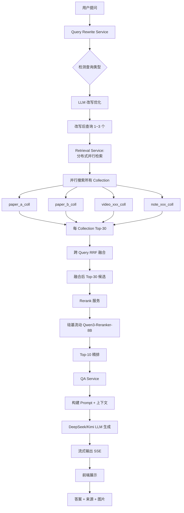
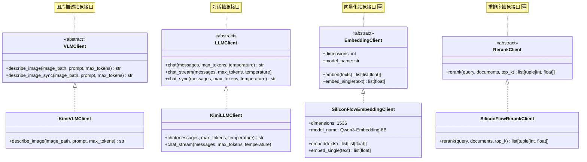
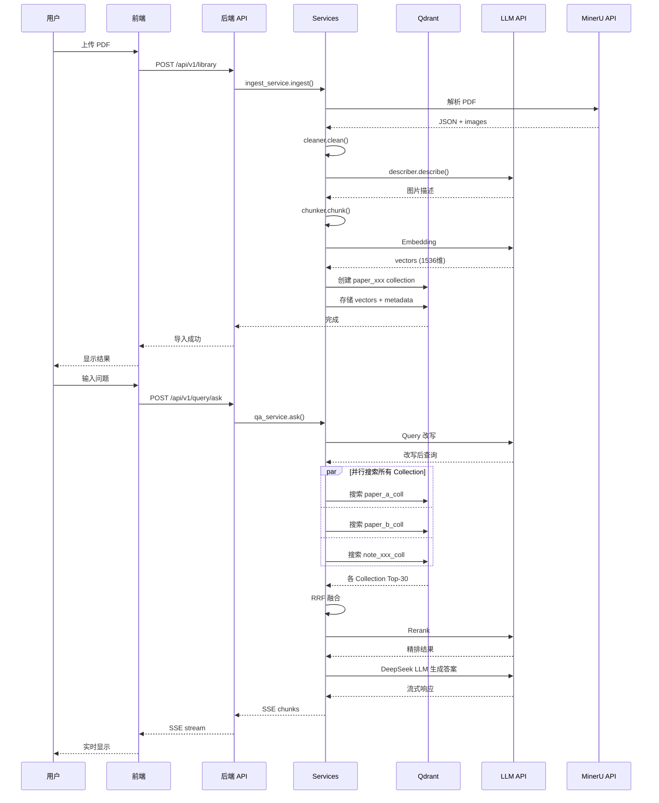
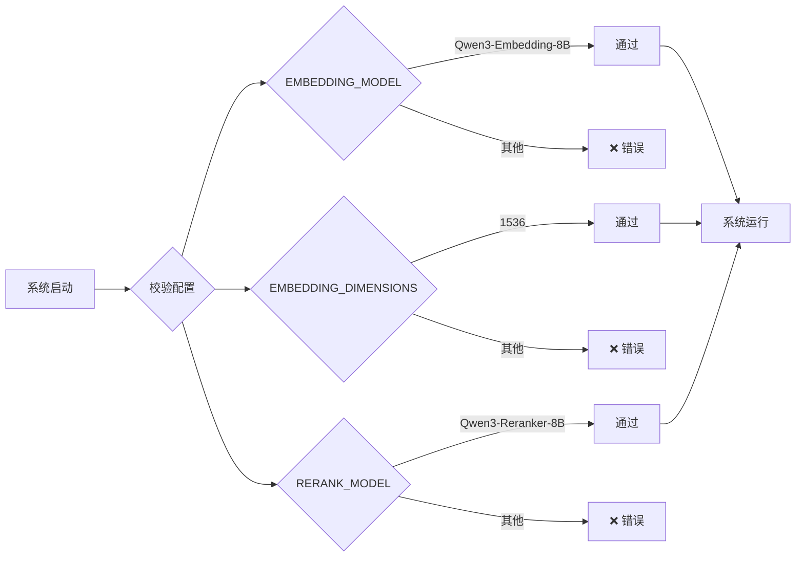

# 论文助手 - 流程架构图

> 生成时间: 2026-04-08
> 架构状态: 已完成重构 + RRF 优化 + 扩展接口预留

## 1. PDF 导入与处理流程

```mermaid
flowchart TD
    A[用户上传 PDF] --> B[MinerU API 解析]
    B --> C[content_list_v2.json]
    B --> D[images/]
    C --> E[后端: 数据清洗层]
    D --> E
    E --> F[过滤噪声类型]
    F --> G[UI 噪声过滤]
    G --> H[LaTeX 清洗]
    H --> I[表格转换]
    I --> J[Chunk[] + 图片路径]
    J --> K[后端: VLM 图片描述]
    K --> L{Kimi Coding API}
    L -->|User-Agent: claude-code| M[10 并发请求]
    M --> N[图片详细描述]
    N --> O[Chunk[] + 描述]
    O --> P[后端: 混合切分策略]
    P --> Q{两个块 <= 32k?}
    Q -->|是| R[打包一起]
    Q -->|否| S{单个超过 32k?}
    S -->|否| T[分开，无重叠]
    S -->|是| U[平均切分到 24k]
    U --> V[首尾重叠接近 32k]
    R --> W[Embedding 服务]
    T --> W
    V --> W
    W --> X[硅基流动 Qwen3-Embedding-8B]
    X --> Y[向量 1536 维]
    Y --> Z[Qdrant 分布式存储]
    Z --> ZA["独立 Collection:<br/>paper_{uuid}"]
    ZA --> AA[导入完成]
```

## 2. 分布式 RAG 问答流程（核心）



### RRF 融合详解

```
┌─────────────────────────────────────────────────────────┐
│  RRF (Reciprocal Rank Fusion) - 排名融合算法             │
├─────────────────────────────────────────────────────────┤
│                                                          │
│  问题：不同 Collection 的分数可能不可比                  │
│  解决：只看排名，不看分数                                │
│                                                          │
│  公式：score[doc] += 1 / (k + rank + 1)                 │
│                                                          │
│  示例：                                                 │
│  ┌─────────────────┐     ┌─────────────────┐            │
│  │ Collection A    │     │ Collection B    │            │
│  ├─────────────────┤     ├─────────────────┤            │
│  │ doc1: 第1名     │     │ doc2: 第1名     │            │
│  │ doc2: 第2名     │     │ doc3: 第2名     │            │
│  │ doc3: 第3名     │     │ doc1: 第3名     │            │
│  └─────────────────┘     └─────────────────┘            │
│           │                       │                     │
│           └───────────┬───────────┘                     │
│                       ▼                                 │
│  ┌─────────────────────────────────────────┐            │
│  │ RRF 融合结果（k=60）                    │            │
│  ├─────────────────────────────────────────┤            │
│  │ doc2: 1/(60+2) + 1/(60+1) = 0.0325      │            │
│  │ doc1: 1/(60+1) + 1/(60+3) = 0.0323      │            │
│  │ doc3: 1/(60+3) = 0.0159                │            │
│  └─────────────────────────────────────────┘            │
│                                                          │
└─────────────────────────────────────────────────────────┘
```

## 3. 系统架构图（完整）

```mermaid
graph TB
    subgraph 前端
        A1[AppShell.vue]
        A2[SessionList]
        A3[MessageList]
        A4[SourceCardList]
        A5[ChatInput]
        A1 --> A2
        A1 --> A3
        A1 --> A4
        A1 --> A5
    end

    subgraph 后端-API层
        B1[/api/v1/health]
        B2[/api/v1/session]
        B3[/api/v1/query/ask]
        B4[/api/v1/library]
    end

    subgraph 后端-Services
        C1[qa_service_rag]
        C2[ingest_service]
        C3[retrieval_service]
        C4[query_rewrite_service]
        C5[embedding_service]
    end

    subgraph 后端-Processing
        D1[cleaner.py]
        D2[describer.py]
        D3[chunker.py]
    end

    subgraph 后端-Stores
        E1[qdrant_store.py<br/>分布式]
        E2[bm25_store.py]
        E3[sqlite_repo.py]
    end

    subgraph 外部服务
        F1[MinerU API]
        F2[Kimi Coding API]
        F3[硅基流动 API]
        F4[DeepSeek API]
    end

    subgraph 抽象接口-完整
        G1[VLMClient]
        G2[LLMClient]
        G3[EmbeddingClient]
        G4[RerankClient]
        G5[KimiVLMClient]
        G6[KimiLLMClient]
        G7[SiliconFlowEmbedding]
        G8[SiliconFlowRerank]
    end

    subgraph Qdrant-分布式存储
        Q1["paper_a_coll"]
        Q2["paper_b_coll"]
        Q3["video_xxx_coll"]
        Q4["note_xxx_coll"]
    end

    A2 -.HTTP/SSE.-> B2
    A5 -.HTTP/SSE.-> B3
    B1 --> C1
    B2 --> C1
    B3 --> C1
    B3 --> C3
    B4 --> C2

    C1 --> C5
    C1 --> F4
    C2 --> D1
    C2 --> D2
    C2 --> D3
    C2 --> C5
    C3 --> C5
    C3 --> E1
    C4 --> F4

    D1 -.清洗.-> F1
    D2 -.10并发.-> G5
    D3 --> E1
    C5 -.批量.-> E1
    C5 -.批量.-> F3

    E1 -.并行搜索.-> Q1
    E1 -.并行搜索.-> Q2
    E1 -.并行搜索.-> Q3
    E1 -.并行搜索.-> Q4

    G5 -.实现.-> G1
    G6 -.实现.-> G2
    G7 -.实现.-> G3
    G8 -.实现.-> G4

    G7 -.调用.-> F3
    G8 -.调用.-> F3
```

## 4. 抽象接口设计（完整）



## 5. 前后端交互时序图（完整）



## 6. 目录结构（当前状态）

```
论文助手/
├── project/MVP/
│   ├── backend/
│   │   ├── app/
│   │   │   ├── api/v1/routes/      # API 路由
│   │   │   ├── clients/            # 外部服务客户端 + 完整抽象接口
│   │   │   │   ├── vlm_client.py   # VLM/LLM/Embed/Rerank 抽象
│   │   │   │   ├── kimi_client.py  # Kimi 实现
│   │   │   │   ├── embedding_client.py  # 硅基流动 Embedding 🆕
│   │   │   │   ├── rerank_client.py     # 硅基流动 Rerank 🆕
│   │   │   │   └── mineru_client.py
│   │   │   ├── core/               # 配置
│   │   │   │   └── config.py       # 固定模型契约
│   │   │   ├── models/             # 数据模型
│   │   │   │   └── query.py        # 🔮 resource_types, selected_papers
│   │   │   ├── processing/         # 数据处理
│   │   │   │   ├── cleaner.py
│   │   │   │   ├── describer.py
│   │   │   │   └── chunker.py
│   │   │   ├── services/           # 业务逻辑编排
│   │   │   │   ├── qa_service_rag.py     # 🔮 扩展接口
│   │   │   │   ├── retrieval_service.py  # 🔮 并行搜索 + RRF
│   │   │   │   ├── ingest_service.py
│   │   │   │   ├── query_rewrite_service.py
│   │   │   │   └── embedding_service.py
│   │   │   ├── stores/             # 数据存储
│   │   │   │   ├── qdrant_store.py  # 分布式存储
│   │   │   │   ├── bm25_store.py
│   │   │   │   └── sqlite_repo.py
│   │   │   └── main.py
│   │   ├── data/
│   │   │   ├── qdrant_db/
│   │   │   └── app.db
│   │   └── main.py
│   └── frontend/
│       └── src/
├── docs/
│   ├── 北极星.md
│   ├── 流程架构图.md
│   └── 架构分析报告.md
├── CLAUDE.md
└── README.md
```

## 7. 配置常量（硬契约）



### 固定配置

```python
# app/core/config.py
PINNED_EMBEDDING_MODEL = "Qwen/Qwen3-Embedding-8B"
PINNED_EMBEDDING_DIMENSIONS = 1536  # 固定
PINNED_RERANK_MODEL = "Qwen/Qwen3-Reranker-8B"
```

**⚠️ 更换模型会导致向量库失效，需要重建索引。**

## 8. 🔮 未来扩展：用户自选文献

### 产品设计

```
┌─────────────────────────────────────────┐
│  📚 选择要参考的文献                     │
│  ─────────────────────────────────────  │
│  ☑ 论文1: Attention Is All You Need     │
│     2017 · 8页 · 156 chunks             │
│                                         │
│  ☐ 论文2: BERT: Pre-training of Deep... │
│     2018 · 12页 · 234 chunks            │
│                                         │
│  ☑ 笔记: 我的灵感整理                   │
│     2024-04-08 · 23 chunks              │
│                                         │
│  ─────────────────────────────────────  │
│  [已选 2 篇]  [清空选择]  [全选]         │
└─────────────────────────────────────────┘

        ↓ 用户提问

┌─────────────────────────────────────────┐
│  Q: Transformer 的核心机制是什么？       │
│                                         │
│  🔍 仅在选定的 2 篇文献中检索           │
└─────────────────────────────────────────┘
```

### 代码接口

```python
# app/models/query.py
class AskRequest(BaseModel):
    session_id: str
    query: str

    # 🔮 未来扩展：用户自选数据类型
    resource_types: Optional[list[str]] = None
    # 示例: ["paper", "video", "note"]

    # 🔮 未来扩展：用户自选文献
    selected_papers: Optional[list[str]] = None
    # 示例: ["paper_abc123", "note_xyz456"]
```

**快速定位所有扩展点**:
```bash
grep -r "🔮 未来扩展" app/
```
