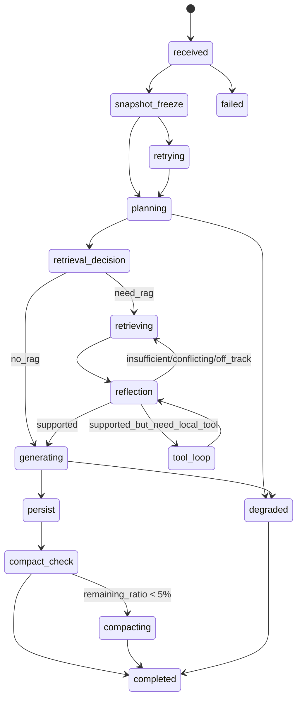

# agent_layer 架构设计

## 1. 文档定位

这份文档是当前 `agent_layer` 的活动设计稿。

它回答四件事：

1. Agent 层第一版到底负责什么。
2. 它和 `data_layer`、`service_layer` 的边界怎么切。
3. 前端 V2 已经定下来的接口契约，后端 Agent 层要怎么接。
4. 当前实现为什么还不算“真正的 Agent runtime”。

本文件的设计输入基线只有三份：

- `docs/backend/architecture.md`
- `docs/frontend/重构说明.md`
- 当前代码实现：`backend/app/agent_layer`、`backend/app/service_layer/api`

## 2. 当前混合态声明

当前 `agent_layer` 处于“有骨架、无主链”的混合态。

已存在的目录只有：

- `planning/`
- `response/`
- `runtime/`
- `session/`
- `hooks/`

但这并不代表 Agent 层已经成立，原因是：

1. ~~当前真正的对话入口仍是 `/api/v1/conversations/chat`，不是前端 V2 需要的 `POST /api/v1/query`。~~ ✅ 已统一：`/api/v1/query` 是主入口，`/api/v1/conversations/chat` 也已转发到 TurnRunner。
2. `written_context / selection` 已接入 snapshot_freeze → planning → query assembly（按权重排序）。
3. ~~当前 SSE 事件仍是 `metadata / chunk / done / error`，而前端 V2 已切到 `thinking / block / sources / done / error`。~~ ✅ 已切换到 `thinking / block / sources / done / error` 协议。
4. 当前回答载体仍是“原始文本流 + 编号引用”，不是结构化 `ContentBlock`。
5. `compact`、活动窗口、request 级模型选择、reflection loop 都还没有接上主链。

结论：

- 当前实现更接近“RAG 回答器 + 几个未接线的组件”。
- 后续重构目标不是“继续往 `AnswerGenerator` 上堆逻辑”，而是补出真正的 Agent runtime。

## 3. 第一版目标

第一版 Agent 层目标是：

1. 接住一次前端 `POST /api/v1/query` 请求。
2. 从 `prompt / selection / written_context / recent window / summary` 冻结出本轮快照。
3. 判断本轮是否需要 RAG，以及要取多少证据。
4. 按有限轮 reflection 做取证、校验、补证或换方向。
5. 把最终回答输出为前端 V2 可直接渲染的结构化块流。
6. 保存会话事实、活动窗口、来源映射、compact 摘要。

一句话概括：

Agent 层不是多 Agent 系统，而是一个“单编排器 + 内部工具”的运行时。

## 4. Agent 层不是什么

第一版明确不做：

- 不做复杂多 Agent 编队
- 不做 planner / executor / reviewer 三角色分裂
- 不做 benchmark 驱动的策略 A/B
- 不把 API 协议细节直接塞进 `data_layer`

第一版只需要把“对话编排主链”立住。

## 5. 双循环模型

Agent 层有两条并行线：

### 5.1 常驻循环

职责：

- 持续接收编辑器上下文更新
- 维护 `written_context`
- 维护 `selection`
- 写入进程内内存运行态

注意：

- 常驻循环写入的是“活上下文”
- 真正进入本轮回答的必须是“冻结副本”

### 5.2 对话级循环

职责：

- 接住一次用户发送动作
- 冻结本轮输入
- 做 planning / retrieval / reflection / generate
- 流式返回结构化事件
- 持久化本轮结果

## 6. 输入契约

前端 V2 当前对对话接口的正式请求体是：

```json
{
  "session_id": "v1-session-xxx",
  "prompt": "用户提问...",
  "selection": "可选，当前圈选内容",
  "draft": "可选，前端兼容字段",
  "paper_ids": ["paper_1", "paper_2"],
  "enable_rag": true,
  "model": "deepseek-chat",
  "thinking": true
}
```

Agent 层内部不要直接消费这个 JSON，而是要先归一化成 `FrozenTurnSnapshot`。

建议字段：

| 字段 | 说明 |
|---|---|
| `request_id` | 本轮请求唯一 ID |
| `session_id` | 会话 ID |
| `prompt` | 用户显式输入 |
| `selection` | 当前圈选内容 |
| `written_context` | 当前正文快照 |
| `paper_ids` | RAG 限定文献 |
| `enable_rag` | 是否允许使用知识库 |
| `model_name` | 本轮回答模型 |
| `thinking_enabled` | 是否输出 thinking 事件 |
| `recent_window` | 最近活动窗口消息 |
| `history_summary` | compact 摘要 |
| `frozen_at` | 快照冻结时间 |
| `used_inputs` | 本轮实际采用了哪些输入源 |

### 6.1 输入源加权规则

沿用 `docs/backend/architecture.md` 的基线：

1. 只有 `prompt`：`prompt = 100%`
2. 只有 `written_context`：`written_context = 100%`
3. `written_context + selection`：`selection = 70%`，`written_context = 30%`
4. `written_context + selection + prompt`：`prompt = 50%`，`selection = 30%`，`written_context = 20%`

这里的“加权”不是简单字符串拼接，而是影响：

- planning 提示词
- query 改写
- retrieval gating
- 最终回答口径

## 7. 目标状态机



状态含义：

- `snapshot_freeze`：冻结本轮输入，防止监听中的 live context 污染本轮推理
- `retrieval_decision`：判断本轮要不要 RAG
- `reflection`：判定 `supported / insufficient / conflicting / off_track`
- `tool_loop`：调用内部工具，例如补检索、生成标题、compact
- `compact_check`：检查上下文剩余比例

## 8. 模块划分

建议把 Agent 层拆成下面几块：

```text
agent_layer/
  orchestration/
    turn_runner.py
  contracts/
    query.py
    events.py
    artifacts.py
  planning/
    snapshot_builder.py
    retrieval_gate.py
    title_builder.py
  retrieval/
    evidence_loop.py
    context_packer.py
  reflection/
    evidence_judge.py
  response/
    block_streamer.py
    citation_resolver.py
    source_mapper.py
  session/
    window_store.py
    editor_context_store.py
    persistence.py
  hooks/
    compact.py
  runtime/
    chat_model.py
    token_budget.py
```

### 8.1 关键职责边界

- `orchestration/turn_runner.py`
  - 只负责编排一轮请求，不直接写 API，不直接写底层索引查询。
- `planning/snapshot_builder.py`
  - 把前端 payload、进程内 editor context、最近窗口、摘要组合成冻结快照。
- `planning/retrieval_gate.py`
  - 判断本轮是否真的需要 RAG。
- `retrieval/evidence_loop.py`
  - 执行分批取证，不直接负责最终回答。
- `reflection/evidence_judge.py`
  - 给出 `supported / insufficient / conflicting / off_track` 判定。
- `response/block_streamer.py`
  - 将最终回答转换为 `ContentBlock` 流。
- `response/source_mapper.py`
  - 把检索证据映射成前端 `SourceCard[]`。
- `session/persistence.py`
  - 保存用户消息、结构化回答、来源、摘要、used_inputs。

## 9. SSE 契约

前端 V2 当前已经定死的事件协议如下：

| 事件 | data | 用途 |
|---|---|---|
| `thinking` | `{ text, time_ms }` | 逐段追加思考摘要 |
| `block` | `ContentBlock` | 逐块渲染回答 |
| `sources` | `SourceCard[]` | 回答末尾一次性返回来源卡片 |
| `done` | `{}` | 标记结束 |
| `error` | `{ message }` | 显示错误 |

Agent 层设计要求：

1. `thinking` 只发阶段性摘要，不暴露长链式内部推理原文。
2. `block` 是正式回答载体，不能再退回“纯 markdown 文本流”。
3. `sources` 的 `id` 必须能和 `block.citations[].sourceId`、`citation_block.sourceIds` 对上。
4. 若要保留 `metadata` 事件，只能作为附加事件，不能替代 `block/sources` 主协议。

## 10. 来源卡片契约

`SourceCard` 至少要包含：

| 字段 | 说明 |
|---|---|
| `id` | 来源唯一 ID |
| `paper_id` | 文献 ID |
| `title` | 文献标题或文件名 |
| `page` | 页码 |
| `section` | 章节标题 |
| `file_path` | 原始 PDF / DOCX 绝对路径 |
| `local_path` | 本地路径备选 |
| `content` | 用于悬停预览的原文摘录 |
| `import_time` | 文献导入时间 |

当前前端的引用预览和 WPS 打开能力依赖这些字段。

## 11. 持久化与缓存

### 11.1 长期事实

建议继续由 SQLite 承担：

- 会话
- 消息
- 结构化回答 `blocks_json`
- 来源 `sources_json`
- 本轮输入说明 `used_inputs_json`
- compact 摘要

### 11.2 短期运行态

建议继续由进程内内存承担：

- `editor_context:{session_id}`
- `conversation_window:{session_id}`
- `frozen_snapshot:{request_id}`
- `history_summary:{session_id}` 作为短期读写缓存，长期事实仍落 SQLite

### 11.3 约束

1. 不能把 live editor context 直接当长期事实。
2. 不能只存 assistant 纯文本而不存结构化块。
3. 不能只存引用编号而不存真实来源映射。

## 12. 观测要求

每轮请求至少要记录这些字段：

| 字段 | 说明 |
|---|---|
| `request_id` | 请求 ID |
| `session_id` | 会话 ID |
| `stage` | 当前阶段 |
| `used_inputs` | 本轮使用的输入源 |
| `retrieval_planned` | 是否计划检索 |
| `retrieval_round` | 当前第几轮取证 |
| `evidence_count` | 已纳入证据数 |
| `context_tokens` | 当前上下文 token |
| `remaining_ratio` | 剩余比例 |
| `degraded_flags` | 降级标记 |
| `latency_ms` | 阶段耗时 |

## 13. 当前落地顺序

建议按这个顺序推进：

1. 修掉当前导入阻断：
   - `input_assembler.py` 语法错误
   - `openai` 依赖缺失时的启动失败
   - `container.py` 旧路径导入
2. ~~新建 `POST /api/v1/query`，先跑通 `thinking / block / sources / done / error` 基本协议。~~ ✅ 已完成（含 HTTP E2E 测试）。
3. ~~把 `written_context / selection` 真正接进 `snapshot_freeze -> planning`。~~ ✅ 已接入（权重参与查询组装）。
4. 再补 retrieval loop、reflection、compact、结构化持久化。

## 14. 当前设计结论

Agent 层下一步最关键的不是“继续增强 RAG 质量”，而是先把下面四件事变成真实能力：

1. 输入快照冻结
2. 请求级运行时状态机
3. 结构化 SSE 回答协议
4. 会话事实与运行态分离

没有这四件事，`agent_layer` 仍然只是一个名字。
