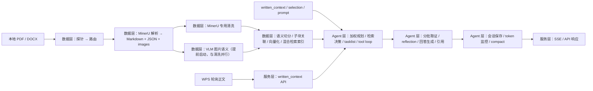

# 后端架构文档

## 1. 文档定位

这份文档是当前后端唯一活动真相源。

它只回答三件事：

1. 第一版后端到底要做什么
2. 后端三层各自负责什么
3. 后续代码该往哪里迁，不该再沿着哪些错误方向继续长

当前明确废止两种错误做法：

- 把“旧实现搬家 + 改命名”当成重构
- 先套 `Strict Clean / domain / infrastructure` 这种抽象分层，再让业务去适配它
- 在三层主链和遗留目录边界还没收敛前，先做评测、A/B、benchmark

这项目现在不需要先讲架构名词，而是先把后端真实职责讲清楚。

### 1.1 归档映射表

`archives/_arch_doc/` 继续保留，但只作为历史证据，不再承担活动设计职责。

| 归档来源 | 当前处理方式 | 结论 |
|---|---|---|
| `archives/_arch_doc/流程架构图.md` | 吸收其中还能成立的主链路表达 | 已采纳三层主链、导入链、对话链；旧细节实现不继承 |
| `archives/_arch_doc/Decision-Snapshot/` | 用作“代码曾经怎么长成这样”的证据 | 部分采纳，用于现状映射和迁移判断，不直接约束新架构 |
| `archives/_arch_doc/Short-Iteration/` | 只保留迭代痕迹 | 不再作为活动计划来源 |
| `archives/_arch_doc/开发文档/` | 只吸收仍然成立的业务意图和接口背景 | 旧 API 命名、旧目录边界、旧解析主链大多废弃 |
| `archives/_arch_doc/讨论/` | 吸收用户已确认的设计意图 | 已采纳三源加权、双循环、异常容灾、compact、进程内内存运行态策略 |
| `archives/_arch_doc/plan.md` | 视为历史版本计划 | 不再直接驱动当前重构 |

规则只有一条：

- 活动设计写回 `docs/backend/`
- 历史判断只做证据，不回流成第二套真相源

### 1.2 当前执行边界

这一轮先做两件事：

1. 收敛后端活动链路与遗留目录边界
2. 按三层重构主链

这一轮明确不做：

- 不先接评测系统
- 不先跑 RAG A/B
- 不先做 benchmark

评测体系不是被否定，而是后置到：

`数据层主链稳定 -> Agent 层主链稳定 -> 服务层主链稳定 -> 旧目录冻结/清理`

之后再接。

### 1.3 当前混合态声明

当前 `backend/app` 仍然处于混合态：

- `api/clients/core/models/pipelines/stores/utils` 是旧实现残留
- `bootstrap/application/domain/infrastructure/interfaces` 是临时新骨架
- 两者都不是最终三层目录

因此这份文档描述的是**目标活动架构与执行顺序**，不是声称“后端已经完成重构”。

### 1.4 活动模型基线说明

Kimi 套餐和相关默认假设已经退出当前活动基线。

当前要求是：

- 后端配置保持 provider-neutral
- 活动示例配置不再默认指向 Kimi
- 后续如果保留 Kimi 兼容分支，也只算兼容能力，不算默认主链

## 2. 第一版后端目标

第一版后端目标：

1. 读入本地 `PDF / DOCX`
2. 复用成熟文档处理能力，把文档转成 `Markdown + JSON 元数据`
3. 形成可增删、可检索、可回跳原文的知识层
4. 让 Agent 按需检索并引用原文回答
5. 保存会话、缓存上下文、控制成本
6. 对前端稳定暴露 API、SSE、配置和运行状态

一句话概括：

这是一个“文档理解 + 检索 + Agent 问答 + 写作连续性维护”的本地后端。

## 3. 三层总览

后端分三层：

| 层 | 核心职责 | 不负责什么 |
|---|---|---|
| 数据层 | 文档预处理、清洗、结构化、向量化、混合检索、原文锚点 | 不负责对话编排，不直接暴露 HTTP |
| Agent 层 | 会话、缓存、输入加权、按需检索、reflection、回答生成、compact、tool call、loop、tasklist | 不直接处理底层文件解析，不直接承载 API 协议 |
| 服务层 | API、SSE、配置、启动、健康检查、日志、观测、依赖装配 | 不承载业务推理，不直接写检索和总结策略 |

理解方式：

- 数据层负责“把知识准备好，并且能找回来”
- Agent 层负责“决定何时用知识、拿多少证据、怎么验证、怎么回答”
- 服务层负责“把这些能力安全稳定地暴露出去”

## 4. 总体链路



## 5. 数据层

数据层唯一目标：把原始文档变成 Agent 能稳定消费的知识对象，并且保留精确回到原文的能力。

### 5.1 数据层职责拆解

数据层分三块：

#### 5.1.1 预处理与数据清洗

这一层负责：

- 接收 Windows 本地 `PDF / DOCX`
- 先做格式识别、轻量探针、路由决策
- 按文档特征选择合适的转换 / 增强链路
- 统一产出 `markdown + structured json + extraction report + 原文锚点`
- 为后续 chunk、indexing、引用、回跳提供稳定输入

PDF 解析主链路为 MinerU 精准解析 API（模型驱动，PP-DocLayoutV2 + SLANet+）。
MinerU 从源头解决布局检测、表格识别、阅读排序问题，输出质量远高于纯规则解析器。
MinerU 失败即为导入失败，不保留低质量降级路径（纯规则解析器输出的噪音比信号多，降级是假降级）。

MinerU 客户端内置：
- 状态管理：pending → uploading → running → done / failed
- 自动重试：抖动 + 指数退避，最多 3 次
- 实时进度回调：前端可显示解析进度
- JSON 元数据提取：layout、content_list、image_paths

MinerU 专用清洗器针对实际噪音模式：
- 封面元数据（分类号、单位代码、密级、学号）
- 目录条目（带点号的目录行）
- CNKI 水印
- 作者简介块
- 封面机构行（培养单位、指导教师、学位论文标题等）
- URL 空格修复

总架构层在这里只锁定三个约束：

- `PDF` 和 `DOCX` 在后端数据契约里同级支持
- 后端后续消费的是归一化后的 `Markdown + JSON 元数据`
- 具体到 PDF、DOCX、OCR、图片、表格、公式的实现细节，分别下沉到模块文档维护

模块文档入口：

- [文档导入与预处理模块](./文档导入与预处理模块/README.md)
- [PDF 清洗重构方案](./关于PDF的清洗模块/PDF清洗重构方案.md)
- [自研清洗逻辑 VS MinerU](../../../我的能力树/能力树/RAG相关/对于pipeline/_自研清洗逻辑_VS_MinerU_.md)

输入：

- Windows 本地文件路径
- 第一版只支持本地 `PDF / DOCX`

输出：

- `markdown` 主内容
- `json` 结构化元数据
- 文档块树
- 图片语义描述
- 质量报告 / 路由报告
- 原文锚点

这里的 `json` 元数据不是附属品，而是后面做切分、索引、引用、回跳的依据。

处理目标：

1. 用统一入口接 PDF 和 DOCX
2. 通过探针路由选择合适处理链
3. 导出 Markdown 作为主文本表示
4. 保留 JSON 作为结构与索引依据
5. 对图片、表格、公式等特殊块保留增强入口
6. 为后续 chunk 建立稳定原文锚点
7. 把具体清洗策略留在模块文档，不在总架构文档里堆实现细节

结论：

- `PDF` 和 `DOCX` 在后端数据契约里同级支持
- 后端切分面对的是 `Markdown + JSON 元数据索引`
- 不是分别为 PDF 和 DOCX 写两套完全不同的知识建模

#### 5.1.2 向量化与可增删索引

数据层第二块负责把结构化文档变成可检索索引。

目标不是“把文本丢进向量库”这么简单，而是：

- 支持增量导入
- 支持单文档删除后向量库、关键词索引、元数据一致清理
- 支持重建单篇文档
- 每个 chunk 都能反查回原文锚点

这一块至少包含：

- retrieval chunk 构建
- 子块关联
- embedding
- 向量索引写入
- 关键词索引写入
- 元数据持久化
- 原文锚点持久化

当前向量库基线可以继续先用 Chroma，但 Chroma 只是实现，不是架构中心。

#### 5.1.3 混合检索

第一版检索固定是混合检索，不是纯 dense，也不是纯 sparse。

至少包含：

- dense semantic recall
- sparse keyword / BM25 recall
- 融合
- 原文片段与锚点返回

检索结果必须是真实证据，不允许返回占位数据。

### 5.2 数据层切分与索引规则

这一块现在已经定规则，不再算“未定”。

#### 5.2.1 切分原则

- 先按语义切分
- `PDF` 与 `DOCX` 在切分规则上无差异
- 切分依据是 `Markdown + JSON 元数据`
- 标题层级参与 chunk 边界
- 表格、公式、脚注不允许被粗暴切断
- 对这些特殊块的处理细节在对应模块文档维护

#### 5.2.2 图片语义的父子块策略

图片语义不直接并入主正文块，而是采用父子块关系：

- 父块：正文或包含图片的语义块
- 子块：该图片对应的语义描述块

召回规则：

- 当父块被召回时，相关图片语义子块应一并可用
- 图片描述不能脱离父块孤立解释上下文

#### 5.2.3 检索块与回答块分离

这条非常关键：

- 为检索准备的 chunk
- 为回答拼上下文准备的 chunk

这两者分离。

也就是说：

- 检索块追求召回精度、可定位、可过滤
- 回答块追求上下文完整性、可读性和证据组织

检索命中后，Agent 层可以把多个 retrieval chunk 重新组装成 answer context pack，再喂给模型。

#### 5.2.4 重叠策略

默认不是靠 overlap 解决问题，而是靠语义切分解决问题。

只有当单个语义块过大，继续坚持纯语义切分已经不现实的时候，才启用暴力均分策略。

当前硬约束：

- 单个可嵌入块不能超过 embedding 模型上下文窗口的 `1/4`

一旦单个语义块超过这条硬约束：

1. 退出纯语义切分路径
2. 对该语义块做暴力均分
3. 只在这一类场景里引入 overlap

结论：

- overlap 是兜底，不是默认方案
- 默认方案仍是语义切分

#### 5.2.5 tokenizer 最小约束

这一块不再只是“后面再定”。

第一版至少锁定这些约束：

- 输入文本长度不能超过目标模型最大支持长度
- 批量输入时必须统一长度，明确 padding 与 truncation 策略
- 如果需要处理新增词汇，可以扩展词汇表，但必须同步调整模型嵌入矩阵

落实到工程上：

1. retrieval chunk 做 embedding 前，必须先过 tokenizer 长度校验
2. 超长输入不能静默放行，必须显式重切、截断或拒绝
3. 批量 embedding 需要统一的 padding / truncation 规则
4. 如果调用 `add_tokens` 扩词，模型侧必须同步 `resize_token_embeddings`

第一版默认实现约定也一并锁定：

- embedding 侧 tokenizer 默认绑定到当前 embedding 模型同名 tokenizer
- 如果 embedding 走远程 API，本地仍要保留一份同名 tokenizer 只用于预算、校验和切分
- rerank 侧如果与 embedding 模型不同，单独维护自己的 tokenizer 预算，不共用 embedding 长度上限
- 生成模型侧 token 统计优先使用模型服务返回的 usage；拿不到 usage 时，再退回本地估算器，只用于告警和 compact 触发，不用于硬截断检索证据

超长文本的处理顺序也锁定：

1. 先重切
2. 再强制均分
3. 仍超限才拒绝写入索引

也就是说：

- 不允许静默截断后直接入库
- 优先保住语义边界
- 实在保不住时才进入暴力切分兜底

#### 5.2.6 原文锚点默认结构

锚点不是“以后再补”的装饰字段，而是检索链和回跳链的正式契约。

第一版默认锚点字段：

| 字段 | 说明 |
|---|---|
| `anchor_id` | 锚点唯一标识 |
| `source_file_path` | 原始本地文件绝对路径 |
| `doc_type` | `pdf` 或 `docx` |
| `page` | 页码；DOCX 无页概念时可为空 |
| `block_id` | 解析块唯一标识 |
| `block_type` | paragraph / heading / table / formula / figure / footnote |
| `heading_path` | 标题层级路径 |
| `paragraph_index` | 段落序号 |
| `char_start` / `char_end` | 在标准化正文里的字符范围 |
| `bbox` | PDF 可选，保留矩形坐标以支持更细粒度跳转 |
| `parent_anchor_id` | 子块回指父块，例如图片语义子块 |
| `source_text_hash` | 用于校验锚点是否与当前解析产物一致 |

约束：

- PDF 和 DOCX 都要产出这套统一结构
- 宿主是否能一步跳到该位置，是前端/Windows 集成问题
- 后端不能因为 DOCX 跳转能力较弱，就放弃段落级锚点

### 5.3 数据层核心对象

| 对象 | 说明 |
|---|---|
| 文档资源 | 一个被导入系统的本地 PDF 或 DOCX |
| 解析产物 | 由预处理模块生成的统一文档表示、Markdown、JSON 和质量报告 |
| Retrieval Chunk | 用于检索的最小语义单元 |
| Answer Context Pack | 给模型回答时组装的证据包 |
| 原文锚点 | 用于回跳 PDF / DOCX 原文段落的定位信息 |
| 图片子块 | 与父块关联的图片语义描述块 |

### 5.4 数据层运行状态

导入建议使用明确状态：

`queued -> probing -> routing -> transforming -> cleaning -> enriching -> chunking -> embedding -> indexing -> completed / failed`

含义：

- `probing`：探针检测（格式识别、文本密度、图片/表格/公式信号）
- `routing`：路由决策（A/B/C/D/E）
- `transforming`：MinerU 解析（PDF → Markdown + JSON + images）；图片到手后立即启动 VLM
- `cleaning`：MinerU 专用清洗（封面/目录/CNKI/机构行移除 + 标题标准化）
- `enriching`：VLM 图片语义理解（与 cleaning 并行，提前于 transformation 完成前启动）
- `chunking`：语义切分、父子块关联、锚点建立
- `embedding`：向量生成
- `indexing`：向量索引、关键词索引、元数据写入

### 5.5 数据层硬约束

- 入口固定为 Windows 本地路径
- 第一版固定支持 `PDF`、`DOCX`
- PDF 解析主链路固定为 MinerU 精准解析 API，失败即失败，不降级到低质量解析器
- 数据层必须保存”证据 -> 原文锚点”的稳定映射
- 不能把 retrieval chunk 和 answer context pack 混为一谈
- 图片语义必须以父子块方式建模
- 表格、公式、脚注不能被粗暴切裂

### 5.6 原文回跳契约

后端对 `PDF` 和 `DOCX` 都必须返回统一锚点结构。

至少应包含：

- 原始文件路径
- 文档类型
- 页码或等效位置
- 段落 / block 标识
- 章节或标题路径

说明：

- 后端契约上，PDF 和 DOCX 同级支持
- “宿主如何实际打开并跳转”属于服务层和前端集成细节
- 但后端不能因为宿主能力差异，就不给 DOCX 建锚点

## 6. Agent 层

Agent 层是第一版后端的业务中枢。

它不是一个“固定检索 + 固定回答”的包装器，而是一个会判断、会取证、会压缩上下文的响应编排层。

### 6.1 Agent 层职责拆解

#### 6.1.1 数据持久化与缓存

负责：

- 会话保存
- 对话消息保存
- 活动窗口缓存
- `written_context` 缓存
- 成本缓存命中

目标：

- 历史可回放
- 窗口可命中
- 重复上下文尽量少重复花钱

当前实现基线仍可先用：

- SQLite：长期事实
- 进程内内存：活动窗口、`written_context`、selection、冻结副本、短期缓存

#### 6.1.2 日志与运行观测

日志是后端的一等能力，不是开发期临时补丁。

第一版至少要能观察到这些运行事实：

- 常驻轮询是否正常工作
- 本轮冻结副本的来源和大小
- query 改写是否发生
- 检索是否触发
- 召回数量、重排数量、最终送入模型的证据数量
- reflection 是否继续深入、是否换方向
- compact 是否触发
- 进程内活动窗口是否触发收缩或清理
- 自动重试、降级、自修复是否发生
- 最终为什么成功、降级或失败

日志要求：

- 每次导入任务要有任务级日志链
- 每次对话请求要有请求级日志链
- 关键阶段必须可观测，不能只在异常时打日志
- 用户可见状态与内部技术日志要分层

第一版默认采用结构化日志。

公共字段至少包含：

| 字段 | 说明 |
|---|---|
| `timestamp` | 事件时间 |
| `level` | 日志级别 |
| `event` | 事件名 |
| `request_id` | 对话请求标识 |
| `task_id` | 导入任务标识 |
| `session_id` | 会话标识 |
| `document_id` | 文档资源标识 |
| `stage` | 当前阶段 |
| `attempt` | 第几次重试 |
| `degraded` | 是否处于降级态 |
| `recovery_action` | 本次自动恢复动作 |
| `latency_ms` | 阶段耗时 |
| `input_tokens` | 本轮输入 token |
| `output_tokens` | 本轮输出 token |
| `retrieval_round` | 第几轮取证 |
| `evidence_count` | 本轮证据数量 |
| `cache_mode` | 运行态缓存模式（`memory`） |

事件命名默认分四类：

- `import.*`
- `agent.*`
- `compact.*`
- `runtime.*`

比如：

- `import.parsing.started`
- `agent.reflection.decision`
- `compact.triggered`
- `runtime.cache.pruned`

#### 6.1.3 输入源加权与起手策略

第一版 Agent 的活动输入源不是四个，而是三个：

| 输入源 | 说明 | 来源 |
|---|---|---|
| `written_context` | 用户已经写好的正文上下文 | WPS 常驻轮询得到的正文快照 |
| `selection` | 用户手动圈选的局部重点 | 可选 |
| `prompt` | 用户显式输入的要求或指令 | 可选 |

这三者不是平权输入，而是加权输入。

### 四种起手场景

#### 场景 1：只有 prompt

- `prompt = 100%`
- `selection = 0%`
- `written_context = 0%`

用法：

- 依赖 prompt 起手
- 基于 prompt 做 query 改写
- 去混合检索召回

#### 场景 2：只有 written_context

- `written_context = 100%`
- `selection = 0%`
- `prompt = 0%`

用法：

- 根据用户已写内容推断下一句或下一段
- 这是“继续写”模式
- 不需要用户额外 prompt 也可触发

#### 场景 3：written_context + selection，无 prompt

- `written_context = 30%`
- `selection = 70%`
- `prompt = 0%`

用法：

- selection 是当前焦点
- written_context 是背景约束
- 组合后再做 query 改写和检索

#### 场景 4：written_context + selection + prompt

- `written_context = 20%`
- `selection = 30%`
- `prompt = 50%`

用法：

- prompt 决定显式任务方向
- selection 决定局部焦点
- written_context 决定已有写作现场

### 触发规则

- 如果三者都没有内容，点击发送后什么也不发生
- 如果存在内容，则把当前内容快照复制一份进入 query 改写和检索链
- 监听进程继续监听，不被本轮请求阻塞

这里的重点是：

- 持续监听的正文快照是活的
- 每次真正进入 Agent 链路的是一个不可变副本

#### 6.1.4 双循环：常驻循环与对话级循环

Agent 层不是只有“点击发送后跑一次”。

它实际有两层循环。

### 常驻循环

常驻循环职责：

- 每隔 5 秒轮询用户当前正文
- 更新 `written_context`
- 将其写入临时运行态
- 为随后的对话级循环提供最新正文快照

行为规则：

1. 程序启动后先读取当前文档已存在正文
2. 以此作为首次 `written_context`
3. 后续每 5 秒轮询增量更新
4. 程序关闭后，临时监听内容清空
5. 程序再次打开时，不恢复上次临时缓存，而是优先读取当前文档真实已有内容

### 对话级循环

对话级循环职责：

- 接住一次用户发送动作
- 根据三类输入源加权形成任务
- 执行 query 改写、RAG、回答生成
- 返回带来源的自然语言结果

基本链路：

`written_context / selection / prompt -> LLM planning -> query tool -> RAG tool -> 混合检索 + 重排 -> 组织回答 -> 输出来源`

整个会话性上下文是临时的，但长期消息和必要摘要需要持久化。

#### 6.1.5 按需检索，而不是盲目检索

Agent 首先要判断：

- 这轮是否真的需要知识库
- 当前 `written_context / selection / prompt` 是否已经足够
- 应该沿当前方向深入，还是换方向验证

如果需要检索，链路不是“一次性喂一大坨证据”，而是：

1. 读取当前输入源
2. 读取活动窗口
3. 形成初始检索意图
4. 拉取第一批候选证据
5. 做 reflection，判断证据是否支持当前方向
6. 若支持，则继续深入或扩展局部证据
7. 若不支持，则换检索方向重新验证
8. 足够支撑回答后再生成最终输出

结论：

- 检索是行动后分析
- 证据摄入是分批进行
- 不是一次性把所有证据塞进模型

#### 6.1.6 reflection 驱动的证据预算

上一版把 `topk` 当成一次性预算，这是错的。

这一版改为：

- 每轮只拿当前行动需要的一小批证据
- 由 reflection 判断是否继续深入
- 再决定下一轮拿多少、换不换方向

因此这里真正动态的不是一个固定数字，而是：

- 本轮候选召回规模
- 本轮送入 rerank 的证据量
- 本轮真正喂给模型的证据包数量
- 是否继续下一轮取证

约束：

- 不能把 `topk` 写死成固定常量
- 预算必须结合模型上下文窗口、当前历史负载、`written_context` 和本轮行动目标

第一版默认 reflection 轮语义：

- 每轮必须产出一个明确判定：`supported / insufficient / conflicting / off_track`
- `supported`：当前证据已经足够回答，或只需要补一个很小的局部证据包
- `insufficient`：方向没错，但证据不够，需要继续沿当前方向深挖
- `conflicting`：命中证据彼此冲突，需要换关键词或换焦点再验证
- `off_track`：当前方向偏了，需要重写 query 并切换路线

第一版默认停止条件：

1. 已有证据足以生成带引用回答
2. 剩余上下文预算已经不足以继续安全扩展证据
3. 连续两轮都判定为 `off_track`
4. 已经发生两次方向切换
5. 已达到本轮最大反思轮数

第一版默认不是写死一个 `topk`，而是写死“最大轮数和每轮决策框架”：

- 单次请求默认最多 3 轮 reflection
- 每轮先拿小批证据，再决定是否继续
- answer context pack 只放本轮真正要验证或回答所需的证据，不追求一次塞满

#### 6.1.7 回答生成与原文引用

回答必须做到：

- 有结论
- 有直接依据
- 引用原文
- 提供原文定位信息

检索命中后，Agent 负责把 retrieval chunk 组装成 answer context pack，再交给模型回答。

#### 6.1.8 compact 与上下文连续性

第一版必须具备上下文窗口监控和 compact 能力。

要求：

- 显示当前上下文窗口 token 数
- 显示剩余可用 token 比例
- 当剩余可用上下文低于 `5%` 时，触发 compact
- compact 使用小模型总结历史对话
- 将摘要重新注入对话上下文
- 保持对话连续性，不直接丢历史事实

compact 的目标：

- 降低长对话成本
- 避免主模型上下文爆掉
- 保持可连续写作和追问

默认落地方式：

- 每次对话响应开始时，先计算当前窗口 token、剩余 token、剩余比例
- 这三个值必须进入首个 SSE metadata 事件
- compact 触发后，要把“触发前窗口大小、摘要长度、压缩收益、是否成功”写入结构化日志
- compact 摘要本身进入长期事实存储，下一轮由 Agent 按“摘要 + 最近窗口 + 当前冻结副本”重新组装上下文

#### 6.1.9 基础 Agent Runtime

第一版 Agent 需要最基础的运行骨架：

- tool call
- loop
- tasklist

这里的含义：

- `tool call`：调用检索、读取锚点、压缩历史、生成标题等内部工具
- `loop`：允许有限轮验证和再检索
- `tasklist`：把本轮响应拆成若干执行子任务，而不是一轮 prompt 把一切说死

第一版不做复杂多 Agent 系统，但必须有基础 Agent runtime。

### 6.3 Agent 层状态

第一版状态机不能只是“出错就抛异常”。

状态机必须同时具备：

- 正常推进
- 重试
- 降级
- 自修复
- 最终失败

### 6.3.1 对话级状态机

建议状态：

`received -> snapshot_freeze -> planning -> retrieval_decision -> retrieving -> reflection -> tool_loop -> generating -> persist -> compact_check -> compacting -> completed`

异常出口：

- `retrying`
- `degraded`
- `needs_user_action`
- `failed`
- `cancelled`

说明：

- `snapshot_freeze`：冻结本轮输入副本，避免监听流持续变化污染本轮推理
- `reflection`：判断当前证据是否支持回答方向
- `compact_check`：检查当前可用上下文比例
- `compacting`：使用小模型总结并重注入历史
- `retrying`：瞬时错误，系统自动重试
- `degraded`：部分能力不可用，但链路继续
- `needs_user_action`：自动修复失败，需要用户介入

### 6.3.2 导入级状态机

导入也不能只有“完成 / 失败”。

建议状态：

`queued -> probing -> routing -> transforming -> cleaning -> enriching -> chunking -> embedding -> indexing -> completed`

异常分支：

- `retrying`：MinerU API 瞬时错误，自动重试（抖动 + 指数退避，最多 3 次）
- `degraded`：VLM 图片描述失败但文本主链继续；MinerU 失败即为 failed，不降级到低质量解析器
- `paused`：等待资源恢复或后台恢复
- `needs_user_action`：文件损坏、路径失效、权限异常等需要人工处理
- `failed`：MinerU 重试耗尽、网络不可达、配额用尽

### 6.3.3 异常处理原则

不能直接把底层异常原样抛给用户就算结束。

优先级应当是：

1. 自动重试
2. 自动降级
3. 自动修复或恢复
4. 给出结构化错误和恢复建议
5. 最后才进入终态失败

### 6.4 Agent 层硬约束

- 不能把检索写成每次必调
- 不能把 `topk` 写死成固定数字
- 不能一次性把所有证据都塞给模型
- 必须允许 reflection 后继续深入或换方向
- 必须显示上下文 token 使用情况
- 可用上下文低于 `5%` 时必须触发 compact
- 不能把 `written_context`、selection、prompt、历史摘要混成一坨无标识文本
- 不能只有引用文本，没有原文锚点
- 不能靠内存全局变量假装做状态管理
- 不能把异常处理简化成“报错直接丢出”
- 不能没有阶段日志和运行观测

## 7. 服务层

服务层只负责对外暴露和运行支撑。

### 7.1 服务层职责

#### 7.1.1 API

服务层需要暴露的能力：

- 文档导入与导入状态
- Agent 响应
- 会话管理
- `written_context` 同步
- 健康检查
- 当前上下文窗口 token 统计
- 当前运行态降级状态

其中对话响应流的首个 metadata 事件至少要带：

- `request_id`
- `session_id`
- `used_inputs`
- `context_tokens`
- `remaining_tokens`
- `remaining_ratio`
- `retrieval_planned`
- `degraded_flags`
- `cache_mode`

#### 7.1.2 配置

服务层统一管理：

- 模型配置
- 文档解析与路由配置
- 索引配置
- 缓存配置
- token / compact 阈值配置
- SSE、超时、日志配置

但服务层不负责发明业务规则。

#### 7.1.3 日志与观测出口

服务层必须提供正式的日志与观测出口，而不是靠零散 `print`。

至少要覆盖：

- 导入任务阶段日志
- 对话请求阶段日志
- 进程内活动窗口与冻结副本监控
- compact 触发事件
- retry / degrade / self-heal 事件
- 健康检查中的结构化状态

观测目标：

- 本地开发时直接可看
- 后续可以接入更正式的聚合或监控
- 出问题时能快速定位是在数据层、Agent 层还是服务层

### 7.2 服务层接口原则

- API 只做输入输出和错误映射
- SSE 只负责流式事件和 metadata 编码
- 健康检查必须能反映 degraded
- 日志与观测必须是正式能力
- token 统计应对前端可见
- compact 触发信息应可观测

### 7.3 WPS 轮询与 `written_context`

WPS 轮询入口在服务层，但语义属于 Agent 层。

所以：

- 服务层提供监听与同步接口
- Agent 层把轮询正文视为 `written_context`
- 数据层不直接感知这个能力

补充规则：

- 轮询周期默认 5 秒
- 轮询拿到的是当前正文全文快照
- 对话请求真正消费的是冻结副本，不是正在变化的实时正文流
- 关闭程序后临时监听状态清空
- 再次打开时先读取文档当前真实内容，再恢复轮询

## 8. 运行时存储拓扑

| 存储 | 用途 |
|---|---|
| `backend/data/app.db` | 文档元数据、导入记录、会话记录、摘要记录、锚点索引 |
| `backend/data/chroma_db/` | 向量索引 |
| `backend/data/bm25_index/` | 关键词索引 |
| `backend/data/papers/` | 原始文件副本与图片资源 |
| `backend/data/parsed/` | Markdown、JSON、质量报告等解析产物 |
| `backend/data/backups/` | 导入阶段中间产物和恢复点 |
| 进程内内存（`agent_layer/session/*`） | 活动窗口、`written_context`、selection、冻结副本、compact 工作态 |

### 8.1 进程内内存窗口与回收策略

- 运行态缓存不依赖外部服务，默认由进程内内存承担
- 活动窗口和冻结副本都以请求上下文为中心，属于短期工作态
- 冻结副本按 `request_id` 保留短暂窗口，过期后自动清理
- 活动窗口按 token 预算和对话轮次截断，不做外部 TTL 驱动
- 当上下文预算接近上限时，优先触发 compact，再裁剪最旧的 live window 条目
- 程序关闭后临时监听状态清空；重启后先读取当前文档真实内容，再重建活窗口

### 8.2 内存异常与降级

- 进程内运行态没有外部依赖，不存在重连流程
- 如果缓存对象初始化失败，回退到空窗口/空上下文，不阻塞主链
- 长期事实继续由 SQLite 承担，摘要和会话记录可重建
- compact 失败、图片语义失败等短期能力可降级，但不能伪装成功
- 内存窗口恢复依赖当前 editor context 和持久化摘要重新组装

## 9. 目标目录组织

后端目标目录围绕三层：

```text
backend/app/
├─ data_layer/
│  ├─ preprocessing/     # 文档探针、路由、清洗、图片语义、结构化
│  ├─ indexing/          # retrieval chunk、parent-child、embedding、anchor
│  ├─ retrieval/         # dense、sparse、fusion
│  └─ storage/           # 文件、元数据、索引、锚点
├─ agent_layer/
│  ├─ session/           # 会话、消息、摘要、缓存
│  ├─ planning/          # 输入加权、检索决策、取证规划、tasklist
│  ├─ runtime/           # tool call、loop、reflection、retry/degrade
│  ├─ response/          # 回答生成、引用、context pack
│  └─ hooks/             # compact、标题、摘要等 hook
└─ service_layer/
   ├─ api/               # FastAPI routes
   ├─ schemas/           # request/response schema
   ├─ sse/               # 流式事件编码
   ├─ config/            # settings
   └─ bootstrap/         # app factory、lifespan、health、logging
```

这才是后面代码应该迁移到的目标目录。

## 10. 当前代码与目标架构的关系

当前代码里有三类东西：

1. 真正的旧实现
2. 我前面临时拉出来的新骨架
3. 尚未清理的过渡代码

它们都不是目标架构本身。

具体目录和模块级映射见：

- [现状代码映射](D:/真项目/论文助手/docs/backend/现状代码映射.md)
- [后端文件分布重规划](D:/真项目/论文助手/docs/backend/后端文件分布重规划.md)
- [参考源码借鉴清单](D:/真项目/论文助手/docs/backend/参考源码借鉴清单.md)

### 10.1 不应继续强化的目录概念

- 旧 `services / stores / clients / pipelines`
- 临时 `application / domain / infrastructure / interfaces`

不是说其中代码一定没用，而是这些目录的边界不再代表目标职责。

### 10.2 迁移原则

后续重构不是“把旧代码平移到新目录”，而是：

1. 先按三层重新定义职责
2. 再决定哪些旧代码可以复用
3. 不能为了复用而保留错误边界

## 11. 当前已锁定的关键决策

- PDF 解析主链路固定为 MinerU 精准解析 API（模型驱动，PP-DocLayoutV2 + SLANet+），失败即失败，不保留低质量降级路径
- MinerU 专用清洗针对实际噪音模式（封面/目录/CNKI/机构行/URL），不再需要 PUA/伪表格/碎片行修复
- VLM 在 MinerU 返回图片的那一刻就提前启动，与 transformation 剩余工作和 cleaning 并行
- 第一版支持 `PDF + DOCX`
- 数据层处理对象是 `Markdown + JSON 元数据`
- 默认按语义切分
- 标题层级参与 chunk 边界
- 图片语义采用父子块
- 检索块与回答块分离
- overlap 只在超大语义块兜底场景启用
- 原文锚点采用统一结构，不因 PDF/DOCX 差异放弃段落级定位
- Agent 活动输入源固定为 `written_context + selection + prompt`
- 四种触发场景使用固定权重策略起手
- WPS 常驻轮询每 5 秒更新一次 `written_context`
- 检索不是一次性喂满证据，而是分批取证 + reflection
- 对话请求消费的是输入冻结副本
- 状态机必须支持 retry / degrade / self-heal / needs_user_action
- 上下文剩余比例低于 `5%` 时触发 compact
- compact 使用小模型总结历史并重注入上下文
- 日志与观测是正式能力，采用结构化事件
- 进程内内存运行态由上下文预算和 compact 机制驱动

## 12. 仍待落地的事项

当前不是“没想清楚架构”，而是还有一些实现参数和协议细节待落地，见：

- [docs/backend/代办/后端架构待办.md](D:/真项目/论文助手/docs/backend/代办/后端架构待办.md)

后面所有后端代码重构，都应该以这份文档为准，而不是反过来让文档替错误代码擦屁股。
