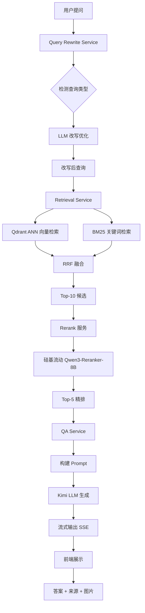
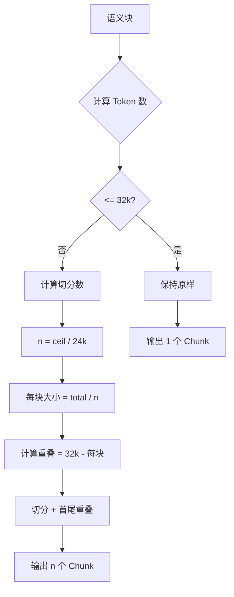
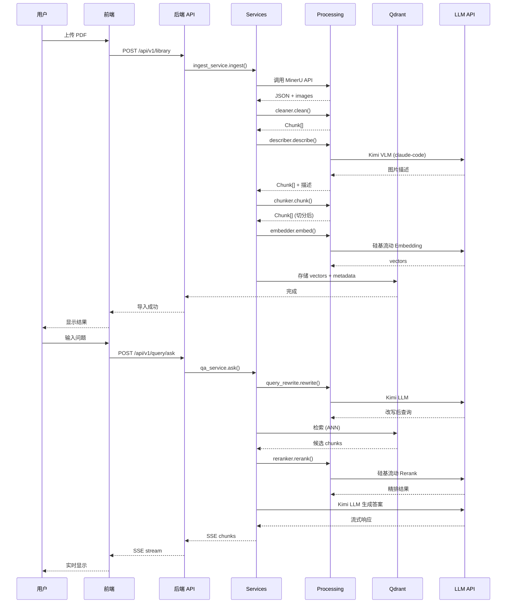

# 论文助手 - 流程架构图

## 1. PDF 导入与处理流程

```mermaid
flowchart TD
    A[用户上传 PDF] --> B[MinerU API 解析]
    B --> C[content_list_v2.json]
    B --> D[images/]
    C --> E[后端: 数据清洗层]
    D --> E
    E --> F[过滤噪声类型]
    F --> G[UI 噪声过滤]
    G --> H[LaTeX 清洗]
    H --> I[表格转换]
    I --> J[Chunk[] + 图片路径]
    J --> K[后端: VLM 图片描述]
    K --> L{Kimi Coding API}
    L -->|User-Agent: claude-code| M[10 并发请求]
    M --> N[图片详细描述]
    N --> O[Chunk[] + 描述]
    O --> P[后端: 混合切分策略]
    P --> Q{语义块 > 32k?}
    Q -->|否| R[保持原样]
    Q -->|是| S[平均切分]
    S --> T[首尾重叠 8k]
    T --> U[Chunk[] ~24k]
    R --> V[Embedding 服务]
    U --> V
    V --> W[硅基流动 Qwen3-Embedding-8B]
    W --> X[向量 4096 维]
    X --> Y[Qdrant 存储]
    Y --> Z[导入完成]
```

## 2. RAG 问答流程



## 3. 系统架构图

```mermaid
graph TB
    subgraph 前端
        A1[AppShell.vue]
        A2[SessionList]
        A3[MessageList]
        A4[SourceCardList]
        A5[ChatInput]
        A1 --> A2
        A1 --> A3
        A1 --> A4
        A1 --> A5
    end

    subgraph 后端-API层
        B1[/api/v1/health]
        B2[/api/v1/session]
        B3[/api/v1/query/ask]
        B4[/api/v1/library]
    end

    subgraph 后端-Services
        C1[qa_service]
        C2[ingest_service]
        C3[retrieval_service]
        C4[query_rewrite_service]
    end

    subgraph 后端-Processing
        D1[cleaner.py]
        D2[describer.py]
        D3[chunker.py]
        D4[embedder.py]
        D5[reranker.py]
    end

    subgraph 后端-Stores
        E1[qdrant_store.py]
        E2[bm25_store.py]
        E3[sqlite_repo.py]
        E4[file_store.py]
    end

    subgraph 外部服务
        F1[MinerU API]
        F2[Kimi Coding API]
        F3[硅基流动 API]
    end

    A2 -.HTTP/SSE.-> B2
    A5 -.HTTP/SSE.-> B3
    B1 --> C1
    B2 --> C1
    B3 --> C1
    B3 --> C3
    B4 --> C2

    C1 --> D4
    C1 --> D5
    C2 --> D1
    C2 --> D2
    C2 --> D3
    C2 --> D4
    C3 --> D4
    C3 --> D5
    C4 --> F2

    D1 --> E4
    D2 --> E4
    D2 -.10并发.-> F2
    D3 --> E1
    D4 --> E1
    D4 -.批量.-> F3
    D5 -.精排.-> F3

    E1 -.查询.-> F3
    E2 -.本地.-> E2
    E3 -.本地.-> E3
    E4 -.本地.-> E4

    C2 -.PDF解析.-> F1
```

## 4. 混合切分策略



## 5. 前后端交互



## 6. 目录结构（目标）

```text
论文助手/
├── backend/
│   ├── app/
│   ├── scripts/
│   ├── data/
│   ├── main.py
│   └── pyproject.toml
├── frontend/
│   ├── src/
│   ├── wps-plugin/
│   ├── app.html
│   ├── index.html
│   └── vite.config.ts
├── docs/
├── datasets/
│   └── test_meta_papers/
└── archives/
    ├── legacy/
    └── packages/
```
